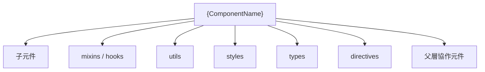
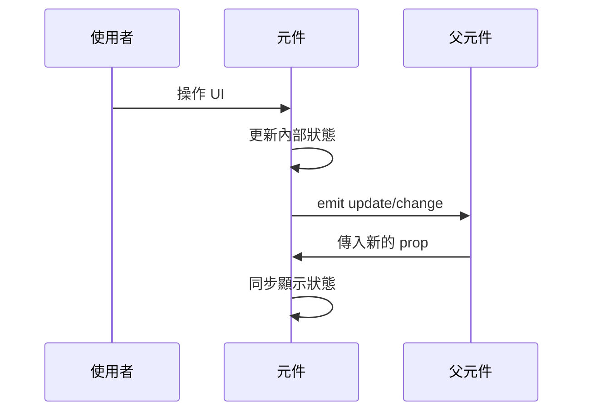
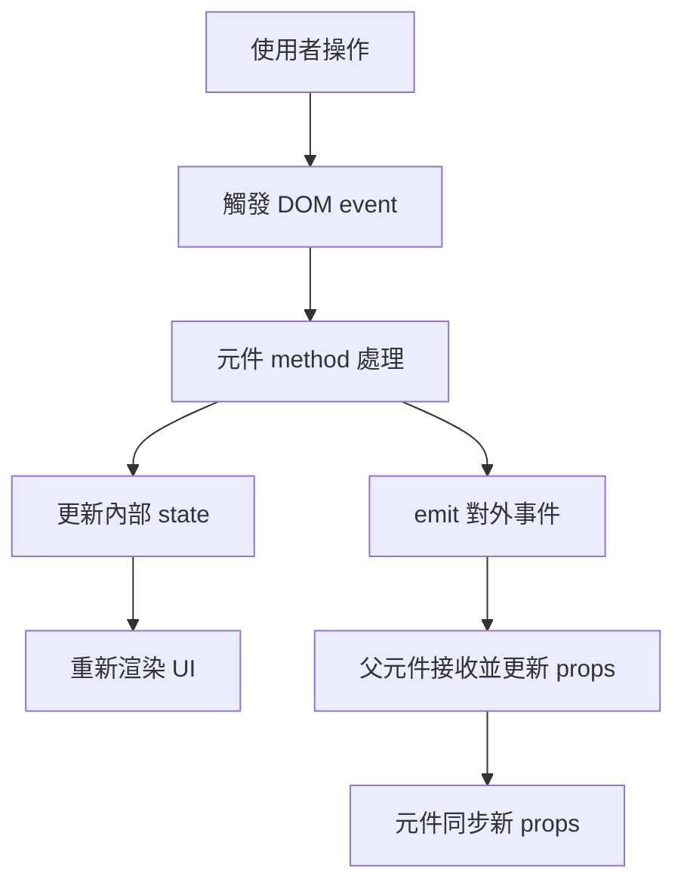
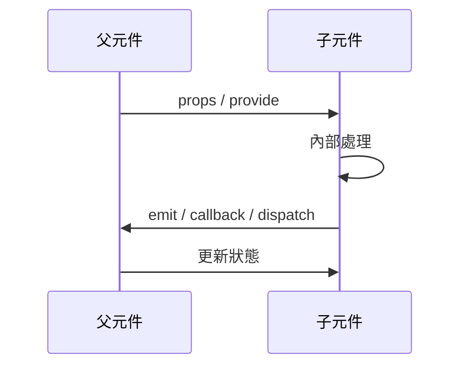
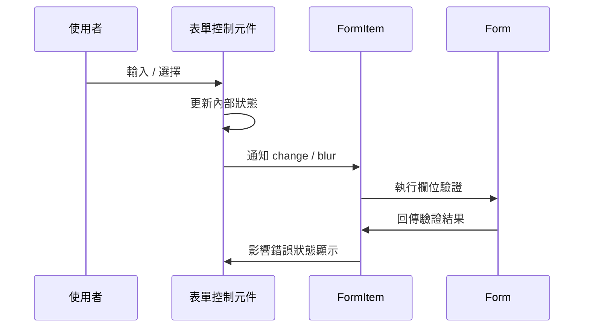
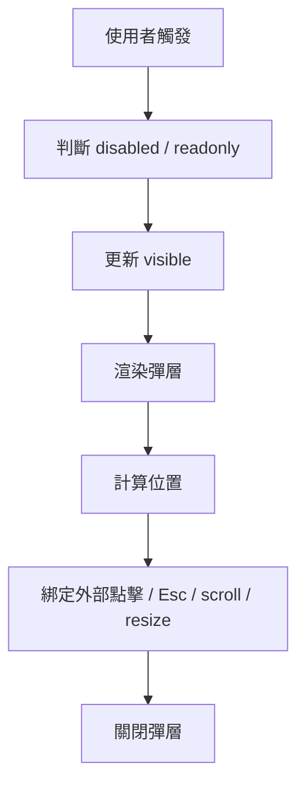
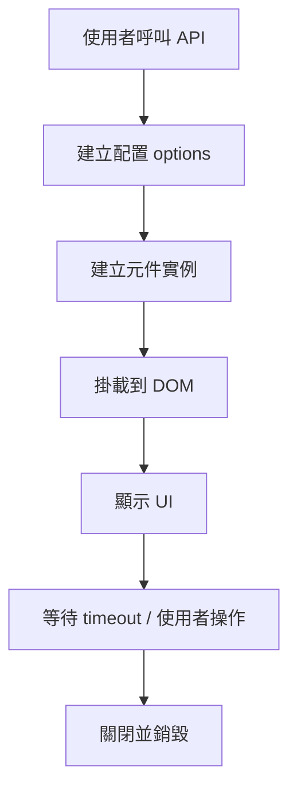
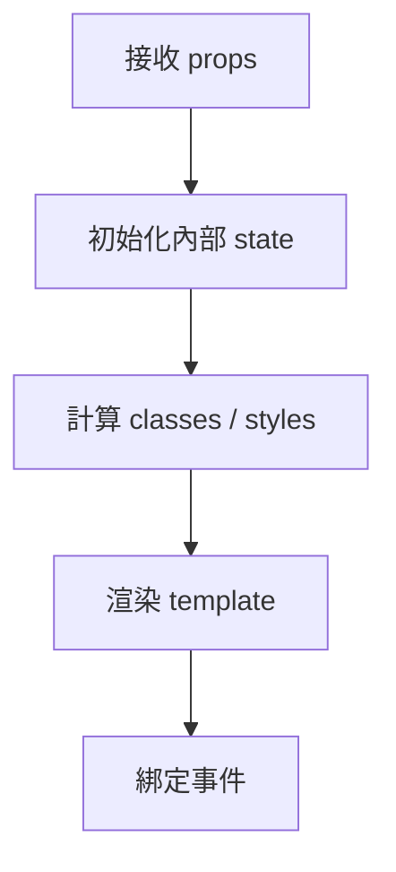
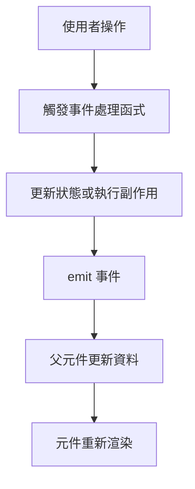
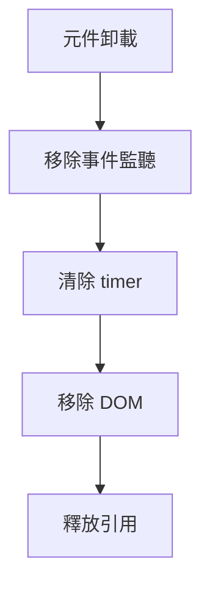

# 00-06_單一元件讀碼模板

> 版本定位：9.5 分版本  
> 適用對象：正在閱讀 View UI Plus 原始碼，並希望把單一元件讀碼過程整理成可回查、可仿寫、可轉化為企業後台封裝能力的學習者。  
> 適用範圍：Button、Icon、Input、Select、Form、FormItem、Table、Modal、Message、Dropdown、Tooltip、Upload、Tree、DatePicker 等單一元件或小型元件群。  
> 不適用範圍：全域安裝機制、國際化機制、表單驗證系統、彈層定位系統、樣式主題系統等大型橫向機制。這類內容應使用 `00-07_橫向機制讀碼模板.md`。

---

## 1. 這份模板的用途

這份模板不是單純用來「記錄我看過哪些程式碼」，而是用來建立一套穩定的單一元件讀碼流程。

閱讀 View UI Plus 這類企業級元件庫時，最容易出現三種問題：

1. 只看懂局部程式碼，但不知道元件整體設計意圖。
2. 只記錄 props、methods、computed，卻沒有看出元件 API 設計邏輯。
3. 看完源碼後無法轉化成自己的元件封裝能力。

因此，單一元件筆記必須同時回答四個層次的問題：

```txt
第一層：這個元件解決什麼 UI 問題？
第二層：它對使用者暴露了什麼 API？
第三層：它內部如何組織狀態、事件、渲染、樣式與型別？
第四層：我能從它身上學到什麼，並轉化成自己的企業後台元件設計？
```

---

## 2. 單一元件讀碼的基本原則

### 2.1 先看使用方式，再看源碼

不要一開始就打開元件檔案硬讀。

正確順序應該是：

```txt
官方文件 / Demo
→ 使用者如何使用這個元件
→ 元件暴露了哪些 API
→ 再進入源碼確認它如何實作
```

如果不知道使用者如何使用元件，就很難判斷源碼中的設計是為了解決什麼問題。

---

### 2.2 先抓主流程，再補分支

閱讀元件源碼時，不要一開始就追所有 if、watch、computed、工具函式。

應優先抓住主流程：

```txt
輸入：props / slots / v-model / 使用者事件
處理：computed / watch / methods / composition function / mixin
輸出：DOM 結構 / class / style / emits / 暴露方法
```

等主流程清楚後，再回頭整理邊界條件與特殊分支。

---

### 2.3 讀元件不是背程式碼，而是反推設計

每讀一個元件，都應該反推出：

```txt
1. 這個元件的 API 為什麼這樣設計？
2. 哪些狀態交給使用者控制？
3. 哪些狀態由元件內部維護？
4. 哪些能力透過 slot 擴展？
5. 哪些能力透過全域配置或 prefixCls 統一？
6. 如果我要自己仿寫，最低限度要保留哪些設計？
```

---

## 3. 單一元件筆記命名規範

建議每個元件獨立成一篇筆記。

```txt
11_基礎通用元件/
├── Button_按鈕元件讀碼.md
├── Icon_圖示元件讀碼.md
└── ...

13_表單與輸入元件/
├── Input_輸入框元件讀碼.md
├── Select_選擇器元件讀碼.md
├── Checkbox_核取方塊元件讀碼.md
└── ...

17_回饋_彈層_命令式元件/
├── Modal_對話框元件讀碼.md
├── Message_訊息提示元件讀碼.md
└── ...
```

建議檔名格式：

```txt
元件名稱_中文定位_元件讀碼.md
```

例如：

```txt
Button_按鈕元件讀碼.md
FormItem_表單項元件讀碼.md
Message_命令式訊息元件讀碼.md
```

---

# 單一元件讀碼模板正文

> 以下內容可以直接複製成每一個元件的讀碼筆記模板。

---

# `{ComponentName}` 元件讀碼筆記

## 0. 筆記基本資訊

| 項目 | 內容 |
|---|---|
| 元件名稱 | `{ComponentName}` |
| 中文名稱 | `{中文元件名稱}` |
| 所屬分類 | 基礎元件 / 表單元件 / 資料展示元件 / 導航元件 / 回饋元件 / 命令式元件 / 其他 |
| 閱讀日期 | `{YYYY-MM-DD}` |
| 對應 View UI Plus 版本 | `{version}` |
| 閱讀狀態 | 初讀 / 已整理 / 已仿寫 / 已重構 / 已應用 |
| 難度評估 | 低 / 中 / 高 |
| 建議閱讀優先級 | 高 / 中 / 低 |

---

## 1. 元件定位

### 1.1 這個元件解決什麼問題？

請用一句話描述這個元件的核心定位。

```txt
範例：
Button 元件用來提供統一樣式、狀態與互動行為的按鈕。
Input 元件用來封裝文字輸入、狀態控制、事件派發與表單協作。
Modal 元件用來提供可控制顯示狀態的對話框，並支援命令式與宣告式使用。
```

我的整理：

```txt
{在這裡填寫}
```

---

### 1.2 這個元件在企業後台中的常見場景

| 場景 | 說明 |
|---|---|
| 新增 / 編輯資料 | `{是否常用於表單或 CRUD}` |
| 查詢篩選 | `{是否常用於查詢條件}` |
| 資料展示 | `{是否常用於列表、表格、卡片}` |
| 使用者回饋 | `{是否常用於提示、確認、錯誤訊息}` |
| 權限控制 | `{是否會搭配角色、權限、禁用狀態}` |
| 複雜互動 | `{是否涉及拖曳、鍵盤、焦點、彈層、定位}` |

---

### 1.3 元件複雜度判斷

請判斷這個元件屬於哪一種類型：

```txt
A. 簡單展示型元件
   例：Icon、Divider、Tag

B. 樣式狀態型元件
   例：Button、Alert、Badge

C. 輸入控制型元件
   例：Input、Checkbox、Radio、Switch

D. 父子協作型元件
   例：Form / FormItem、Menu / MenuItem、Tabs / TabPane

E. 彈層定位型元件
   例：Tooltip、Popover、Dropdown、Select

F. 命令式 API 元件
   例：Message、Notice、Modal.confirm

G. 複合資料型元件
   例：Table、Tree、Upload、Transfer、DatePicker
```

本元件分類：

```txt
{在這裡填寫}
```

---

## 2. 使用者視角：先看怎麼用

### 2.1 最小使用範例

請先從官方文件、examples 或測試中找出最小使用方式。

```vue
<!-- 在這裡放最小使用範例 -->
```

---

### 2.2 常見使用範例

請整理 2～5 個最常見用法。

```vue
<!-- 範例 1：基本使用 -->
```

```vue
<!-- 範例 2：狀態控制 -->
```

```vue
<!-- 範例 3：事件處理 -->
```

```vue
<!-- 範例 4：slot 擴展 -->
```

```vue
<!-- 範例 5：與表單或其他元件整合 -->
```

---

### 2.3 從使用方式反推 API

從上面的範例中，先不要看源碼，直接反推這個元件大概需要哪些 API。

| API 類型 | 可能內容 | 說明 |
|---|---|---|
| props | `{prop names}` | 使用者傳入的配置 |
| emits | `{event names}` | 元件對外通知的事件 |
| slots | `{slot names}` | 使用者可自訂的內容 |
| v-model | `{modelValue / value / visible}` | 雙向綁定狀態 |
| methods / expose | `{focus / blur / open / close}` | 對外暴露的方法 |
| 全域配置 | `{prefixCls / size / locale}` | 是否受全域設定影響 |

---

## 3. 源碼入口追蹤

### 3.1 源碼位置

| 類型 | 路徑 | 用途 |
|---|---|---|
| 元件主檔 | `{src/components/...}` | 元件主要邏輯 |
| 入口檔 | `{index.ts / index.js}` | 匯出與 install |
| 子元件 | `{child components}` | 元件內部拆分 |
| mixin / hook | `{mixins / hooks}` | 共用邏輯 |
| utils | `{src/utils/...}` | 工具函式 |
| directive | `{src/directives/...}` | DOM 行為 |
| style | `{src/styles/...}` | 樣式 |
| types | `{types/...}` | 型別宣告 |
| examples | `{examples/...}` | 使用範例 |
| test | `{test/...}` | 測試案例 |

---

### 3.2 入口追蹤順序

建議按照以下順序閱讀：

```txt
1. examples / docs：看使用方式
2. 元件 index：看如何匯出與註冊
3. 元件主檔：看 template / render / setup / options
4. 子元件：看拆分責任
5. mixin / hook：看共用行為
6. utils：看輔助邏輯
7. style：看 class 與狀態樣式
8. types：看對外 API 型別
9. test：看邊界情況與預期行為
```

---

### 3.3 源碼依賴圖

請畫出這個元件的依賴關係。



---

## 4. 元件 API 設計分析

## 4.1 Props 分析

請不要只抄 props，要判斷每個 prop 的設計目的。

| Prop | Type | Default | 分類 | 用途 | 是否必填 | 是否影響樣式 | 是否影響行為 | 是否影響狀態 |
|---|---|---|---|---|---|---|---|---|
| `{prop}` | `{type}` | `{default}` | 樣式 / 狀態 / 行為 / 資料 / 其他 | `{說明}` | 是 / 否 | 是 / 否 | 是 / 否 | 是 / 否 |

### Props 分類整理

```txt
樣式型 props：
- 例：type、size、shape、ghost、long、className

狀態型 props：
- 例：disabled、loading、visible、modelValue、value、checked

行為型 props：
- 例：clearable、filterable、transfer、multiple、remote

資料型 props：
- 例：data、options、columns、value、label

進階配置型 props：
- 例：placement、trigger、appendToBody、transferClassName
```

本元件 props 設計重點：

```txt
{在這裡填寫}
```

---

## 4.2 Emits 分析

| Event | 觸發時機 | 參數 | 對應使用者操作 | 是否與 v-model 相關 |
|---|---|---|---|---|
| `{event}` | `{when}` | `{payload}` | `{click / input / change / blur}` | 是 / 否 |

### 事件命名觀察

請觀察事件命名是否有以下模式：

```txt
1. update:modelValue / update:value
2. input
3. change
4. focus
5. blur
6. clear
7. open / close
8. visible-change
9. select
10. remove
```

本元件事件設計重點：

```txt
{在這裡填寫}
```

---

## 4.3 Slots 分析

| Slot | 用途 | Slot Props | 使用場景 |
|---|---|---|---|
| default | `{說明}` | `{slot props}` | `{場景}` |
| `{slot}` | `{說明}` | `{slot props}` | `{場景}` |

### Slot 設計判斷

請判斷：

```txt
1. 這個 slot 是內容替換，還是局部擴展？
2. slot props 是否提供足夠資訊？
3. slot 是否讓元件更彈性？
4. slot 是否增加使用複雜度？
5. 如果自己設計，是否也需要這個 slot？
```

---

## 4.4 v-model / 雙向綁定分析

如果元件支援 v-model，請填寫：

| 項目 | 內容 |
|---|---|
| 綁定 prop | `{modelValue / value / visible / checked}` |
| 更新事件 | `{update:modelValue / input / change}` |
| 內部狀態名稱 | `{internalValue / currentValue / visible}` |
| 是否支援受控模式 | 是 / 否 |
| 是否支援非受控模式 | 是 / 否 |
| 狀態同步方式 | watch / computed setter / method / 其他 |

### 狀態同步流程



本元件 v-model 設計重點：

```txt
{在這裡填寫}
```

---

## 4.5 Expose / 對外方法分析

如果元件有暴露方法，請填寫：

| 方法 | 用途 | 參數 | 回傳值 | 使用場景 |
|---|---|---|---|---|
| `{method}` | `{說明}` | `{params}` | `{return}` | `{場景}` |

常見對外方法：

```txt
1. focus()
2. blur()
3. open()
4. close()
5. clear()
6. reset()
7. validate()
8. scrollTo()
```

判斷問題：

```txt
1. 為什麼這個能力要用方法暴露，而不是 prop？
2. 這個方法是否會操作 DOM？
3. 這個方法是否會改變內部狀態？
4. 父元件什麼情況下需要呼叫它？
```

---

## 5. Template / Render 結構分析

### 5.1 DOM 結構

請整理元件最終渲染的大致結構。

```html
<div class="{prefixCls}">
  <!-- root -->
  <div class="{prefixCls}-xxx">
    <!-- child -->
  </div>
</div>
```

---

### 5.2 結構層級分析

| 區塊 | class | 用途 | 是否條件渲染 |
|---|---|---|---|
| root | `{class}` | 根節點 | 是 / 否 |
| header | `{class}` | 頭部 | 是 / 否 |
| body | `{class}` | 主體 | 是 / 否 |
| footer | `{class}` | 底部 | 是 / 否 |

---

### 5.3 條件渲染分析

請列出所有重要條件渲染：

| 條件 | 影響區塊 | 用途 |
|---|---|---|
| `{v-if condition}` | `{block}` | `{說明}` |
| `{v-show condition}` | `{block}` | `{說明}` |

判斷問題：

```txt
1. 什麼內容是永遠渲染？
2. 什麼內容是條件渲染？
3. 哪些條件跟 props 有關？
4. 哪些條件跟內部狀態有關？
5. 是否有 transition / animation？
```

---

## 6. 狀態設計分析

### 6.1 狀態來源分類

| 狀態 | 來源 | 說明 |
|---|---|---|
| 外部 props | 父元件傳入 | `{說明}` |
| 內部 data / ref | 元件自己維護 | `{說明}` |
| computed | 從 props / state 推導 | `{說明}` |
| inject | 來自父層或全域 | `{說明}` |
| DOM 狀態 | focus / scroll / size | `{說明}` |
| 非同步狀態 | loading / remote / promise | `{說明}` |

---

### 6.2 內部狀態表

| State | Type | 初始值 | 來源 | 何時更新 | 影響什麼 |
|---|---|---|---|---|---|
| `{state}` | `{type}` | `{default}` | `{source}` | `{when}` | `{render / class / emit}` |

---

### 6.3 computed 分析

| Computed | 依賴 | 用途 | 是否影響渲染 |
|---|---|---|---|
| `{computed}` | `{deps}` | `{說明}` | 是 / 否 |

請判斷：

```txt
1. computed 是單純格式化資料，還是封裝業務規則？
2. computed 是否負責 className 組合？
3. computed 是否處理受控 / 非受控狀態？
4. computed 是否會被多處共用？
```

---

### 6.4 watch 分析

| Watch 目標 | 觸發時機 | 處理邏輯 | 是否立即執行 | 是否深度監聽 |
|---|---|---|---|---|
| `{watch target}` | `{when}` | `{logic}` | 是 / 否 | 是 / 否 |

請判斷：

```txt
1. watch 是為了同步 props 到內部狀態嗎？
2. watch 是為了觸發副作用嗎？
3. watch 是否可能造成循環更新？
4. watch 是否可以改成 computed？
5. watch 是否牽涉 DOM 操作或非同步請求？
```

---

## 7. 事件與互動流程分析

### 7.1 使用者互動事件

| 使用者操作 | 觸發函式 | 內部處理 | 對外 emit | UI 變化 |
|---|---|---|---|---|
| click | `{method}` | `{logic}` | `{event}` | `{change}` |
| input | `{method}` | `{logic}` | `{event}` | `{change}` |
| focus | `{method}` | `{logic}` | `{event}` | `{change}` |
| blur | `{method}` | `{logic}` | `{event}` | `{change}` |
| keydown | `{method}` | `{logic}` | `{event}` | `{change}` |

---

### 7.2 主事件流程圖



---

### 7.3 鍵盤與焦點行為

如果元件涉及鍵盤或焦點，請填寫：

| 行為 | 按鍵 / 事件 | 處理邏輯 | 對使用者體驗的影響 |
|---|---|---|---|
| 聚焦 | focus | `{logic}` | `{UX}` |
| 失焦 | blur | `{logic}` | `{UX}` |
| Enter | keydown.enter | `{logic}` | `{UX}` |
| Esc | keydown.esc | `{logic}` | `{UX}` |
| ArrowUp / ArrowDown | keydown | `{logic}` | `{UX}` |

---

## 8. 父子元件協作分析

如果這個元件與其他元件形成父子關係，請填寫。

### 8.1 協作關係

| 角色 | 元件 | 責任 |
|---|---|---|
| 父元件 | `{Parent}` | `{責任}` |
| 子元件 | `{Child}` | `{責任}` |
| 同層元件 | `{Sibling}` | `{責任}` |

---

### 8.2 provide / inject 分析

| Key | 提供者 | 使用者 | 傳遞內容 | 用途 |
|---|---|---|---|---|
| `{key}` | `{provider}` | `{injector}` | `{value}` | `{說明}` |

請判斷：

```txt
1. 為什麼不用 props 一層一層傳？
2. inject 的內容是配置、狀態，還是方法？
3. 子元件是否會反向通知父元件？
4. 這種設計是否適合自己仿寫？
```

---

### 8.3 父子協作流程



---

## 9. 表單協作分析

> 只有 Input、Select、Checkbox、Radio、DatePicker、FormItem 等表單相關元件需要完整填寫。

### 9.1 是否與 Form / FormItem 協作？

| 問題 | 回答 |
|---|---|
| 是否會注入 FormItem？ | 是 / 否 |
| 是否會觸發 validate？ | 是 / 否 |
| 何時觸發 change 驗證？ | `{時機}` |
| 何時觸發 blur 驗證？ | `{時機}` |
| 是否會讀取 disabled / size？ | 是 / 否 |
| 是否會回報 field value？ | 是 / 否 |

---

### 9.2 表單事件流程



---

### 9.3 表單元件讀碼重點

```txt
1. value 如何進入元件？
2. value 如何被修改？
3. value 如何通知父層？
4. change / blur 何時觸發？
5. 是否會和 FormItem 建立關係？
6. disabled / readonly / size 是否會受到 Form 控制？
7. 錯誤狀態如何顯示？
8. 是否支援 clearable？
9. 是否有輸入法 composition 處理？
10. 是否有非同步或遠端搜尋？
```

---

## 10. 彈層與定位分析

> 只有 Dropdown、Tooltip、Popover、Select、DatePicker、Modal、Drawer 等元件需要完整填寫。

### 10.1 彈層基本資訊

| 項目 | 內容 |
|---|---|
| 是否有彈層 | 是 / 否 |
| 彈層顯示狀態 | `{visible state}` |
| 觸發方式 | click / hover / focus / manual |
| 定位方式 | CSS / Popper / 自訂計算 / 其他 |
| 是否支援 transfer / appendToBody | 是 / 否 |
| 是否有遮罩 | 是 / 否 |
| 是否有 z-index 管理 | 是 / 否 |
| 是否支援關閉回調 | 是 / 否 |

---

### 10.2 彈層開關流程



---

### 10.3 彈層元件讀碼重點

```txt
1. visible 是外部控制還是內部控制？
2. 彈層 DOM 是否移動到 body？
3. 定位是如何計算的？
4. 點擊外部如何關閉？
5. Esc 是否可以關閉？
6. scroll / resize 時是否重新定位？
7. 多個彈層同時存在時如何管理？
8. 是否有 transition？
9. 是否處理 z-index？
10. 是否會影響 focus？
```

---

## 11. 命令式 API 分析

> 只有 Message、Notice、Modal.confirm、LoadingBar 等命令式元件需要完整填寫。

### 11.1 使用方式

```ts
// 範例：
Component.xxx({
  title: '標題',
  content: '內容'
})
```

---

### 11.2 命令式 API 結構

| 項目 | 內容 |
|---|---|
| 呼叫入口 | `{API entry}` |
| 建立實例方式 | createApp / render / extend / new instance / 其他 |
| 掛載位置 | body / container / 其他 |
| 關閉方式 | timeout / manual / promise / callback |
| 多實例管理 | queue / array / singleton |
| 對外方法 | open / close / destroy / config |

---

### 11.3 命令式流程圖



---

### 11.4 命令式元件讀碼重點

```txt
1. 為什麼這個元件需要命令式 API？
2. 它是否也支援宣告式使用？
3. 每次呼叫會建立新實例，還是共用單例？
4. options 如何轉成 props？
5. close / destroy 如何實作？
6. 是否有佇列管理？
7. 是否支援全域配置？
8. 是否支援 promise / callback？
9. 是否處理多個實例的 z-index？
10. 我能否仿寫一個 MiniMessage？
```

---

## 12. 樣式系統分析

### 12.1 class 命名與 prefixCls

| 項目 | 內容 |
|---|---|
| prefixCls | `{prefixCls}` |
| root class | `{class}` |
| 狀態 class | `{class}` |
| size class | `{class}` |
| type class | `{class}` |
| disabled class | `{class}` |
| active / focus class | `{class}` |

---

### 12.2 class 組合邏輯

請整理 class 是如何被計算出來的。

```ts
// 例如：
const classes = computed(() => [
  `${prefixCls}`,
  `${prefixCls}-${type}`,
  {
    [`${prefixCls}-disabled`]: disabled,
    [`${prefixCls}-loading`]: loading
  }
])
```

本元件 class 設計重點：

```txt
{在這裡填寫}
```

---

### 12.3 樣式檔案追蹤

| 檔案 | 用途 |
|---|---|
| `{component.less}` | 元件主樣式 |
| `{common.less}` | 共用樣式 |
| `{animation.less}` | 動畫 |
| `{variables.less}` | 變數 |
| `{mixins.less}` | 樣式 mixin |

---

### 12.4 樣式讀碼問題

```txt
1. 樣式是否依賴 prefixCls？
2. 元件狀態如何對應 class？
3. props 如何影響 class？
4. 是否有 hover / active / focus / disabled 狀態？
5. 是否有 transition / animation？
6. 是否有響應式處理？
7. 是否有 z-index？
8. 是否有 CSS 變數或 Less 變數？
9. 樣式是否容易被覆蓋？
10. 如果企業後台要自訂主題，這個元件要改哪裡？
```

---

## 13. TypeScript / 型別設計分析

### 13.1 Props 型別

| 型別名稱 | 用途 | 位置 |
|---|---|---|
| `{TypeName}` | `{說明}` | `{path}` |

---

### 13.2 對外型別

| 型別 | 是否對外暴露 | 用途 |
|---|---|---|
| Props type | 是 / 否 | `{說明}` |
| Event type | 是 / 否 | `{說明}` |
| Instance type | 是 / 否 | `{說明}` |
| Options type | 是 / 否 | `{說明}` |

---

### 13.3 型別設計問題

```txt
1. props 型別是否清楚？
2. event payload 是否有型別？
3. slot props 是否有型別？
4. 對外 options 是否有型別？
5. 元件 instance 是否有型別？
6. 是否使用 union type 限制可選值？
7. 是否有泛型？
8. 是否有和 Vue 原生型別結合？
9. 是否有 any？如果有，為什麼？
10. 這些型別對使用者開發體驗有什麼幫助？
```

---

## 14. 工具函式 / Mixin / Hook 分析

### 14.1 使用到的共用邏輯

| 名稱 | 類型 | 來源 | 用途 |
|---|---|---|---|
| `{name}` | util / mixin / hook | `{path}` | `{說明}` |

---

### 14.2 共用邏輯判斷

```txt
1. 這段邏輯為什麼要抽出去？
2. 有哪些元件也使用它？
3. 它是純函式，還是會產生副作用？
4. 它是否依賴 Vue 實例？
5. 它是否可以轉成 Composition API？
6. 如果我自己做元件庫，是否也需要這個共用邏輯？
```

---

## 15. 邊界情況與防呆設計

### 15.1 邊界情況整理

| 情況 | 元件如何處理 | 是否有測試 |
|---|---|---|
| disabled | `{處理}` | 是 / 否 |
| loading | `{處理}` | 是 / 否 |
| empty data | `{處理}` | 是 / 否 |
| null / undefined value | `{處理}` | 是 / 否 |
| 非法 props | `{處理}` | 是 / 否 |
| 快速連點 | `{處理}` | 是 / 否 |
| 非同步失敗 | `{處理}` | 是 / 否 |
| 元件銷毀 | `{處理}` | 是 / 否 |

---

### 15.2 生命週期與清理

| 生命週期 | 做了什麼 |
|---|---|
| beforeMount / mounted | `{說明}` |
| updated | `{說明}` |
| beforeUnmount / unmounted | `{說明}` |

特別注意：

```txt
1. 是否有 addEventListener？
2. 是否有 setTimeout / setInterval？
3. 是否有 DOM append？
4. 是否有外部實例？
5. 元件銷毀時是否清理乾淨？
```

---

## 16. 測試與 Demo 反推

### 16.1 Demo 反推

從 examples 或 docs 中反推：

| Demo | 展示能力 | 對應源碼 |
|---|---|---|
| `{demo}` | `{feature}` | `{source}` |

---

### 16.2 Test 反推

從 test 中反推元件規格：

| 測試案例 | 驗證行為 | 對應 API |
|---|---|---|
| `{test case}` | `{behavior}` | `{API}` |

---

### 16.3 我會補哪些測試？

```txt
1. 基本渲染測試
2. props 控制測試
3. event emit 測試
4. v-model 同步測試
5. slot 渲染測試
6. disabled / loading 測試
7. 邊界值測試
8. 銷毀清理測試
9. 鍵盤互動測試
10. 表單驗證整合測試
```

本元件建議補充測試：

```txt
{在這裡填寫}
```

---

## 17. 核心流程總結

請用 1～3 張流程圖整理本元件最重要的流程。

### 17.1 初始化流程



---

### 17.2 使用者互動流程



---

### 17.3 銷毀流程



---

## 18. 設計亮點

請整理你認為值得學習的地方。

```txt
1. API 設計亮點：
   - {填寫}

2. 狀態管理亮點：
   - {填寫}

3. 父子協作亮點：
   - {填寫}

4. 樣式設計亮點：
   - {填寫}

5. 型別設計亮點：
   - {填寫}

6. 邊界處理亮點：
   - {填寫}

7. 企業後台封裝亮點：
   - {填寫}
```

---

## 19. 設計缺點或可改進處

讀碼不是只讚美開源專案，也要訓練自己的架構判斷。

```txt
1. API 是否太複雜？
2. props 是否過多？
3. 狀態同步是否難懂？
4. 是否過度依賴 mixin？
5. 是否有型別不夠清楚的地方？
6. 是否有舊寫法可以改成 Composition API？
7. 樣式是否難以客製化？
8. 是否有測試不足？
9. 是否有可讀性問題？
10. 如果我重構，會怎麼做？
```

本元件可改進處：

```txt
{在這裡填寫}
```

---

## 20. 可仿寫版本設計

### 20.1 最小可仿寫版本

請定義自己要仿寫的最小版本。

```txt
元件名稱：Mini{ComponentName}

保留能力：
1. {能力 1}
2. {能力 2}
3. {能力 3}

暫不實作：
1. {能力 1}
2. {能力 2}
3. {能力 3}
```

---

### 20.2 Mini 元件 API 草案

| API | Type | Default | 說明 |
|---|---|---|---|
| `{prop}` | `{type}` | `{default}` | `{說明}` |

---

### 20.3 Mini 元件實作步驟

```txt
Step 1：先完成基本渲染
Step 2：補上 props 控制
Step 3：補上 emits
Step 4：補上 v-model
Step 5：補上 slot
Step 6：補上 disabled / loading / error 等狀態
Step 7：補上樣式 class
Step 8：補上型別
Step 9：補上測試
Step 10：整理成筆記
```

---

## 21. 企業後台封裝轉化

請思考這個元件如何轉化成企業後台中更貼近業務的元件。

### 21.1 可封裝的業務型元件

| 原始元件 | 可封裝成 | 使用場景 |
|---|---|---|
| Input | MoneyInput / UppercaseInput / SearchInput | 金額、統編、查詢條件 |
| Select | DictSelect / RemoteSelect | 字典資料、遠端選項 |
| Table | CrudTable / ReportTable | 查詢列表、報表 |
| Form | SearchForm / DialogForm | 查詢表單、彈窗表單 |
| Button | PermissionButton / ConfirmButton | 權限控制、二次確認 |
| Modal | FormModal / ConfirmModal | 編輯資料、確認操作 |

本元件可轉化方向：

```txt
{在這裡填寫}
```

---

### 21.2 企業封裝時要保留什麼？

```txt
1. 保留原元件的通用 API
2. 增加企業後台常用預設值
3. 不要把過多業務規則寫死
4. 透過 props / slots 保留擴展能力
5. 保留原元件事件
6. 補充權限、字典、格式化、驗證等業務能力
7. 注意和 Form / Table / Modal 的整合
```

---

## 22. 本元件與其他章節的關聯

| 關聯章節 | 關聯原因 |
|---|---|
| `07_元件註冊機制` | 看此元件如何被 install |
| `08_全域配置與globalProperties` | 看是否讀取全域配置 |
| `14_表單驗證系統專題` | 表單元件需要關聯 |
| `20_src-utils_工具函式` | 看使用了哪些工具函式 |
| `21_src-mixins_混入與共用邏輯` | 看是否依賴 mixin |
| `23_src-styles_樣式系統` | 看 prefixCls 與樣式 |
| `24_types_型別宣告` | 看對外型別 |
| `26_test_測試` | 用測試反推規格 |
| `28_高階專題_元件API設計` | 抽象 API 設計原則 |
| `29_高階專題_受控與非受控狀態` | 分析狀態控制 |
| `38_企業後台元件封裝實戰` | 轉化為業務元件 |

---

## 23. 最終摘要

### 23.1 用一句話總結這個元件

```txt
{ComponentName} 是一個用來 {解決問題} 的元件，它的核心設計重點是 {核心設計}。
```

---

### 23.2 我從這個元件學到什麼？

```txt
1. {學習點 1}
2. {學習點 2}
3. {學習點 3}
4. {學習點 4}
5. {學習點 5}
```

---

### 23.3 我之後可以怎麼用？

```txt
1. 在自己的迷你元件庫中仿寫：
   - {填寫}

2. 在企業後台中封裝：
   - {填寫}

3. 在面試或技術表達中說明：
   - {填寫}

4. 在重構舊專案時應用：
   - {填寫}
```

---

## 24. 待追蹤問題

請保留沒有立即搞懂的問題。

| 問題 | 類型 | 後續追蹤章節 | 狀態 |
|---|---|---|---|
| `{問題}` | API / 狀態 / 樣式 / 型別 / 測試 / 其他 | `{章節}` | 未解 / 已解 |

---

## 25. 完成度檢核表

### 25.1 基礎完成標準

```txt
- [ ] 我知道這個元件解決什麼問題
- [ ] 我知道它的最小使用方式
- [ ] 我知道它有哪些 props
- [ ] 我知道它有哪些 emits
- [ ] 我知道它有哪些 slots
- [ ] 我知道它是否支援 v-model
- [ ] 我知道它的源碼入口在哪裡
- [ ] 我知道它主要依賴哪些子元件 / utils / mixins
```

---

### 25.2 進階完成標準

```txt
- [ ] 我能畫出這個元件的事件流程
- [ ] 我能說明它的狀態來源
- [ ] 我能說明它的 class / prefixCls 設計
- [ ] 我能說明它如何處理 disabled / loading / error 等狀態
- [ ] 我能說明它如何與父元件協作
- [ ] 我能說明它是否涉及 Form / FormItem
- [ ] 我能說明它是否涉及彈層與定位
- [ ] 我能說明它是否有命令式 API
```

---

### 25.3 9.5 分完成標準

```txt
- [ ] 我不是只翻譯源碼，而是能反推出 API 設計意圖
- [ ] 我能比較它與自己平常寫法的差異
- [ ] 我能指出這個元件的設計亮點
- [ ] 我能指出這個元件的可改進處
- [ ] 我能設計一個 Mini 版本仿寫方案
- [ ] 我能說明它如何轉化成企業後台業務元件
- [ ] 我能把這篇筆記連回其他章節
- [ ] 我能在未來遇到類似需求時回查這篇筆記
```

---

# 附錄 A：不同類型元件的閱讀重點

## A.1 Button / Tag / Alert 這類基礎元件

優先看：

```txt
1. props 如何控制樣式
2. class 如何組合
3. disabled / loading 狀態
4. slot 如何渲染內容
5. click 事件是否被攔截
6. 是否有 icon / prefix / suffix
```

---

## A.2 Input / Select / Checkbox 這類表單元件

優先看：

```txt
1. value / modelValue 如何同步
2. input / change / blur 如何觸發
3. 是否處理 composition event
4. clearable 如何實作
5. disabled / readonly 如何處理
6. 如何和 FormItem 協作
7. 錯誤狀態如何呈現
```

---

## A.3 Modal / Drawer 這類彈窗元件

優先看：

```txt
1. visible 如何控制
2. close 如何觸發
3. mask / esc / outside click 如何處理
4. z-index 如何管理
5. transition 如何實作
6. 是否支援命令式呼叫
7. footer / header / content slot 如何設計
```

---

## A.4 Message / Notice 這類命令式元件

優先看：

```txt
1. API 入口如何設計
2. options 如何轉成元件 props
3. instance 如何建立
4. DOM 如何掛載
5. 多個 message 如何排列
6. close / destroy 如何處理
7. timeout 如何處理
```

---

## A.5 Table / Tree / Upload 這類複雜元件

優先看：

```txt
1. 資料結構如何設計
2. columns / data / node 如何被解析
3. 狀態如何分層管理
4. 子元件如何拆分
5. selection / expand / sort / filter 如何處理
6. 大量資料是否有性能考量
7. API 是否容易過度膨脹
```

---

# 附錄 B：單一元件讀碼時的常見錯誤

## B.1 只抄 API，不分析 API

錯誤寫法：

```txt
Button 有 type、size、disabled、loading。
```

更好的寫法：

```txt
Button 的 props 可以分成三類：
1. 樣式控制：type、size、shape
2. 狀態控制：disabled、loading
3. 行為控制：htmlType、to、replace

這代表 Button 不只是普通按鈕，而是同時處理樣式一致性、互動狀態與路由行為。
```

---

## B.2 只看元件主檔，不追共用機制

很多元件的核心邏輯不一定在主檔中，而可能散在：

```txt
1. utils
2. mixins
3. directives
4. styles
5. types
6. examples
7. tests
```

如果只看主檔，容易誤判元件設計。

---

## B.3 只問「這段程式碼在幹嘛」，不問「為什麼這樣設計」

讀碼時要從「語法理解」提升到「設計理解」。

```txt
低階問題：
這個 computed 在做什麼？

高階問題：
為什麼這裡用 computed 而不是 method？
這個 computed 是否代表某種 API 設計邏輯？
如果我自己寫，會不會也這樣抽？
```

---

## B.4 沒有轉化成仿寫任務

如果一篇元件筆記沒有產出仿寫方案，通常代表還停留在被動閱讀。

每篇元件筆記最後至少要回答：

```txt
1. 如果我仿寫 Mini 版，要保留什麼？
2. 如果我封裝企業後台版，要增加什麼？
3. 如果我重構舊專案，可以借鑑什麼？
```

---

# 附錄 C：AI 輔助填寫提示詞

## C.1 請 AI 協助分析元件定位

```txt
我正在閱讀 View UI Plus 的 {ComponentName} 元件。

請你根據我提供的使用範例與源碼，幫我分析：

1. 這個元件的定位
2. 它解決的 UI 問題
3. 它在企業後台中的常見使用場景
4. 它屬於哪一類元件
5. 它的讀碼優先級
```

---

## C.2 請 AI 協助整理 API

```txt
以下是 {ComponentName} 元件的 props / emits / slots / 使用範例。

請你幫我整理：

1. props 分類：樣式型、狀態型、行為型、資料型
2. emits 觸發時機
3. slots 的擴展目的
4. v-model 的狀態同步流程
5. 這個 API 設計對元件使用者是否友善
```

---

## C.3 請 AI 協助畫流程

```txt
以下是 {ComponentName} 元件的主要事件處理函式。

請你幫我整理成：

1. 使用者操作流程
2. 內部狀態更新流程
3. 對外 emit 流程
4. 父元件同步流程
5. Mermaid 流程圖
```

---

## C.4 請 AI 協助轉化成仿寫任務

```txt
我已經讀完 View UI Plus 的 {ComponentName} 元件。

請你幫我設計一個 Mini{ComponentName} 仿寫任務，要求：

1. 保留最核心 API
2. 移除過度複雜功能
3. 適合 Vue 3 + TypeScript 初中階練習
4. 分成 5～10 個實作步驟
5. 補上測試案例建議
```

---

# 附錄 D：筆記品質評分標準

## D.1 6 分筆記

```txt
只記錄：
- 元件在哪裡
- 有哪些 props
- 有哪些 events
- 大概怎麼用
```

問題：

```txt
只能幫助回憶，無法幫助成長。
```

---

## D.2 8 分筆記

```txt
能記錄：
- 元件定位
- API 分析
- 源碼流程
- 樣式設計
- 部分設計亮點
```

價值：

```txt
可以幫助你看懂這個元件，但還不一定能轉化成自己的能力。
```

---

## D.3 9.5 分筆記

```txt
能做到：
- 反推 API 設計意圖
- 分析狀態來源與事件流程
- 追蹤父子協作與共用機制
- 看出樣式、型別、測試的設計
- 指出亮點與可改進處
- 設計 Mini 仿寫版本
- 轉化成企業後台封裝思路
- 能與其他章節形成知識網
```

價值：

```txt
不只是看懂 View UI Plus，而是把它轉化成自己的 Vue 3 元件庫設計能力。
```

---

# 結語

`00-06_單一元件讀碼模板.md` 的核心價值，是讓每一次讀元件都有固定產出。

你之後讀 Button、Input、Form、Table、Modal、Message 時，不需要重新思考筆記格式，只要套用這份模板，並專注在回答：

```txt
1. 這個元件為什麼這樣設計？
2. 它的 API、狀態、事件、樣式、型別是如何協作的？
3. 我能從它身上學到什麼？
4. 我能不能仿寫？
5. 我能不能轉化成企業後台元件封裝能力？
```

只要每個核心元件都照這份模板整理，你最後得到的就不會是零散的源碼翻譯，而是一套可回查、可擴充、可實戰的 Vue 3 元件庫設計知識庫。
