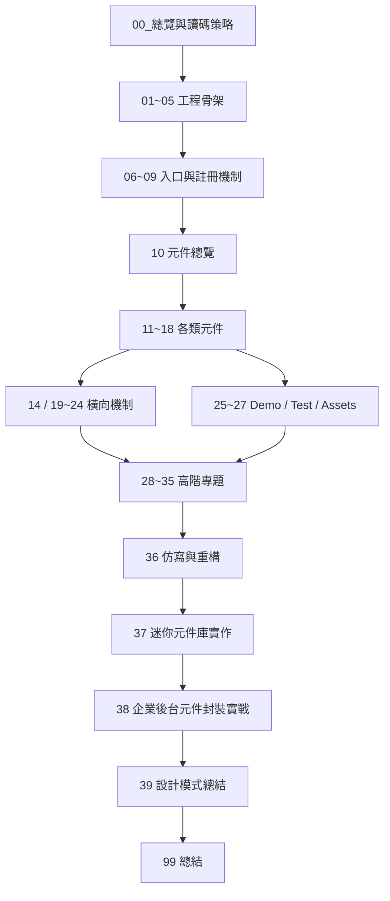

# 00-08_章節依賴關係與閱讀順序

> 版本：9.5 分版本  
> 適用對象：已具備 Vue 開發經驗，想透過 View UI Plus 系統性學習「Vue 3 元件庫設計、工程結構、元件 API、橫向機制、企業後台封裝」的人。  
> 筆記定位：這不是單純的目錄說明，而是整套 View UI Plus 讀碼筆記的「依賴地圖」與「閱讀調度表」。

---

## 1. 這篇筆記解決什麼問題？

你目前的 View UI Plus 筆記目錄已經很完整，但完整目錄有一個風險：

> 章節很多，容易每一章都想讀，最後變成「順序正確但吸收效率不高」。

這篇筆記的目的，就是幫你回答以下問題：

1. 哪些章節必須先讀？
2. 哪些章節可以晚一點讀？
3. 哪些章節適合並行閱讀？
4. 哪些章節不適合一開始就深挖？
5. 讀到某個元件卡住時，應該回頭補哪一章？
6. 要如何把 `01 ~ 39` 串成一條能產出能力的路線，而不是零散筆記？

---

## 2. 本篇的核心結論

View UI Plus 的讀碼順序，不應該只是照資料夾名稱從 `01` 讀到 `39`。

更合理的方式是：

```txt
先建立專案地圖
再理解元件庫入口
再挑核心元件深入
再回頭整理橫向機制
最後抽象成設計模式與企業封裝能力
```

也就是：

```txt
工程骨架
  ↓
入口與安裝
  ↓
元件分類
  ↓
核心元件
  ↓
橫向機制
  ↓
高階專題
  ↓
仿寫與企業後台封裝
```

---

## 3. View UI Plus 讀碼的六層依賴模型

讀一套 UI 元件庫時，可以把知識分成六層：

```txt
第 1 層：工程層
第 2 層：入口層
第 3 層：元件層
第 4 層：橫向機制層
第 5 層：設計抽象層
第 6 層：實戰轉化層
```

### 3.1 第 1 層：工程層

對應章節：

```txt
01_專案啟動與版本選擇
02_根目錄與工程設定
03_package與依賴分析
04_build_打包腳本與建置流程
05_dist_打包產物分析
```

這一層要回答：

```txt
這個元件庫如何啟動？
它如何被開發？
它如何被打包？
它如何被發佈？
使用者最後拿到什麼產物？
```

如果你不理解工程層，後面看到 `src`、`dist`、`types`、`examples`、`build` 時，很容易不知道它們之間的關係。

---

### 3.2 第 2 層：入口層

對應章節：

```txt
06_src_入口與插件機制
07_元件註冊機制
08_全域配置與globalProperties
09_元件庫整體設計模式
```

這一層要回答：

```txt
app.use(ViewUIPlus) 發生了什麼？
元件如何被註冊？
全域設定如何生效？
命令式 API 如何掛到全域？
元件庫對外暴露的入口長什麼樣？
```

這一層是 View UI Plus 的「總開關」。

---

### 3.3 第 3 層：元件層

對應章節：

```txt
10_src-components_元件總覽
11_基礎通用元件
12_布局與容器元件
13_表單與輸入元件
15_資料展示與資料操作元件
16_導航元件
17_回饋_彈層_命令式元件
18_業務型與增強型元件
```

這一層要回答：

```txt
一個元件如何被設計？
元件 API 怎麼規劃？
props / emits / slots / v-model 怎麼設計？
元件內部狀態如何管理？
元件與元件之間如何協作？
```

這是你學元件庫最主要的部分。

---

### 3.4 第 4 層：橫向機制層

對應章節：

```txt
14_表單驗證系統專題
19_src-directives_自訂指令
20_src-utils_工具函式
21_src-mixins_混入與共用邏輯
22_src-locale_國際化
23_src-styles_樣式系統
24_types_型別宣告
25_examples_範例與Demo
26_test_測試
27_assets_靜態資源
```

這一層不是看單一元件，而是看「跨元件共用系統」。

例如：

```txt
表單驗證不是只屬於 Input
prefixCls 不是只屬於 Button
locale 不是只屬於 DatePicker
utils 不是只屬於某一個元件
types 不是只為單一 API 存在
```

橫向機制是元件庫真正成熟的地方。

---

### 3.5 第 5 層：設計抽象層

對應章節：

```txt
28_高階專題_元件API設計
29_高階專題_受控與非受控狀態
30_高階專題_彈層與定位系統
31_高階專題_命令式API設計
32_高階專題_表單架構設計
33_高階專題_樣式主題與PrefixCls
34_高階專題_Mixin與CompositionAPI重構
35_高階專題_測試反推元件規格
```

這一層要回答：

```txt
View UI Plus 為什麼這樣設計？
如果我自己寫一套元件庫，能不能採用相同思路？
哪些地方可以保留？
哪些地方可以用 Vue 3 Composition API 重構？
```

這一層會把你從「看懂源碼」推進到「能自己設計」。

---

### 3.6 第 6 層：實戰轉化層

對應章節：

```txt
36_仿寫與重構
37_迷你元件庫實作
38_企業後台元件封裝實戰
39_ViewUIPlus設計模式總結
99_總結
```

這一層要回答：

```txt
讀完之後，我能做出什麼？
我能不能寫自己的 Mini UI Library？
我能不能把這套思路用在企業後台？
我能不能將開源設計轉成自己的工程能力？
```

---

## 4. 整體依賴關係圖

以下是整套筆記的高層依賴關係：



### 4.1 這張圖的重點

你不要把 `14_表單驗證系統專題` 看成單純排在 `13` 後面。

它實際上依賴：

```txt
13_表單與輸入元件
20_src-utils_工具函式
21_src-mixins_混入與共用邏輯
24_types_型別宣告
25_examples_範例與Demo
26_test_測試
```

也就是說，`14` 可以先粗讀，但不應該一開始就深挖到底。

---

## 5. 推薦閱讀順序總表

### 5.1 第一輪：建立全局地圖

第一輪不追求細節，只追求知道每個區塊在做什麼。

```txt
00 → 01 → 02 → 03 → 04 → 05 → 06 → 07 → 08 → 09 → 10
```

第一輪完成後，你應該知道：

```txt
1. 專案怎麼啟動
2. 根目錄大致怎麼分工
3. package.json 的核心 scripts 是什麼
4. build 與 dist 的關係是什麼
5. src 是源碼核心
6. examples 是使用範例
7. test 可以反推元件規格
8. types 是對外型別宣告
9. 元件庫如何 install
10. 元件大致怎麼分類
```

---

### 5.2 第二輪：先讀 5 個核心元件

第二輪不要一口氣讀所有元件，先挑最有代表性的元件。

建議順序：

```txt
Button
  ↓
Input
  ↓
Form / FormItem
  ↓
Modal
  ↓
Table
```

對應章節：

```txt
11_基礎通用元件
13_表單與輸入元件
14_表單驗證系統專題
15_資料展示與資料操作元件
17_回饋_彈層_命令式元件
```

為什麼先讀這些？

| 元件 | 學習價值 |
|---|---|
| Button | 最適合理解基礎 props、class、slot、事件 |
| Input | 適合理解 v-model、受控狀態、表單接入 |
| Form / FormItem | 適合理解父子協作、校驗、provide/inject 或混入邏輯 |
| Modal | 適合理解彈層、顯示狀態、命令式使用 |
| Table | 適合理解資料驅動、欄位配置、複雜元件 API |

---

### 5.3 第三輪：補橫向機制

讀完幾個核心元件後，你會開始看到很多共用邏輯。

這時再回頭讀：

```txt
19_src-directives_自訂指令
20_src-utils_工具函式
21_src-mixins_混入與共用邏輯
22_src-locale_國際化
23_src-styles_樣式系統
24_types_型別宣告
```

這個時候讀橫向機制會比較有效，因為你已經看過它們在哪些元件裡被使用。

---

### 5.4 第四輪：用 examples 和 test 反推規格

接著讀：

```txt
25_examples_範例與Demo
26_test_測試
```

這一輪的重點不是看展示效果，而是反推：

```txt
1. 使用者最常怎麼用元件？
2. 元件支援哪些邊界情境？
3. 哪些 API 是核心 API？
4. 哪些 API 是兼容舊用法？
5. 測試如何描述元件規格？
```

---

### 5.5 第五輪：進入高階專題

最後才進入：

```txt
28_高階專題_元件API設計
29_高階專題_受控與非受控狀態
30_高階專題_彈層與定位系統
31_高階專題_命令式API設計
32_高階專題_表單架構設計
33_高階專題_樣式主題與PrefixCls
34_高階專題_Mixin與CompositionAPI重構
35_高階專題_測試反推元件規格
```

這些章節不是給初讀用的，而是給你「整理設計模型」用的。

---

### 5.6 第六輪：仿寫與企業後台封裝

最後進入：

```txt
36_仿寫與重構
37_迷你元件庫實作
38_企業後台元件封裝實戰
39_ViewUIPlus設計模式總結
99_總結
```

這一輪的核心是：

```txt
把讀碼轉成可展示、可複用、可面試說明的作品。
```

---

## 6. 章節依賴總表

> 說明：  
> 「前置章節」代表建議先具備的基礎。  
> 「閱讀方式」分為粗讀、精讀、回頭補讀、專題整合。  
> 「完成標準」代表這章讀完後，你至少要能說出什麼。

| 章節 | 前置章節 | 閱讀方式 | 完成標準 |
|---|---|---|---|
| 00_總覽與讀碼策略 | 無 | 精讀 | 能說明整套筆記的學習目的、讀碼策略與產出方向 |
| 01_專案啟動與版本選擇 | 00 | 精讀 | 能選定版本、啟動專案、理解為什麼固定版本很重要 |
| 02_根目錄與工程設定 | 01 | 精讀 | 能說明根目錄下各資料夾與設定檔大致用途 |
| 03_package與依賴分析 | 02 | 精讀 | 能說明核心依賴、devDependencies、scripts 的用途 |
| 04_build_打包腳本與建置流程 | 03 | 精讀 | 能說明打包流程如何把 src 轉成 dist |
| 05_dist_打包產物分析 | 04 | 粗讀後回頭補讀 | 能分辨原始碼與發佈產物的差異 |
| 06_src_入口與插件機制 | 02、03 | 精讀 | 能說明元件庫入口與 app.use 的關係 |
| 07_元件註冊機制 | 06 | 精讀 | 能說明單一元件與整包元件如何被 install |
| 08_全域配置與globalProperties | 06、07 | 精讀 | 能說明全域配置、全域方法、全域屬性如何生效 |
| 09_元件庫整體設計模式 | 06、07、08 | 回頭整理 | 能抽象出元件庫入口層的設計模式 |
| 10_src-components_元件總覽 | 06、07 | 精讀 | 能整理所有元件分類與優先閱讀順序 |
| 11_基礎通用元件 | 10、20、23 | 精讀 | 能以 Button / Icon 等元件說明基礎 API 設計 |
| 12_布局與容器元件 | 10、23 | 粗讀 | 能說明 Layout / Grid / Card 這類元件如何服務頁面結構 |
| 13_表單與輸入元件 | 10、11、20、21、23 | 精讀 | 能說明 Input / Select / Checkbox / Radio 等元件的狀態與事件模型 |
| 14_表單驗證系統專題 | 13、20、21、24、25、26 | 專題精讀 | 能說明 Form / FormItem / 輸入元件如何協作完成驗證 |
| 15_資料展示與資料操作元件 | 10、13、20、23、24 | 精讀 | 能以 Table 為核心說明資料驅動型元件設計 |
| 16_導航元件 | 10、20、21、23 | 粗讀到精讀 | 能說明 Menu / Tabs / Breadcrumb 等元件如何管理選中狀態 |
| 17_回饋_彈層_命令式元件 | 10、20、21、23、08 | 精讀 | 能說明 Modal / Message / Notice 等元件的顯示與命令式使用 |
| 18_業務型與增強型元件 | 13、15、17 | 粗讀 | 能分辨基礎元件與偏業務增強型元件的差異 |
| 19_src-directives_自訂指令 | 06、20、23 | 回頭補讀 | 能說明指令如何封裝 DOM 行為 |
| 20_src-utils_工具函式 | 06、10 | 穿插閱讀 | 能知道工具函式在哪些元件被共用 |
| 21_src-mixins_混入與共用邏輯 | 10、11、13、17 | 穿插閱讀 | 能說明 mixin 如何抽取跨元件共用行為 |
| 22_src-locale_國際化 | 06、08、20、13、15 | 回頭補讀 | 能說明 locale 如何影響元件文字、格式與使用者介面 |
| 23_src-styles_樣式系統 | 02、03、10 | 穿插閱讀 | 能說明 class、prefixCls、樣式變數與元件樣式的關係 |
| 24_types_型別宣告 | 03、06、10、11、13、17 | 回頭補讀 | 能說明型別宣告如何對應元件公開 API |
| 25_examples_範例與Demo | 10、11、13、15、17 | 穿插閱讀 | 能從 Demo 反推元件使用情境 |
| 26_test_測試 | 11、13、15、17、25 | 回頭精讀 | 能從測試反推元件規格與邊界條件 |
| 27_assets_靜態資源 | 02、23、25 | 粗讀 | 能理解靜態資源在文件、Demo、樣式中的角色 |
| 28_高階專題_元件API設計 | 11、13、15、17、24、25 | 專題整合 | 能總結 props / emits / slots / v-model 的 API 設計規律 |
| 29_高階專題_受控與非受控狀態 | 13、15、17、28 | 專題整合 | 能說明 value / modelValue / visible / current 等狀態控制模式 |
| 30_高階專題_彈層與定位系統 | 17、20、21、23 | 專題整合 | 能說明彈層顯示、掛載、定位、層級、關閉機制 |
| 31_高階專題_命令式API設計 | 08、17、30 | 專題整合 | 能說明 Message / Notice / Modal.confirm 這類 API 如何設計 |
| 32_高階專題_表單架構設計 | 13、14、20、21、24 | 專題整合 | 能說明表單系統的資料流、驗證流、父子協作 |
| 33_高階專題_樣式主題與PrefixCls | 08、20、23 | 專題整合 | 能說明 prefixCls、樣式命名、主題擴展的設計 |
| 34_高階專題_Mixin與CompositionAPI重構 | 21、11、13、17 | 專題整合 | 能判斷哪些 mixin 可以轉為 composable |
| 35_高階專題_測試反推元件規格 | 26、28、29 | 專題整合 | 能把測試案例轉為元件規格文件 |
| 36_仿寫與重構 | 11、13、17、28、29、33 | 實作 | 能仿寫 3~5 個核心元件的最小版本 |
| 37_迷你元件庫實作 | 06、07、11、13、17、23、24、36 | 實作 | 能做出可安裝、可引入、可展示的 Mini UI Library |
| 38_企業後台元件封裝實戰 | 13、15、17、28、29、32、33、37 | 實作 | 能封裝 SearchForm、CrudTable、DialogForm 等後台常用元件 |
| 39_ViewUIPlus設計模式總結 | 28~38 | 總結 | 能總結 View UI Plus 中可遷移到自己專案的設計模式 |
| 99_總結 | 39 | 總結 | 能回顧學習成果、建立長期複習與擴展方向 |

---

## 7. 章節之間的關鍵依賴說明

### 7.1 `06_src_入口與插件機制` 是後面很多章節的根

很多章節其實都依賴 `06`。

例如：

```txt
07_元件註冊機制
08_全域配置與globalProperties
09_元件庫整體設計模式
22_src-locale_國際化
31_高階專題_命令式API設計
37_迷你元件庫實作
```

原因是：

```txt
你要先知道元件庫如何對外暴露，
才知道單一元件、全域方法、全域配置要怎麼接出去。
```

---

### 7.2 `20_src-utils_工具函式` 不適合一次讀完

`20_src-utils_工具函式` 很重要，但不建議一開始全部讀完。

更好的方式是：

```txt
第一次：粗讀工具函式分類
第二次：讀 Button / Input / Form 時回頭查
第三次：讀 Modal / Message / Table 時再回頭查
第四次：高階專題時整理工具函式設計模式
```

因為工具函式脫離使用場景時，很容易變成單純看語法。

---

### 7.3 `21_src-mixins_混入與共用邏輯` 要搭配元件讀

Mixin 的價值不在於它本身，而在於：

```txt
哪些元件共用了它？
它抽出了什麼共同問題？
它如果改成 Composition API，應該怎麼改？
```

所以 `21` 最好搭配：

```txt
11_基礎通用元件
13_表單與輸入元件
16_導航元件
17_回饋_彈層_命令式元件
34_高階專題_Mixin與CompositionAPI重構
```

---

### 7.4 `14_表單驗證系統專題` 不應太早深挖

表單驗證是整套元件庫中最值得學的專題之一，但它依賴很多前置概念。

建議順序：

```txt
先讀 Input / Select / Checkbox / Radio
再讀 Form / FormItem
再看 FormItem 如何與子元件互動
再看 rule / validator / trigger
再看 examples
再看 test
最後整理成 32_高階專題_表單架構設計
```

如果你一開始就從 Form 驗證切入，很容易只看到一堆條件判斷，卻看不到架構。

---

### 7.5 `17_回饋_彈層_命令式元件` 是理解高階專題的關鍵

`17` 後面會支撐：

```txt
30_高階專題_彈層與定位系統
31_高階專題_命令式API設計
36_仿寫與重構
37_迷你元件庫實作
38_企業後台元件封裝實戰
```

因為企業後台常見的封裝大量依賴：

```txt
DialogForm
ConfirmDelete
Message feedback
Loading overlay
Drawer detail
Modal workflow
```

如果你想強化「與使用者互動」的前端能力，`17` 是高價值章節。

---

### 7.6 `23_src-styles_樣式系統` 要穿插所有元件閱讀

樣式系統不要等到最後才讀。

建議每讀一個元件，都至少回答：

```txt
1. 它的 prefixCls 是什麼？
2. 它的 class 如何組合？
3. 狀態 class 如何切換？
4. size / type / disabled / active 如何影響 class？
5. 樣式檔與元件檔如何對應？
```

最後再集中整理：

```txt
33_高階專題_樣式主題與PrefixCls
```

---

### 7.7 `24_types_型別宣告` 適合在 API 穩定後回頭讀

型別宣告不是一開始就讀最有效。

建議順序：

```txt
先看元件使用方式
再看 props / emits / slots
再看元件對外暴露 API
最後看 types 如何描述這些 API
```

如果直接從 `.d.ts` 或型別檔切入，容易知道型別名字，卻不知道它背後的設計意義。

---

### 7.8 `25_examples_範例與Demo` 應該前後讀兩次

第一次讀：

```txt
讀元件前，先看 examples，知道使用者怎麼用。
```

第二次讀：

```txt
讀完元件後，再回 examples，驗證自己是否理解 API。
```

Demo 不是附屬品，而是源碼閱讀的入口之一。

---

### 7.9 `26_test_測試` 適合用來反推元件規格

測試不是只看通過或失敗。

你要用它反推：

```txt
1. 這個元件保證哪些行為？
2. 哪些 props 是核心？
3. 哪些事件一定要觸發？
4. 哪些邊界條件被考慮？
5. 哪些使用情境是作者認為重要的？
```

最後可以整理成：

```txt
35_高階專題_測試反推元件規格
```

---

## 8. 三種閱讀路線

你可以依照時間和目標選擇不同路線。

---

### 8.1 路線 A：最小核心路線

適合時間有限，只想快速抓住 View UI Plus 元件庫核心設計。

```txt
00
01
02
03
06
07
08
10
11_Button
13_Input
13_Form/FormItem
17_Modal/Message
20
23
24
28
29
31
32
36
37
```

這條路線的目標：

```txt
能做出自己的 Mini Button / Mini Input / Mini Form / Mini Modal / Mini Message。
```

---

### 8.2 路線 B：企業後台封裝路線

適合你的目標：把 View UI Plus 的設計轉成企業後台元件封裝能力。

```txt
00
01~10
11_Button
13_Input / Select / Form / FormItem
14_表單驗證
15_Table
17_Modal / Message / Drawer
20_utils
21_mixins
23_styles
24_types
25_examples
28_API設計
29_受控與非受控狀態
32_表單架構
33_樣式主題與PrefixCls
36_仿寫
38_企業後台元件封裝實戰
39_設計模式總結
```

這條路線的目標：

```txt
能封裝企業後台常見元件：
- SearchForm
- QueryFilter
- CrudTable
- DialogForm
- DictSelect
- PermissionButton
- ConfirmAction
```

---

### 8.3 路線 C：完整元件庫架構路線

適合想完整理解 View UI Plus 的工程、元件、樣式、型別、測試與專題。

```txt
00
01~09
10~18
19~27
28~35
36~39
99
```

這條路線最完整，但時間成本最高。

---

## 9. 不同章節的閱讀深度建議

不是每一章都要讀到一樣深。

| 章節類型 | 閱讀深度 | 原因 |
|---|---:|---|
| 工程啟動與版本 | 80% | 要能穩定跑專案，但不必深入每個打包細節 |
| package 與 build | 70% | 要理解流程，不必背所有配置 |
| 入口與註冊 | 95% | 這是元件庫架構核心 |
| 全域配置 | 90% | 會影響多個高階專題 |
| 元件總覽 | 85% | 要建立分類地圖 |
| Button / Input / Form / Modal / Table | 95% | 最有學習價值 |
| 其他一般元件 | 60% ~ 80% | 視企業後台常用程度調整 |
| utils / mixins | 70% 起，遇到再補 | 脫離元件場景會很抽象 |
| styles / prefixCls | 85% | 對元件庫封裝能力很重要 |
| types | 75% | 先理解 API，再看型別更有效 |
| examples / test | 80% | 可以反推元件規格 |
| 高階專題 | 90% | 這是將源碼轉成架構能力的關鍵 |
| 仿寫與企業封裝 | 95% | 這是最終產出 |

---

## 10. 高價值章節優先級

如果你時間有限，這些章節優先讀。

### 10.1 第一優先

```txt
06_src_入口與插件機制
07_元件註冊機制
08_全域配置與globalProperties
10_src-components_元件總覽
11_基礎通用元件
13_表單與輸入元件
14_表單驗證系統專題
17_回饋_彈層_命令式元件
20_src-utils_工具函式
23_src-styles_樣式系統
28_高階專題_元件API設計
29_高階專題_受控與非受控狀態
31_高階專題_命令式API設計
32_高階專題_表單架構設計
38_企業後台元件封裝實戰
```

這些章節最能轉化成你的前端工程能力。

---

### 10.2 第二優先

```txt
03_package與依賴分析
04_build_打包腳本與建置流程
15_資料展示與資料操作元件
16_導航元件
21_src-mixins_混入與共用邏輯
22_src-locale_國際化
24_types_型別宣告
25_examples_範例與Demo
26_test_測試
30_高階專題_彈層與定位系統
33_高階專題_樣式主題與PrefixCls
34_高階專題_Mixin與CompositionAPI重構
35_高階專題_測試反推元件規格
37_迷你元件庫實作
39_ViewUIPlus設計模式總結
```

這些章節用來補完整度與深度。

---

### 10.3 第三優先

```txt
05_dist_打包產物分析
12_布局與容器元件
18_業務型與增強型元件
19_src-directives_自訂指令
27_assets_靜態資源
```

這些章節可以視情況補讀，不一定要一開始投入大量時間。

---

## 11. 建議的第一批精讀元件

如果你不知道從哪個元件開始，建議照這個順序：

```txt
Button
Input
Form
FormItem
Select
Modal
Message
Table
Tabs
Upload
```

### 11.1 為什麼是這十個？

| 元件 | 主要學習價值 |
|---|---|
| Button | 基礎 props、slot、class、事件 |
| Input | v-model、受控輸入、focus/blur/change |
| Form | 表單資料流、驗證入口 |
| FormItem | 父子協作、錯誤狀態、label、rule |
| Select | 複雜輸入、選項管理、彈層 |
| Modal | 彈層狀態、slot、footer、確認取消 |
| Message | 命令式 API、動態掛載、回饋提示 |
| Table | 複雜資料展示、columns 配置、slot 擴展 |
| Tabs | 選中狀態、面板切換、父子協作 |
| Upload | 檔案流程、事件設計、企業場景常用 |

這十個元件讀完，你會接觸到大部分 UI 元件庫核心設計問題。

---

## 12. 遇到卡住時的回查地圖

### 12.1 看不懂元件怎麼被使用

回查：

```txt
25_examples_範例與Demo
00-06_單一元件讀碼模板
28_高階專題_元件API設計
```

---

### 12.2 看不懂元件怎麼被註冊

回查：

```txt
06_src_入口與插件機制
07_元件註冊機制
03_package與依賴分析
```

---

### 12.3 看不懂全域設定

回查：

```txt
08_全域配置與globalProperties
22_src-locale_國際化
33_高階專題_樣式主題與PrefixCls
```

---

### 12.4 看不懂 props / emits / slots

回查：

```txt
00-06_單一元件讀碼模板
28_高階專題_元件API設計
24_types_型別宣告
25_examples_範例與Demo
```

---

### 12.5 看不懂 v-model 或狀態同步

回查：

```txt
13_表單與輸入元件
29_高階專題_受控與非受控狀態
14_表單驗證系統專題
```

---

### 12.6 看不懂 Form 驗證

回查：

```txt
13_表單與輸入元件
14_表單驗證系統專題
20_src-utils_工具函式
21_src-mixins_混入與共用邏輯
24_types_型別宣告
32_高階專題_表單架構設計
```

---

### 12.7 看不懂彈層或定位

回查：

```txt
17_回饋_彈層_命令式元件
20_src-utils_工具函式
23_src-styles_樣式系統
30_高階專題_彈層與定位系統
```

---

### 12.8 看不懂命令式 API

回查：

```txt
08_全域配置與globalProperties
17_回饋_彈層_命令式元件
30_高階專題_彈層與定位系統
31_高階專題_命令式API設計
```

---

### 12.9 看不懂樣式命名

回查：

```txt
23_src-styles_樣式系統
33_高階專題_樣式主題與PrefixCls
08_全域配置與globalProperties
```

---

### 12.10 看不懂型別

回查：

```txt
24_types_型別宣告
28_高階專題_元件API設計
00-06_單一元件讀碼模板
```

---

## 13. 每一階段的完成標準

### 13.1 工程骨架階段完成標準

完成章節：

```txt
01 ~ 05
```

你應該能回答：

```txt
1. 我使用的是哪個 View UI Plus 版本？
2. 專案如何啟動？
3. package.json 中有哪些關鍵 scripts？
4. build 目錄負責什麼？
5. dist 目錄是怎麼來的？
6. examples 和 src 是什麼關係？
7. types 目錄對使用者有什麼價值？
```

---

### 13.2 入口與註冊階段完成標準

完成章節：

```txt
06 ~ 09
```

你應該能回答：

```txt
1. View UI Plus 對外入口在哪裡？
2. app.use(ViewUIPlus) 會做哪些事？
3. 單一元件如何支援 app.use(Button)？
4. 全量引入和按需引入的差異是什麼？
5. globalProperties 用來掛哪些能力？
6. 全域配置如何影響元件？
7. 這套入口設計如果自己仿寫，最小版本怎麼做？
```

---

### 13.3 元件閱讀階段完成標準

完成章節：

```txt
10 ~ 18
```

你應該能回答：

```txt
1. View UI Plus 的元件可以分成哪些類型？
2. 基礎元件與複合元件差在哪？
3. 表單元件的 v-model 如何設計？
4. Table 這類資料展示元件如何設計 API？
5. Modal / Message 這類元件和 Button / Input 有什麼不同？
6. 哪些元件最適合拿來仿寫？
```

---

### 13.4 橫向機制階段完成標準

完成章節：

```txt
14、19 ~ 27
```

你應該能回答：

```txt
1. 表單驗證如何跨 Form / FormItem / Input 協作？
2. 自訂指令解決了哪些 DOM 行為？
3. utils 如何降低元件重複邏輯？
4. mixins 抽出了哪些共用能力？
5. locale 如何讓元件支援國際化？
6. styles 和 prefixCls 如何讓元件樣式可控？
7. types 如何約束元件 API？
8. examples 和 test 如何反推元件規格？
```

---

### 13.5 高階專題階段完成標準

完成章節：

```txt
28 ~ 35
```

你應該能回答：

```txt
1. 如何設計一個 Vue 元件的 props API？
2. 什麼是受控與非受控狀態？
3. 彈層元件的核心問題有哪些？
4. 命令式 API 和聲明式元件 API 差在哪？
5. 表單架構如何設計才可擴展？
6. prefixCls 與主題設計如何服務大型元件庫？
7. mixin 如何重構成 Composition API？
8. 如何從 test 反推元件規格？
```

---

### 13.6 實戰轉化階段完成標準

完成章節：

```txt
36 ~ 39、99
```

你應該能產出：

```txt
1. Mini Button
2. Mini Input
3. Mini Form / Mini FormItem
4. Mini Modal
5. Mini Message
6. Mini UI Library install 機制
7. 企業後台 SearchForm
8. 企業後台 CrudTable
9. 企業後台 DialogForm
10. View UI Plus 設計模式總結筆記
```

---

## 14. 章節之間的並行關係

有些章節可以並行，不需要完全線性。

### 14.1 可以並行的章節組合

```txt
02_根目錄與工程設定
03_package與依賴分析
04_build_打包腳本與建置流程
```

這三章可以一起看，因為它們都屬於工程骨架。

---

```txt
11_基礎通用元件
23_src-styles_樣式系統
24_types_型別宣告
25_examples_範例與Demo
```

讀 Button 時，可以同時看：

```txt
Button 源碼
Button 樣式
Button 型別
Button Demo
```

這樣比單獨讀源碼更有效。

---

```txt
13_表單與輸入元件
14_表單驗證系統專題
32_高階專題_表單架構設計
```

這三章可以分三輪並行：

```txt
第一輪：看 Input / Form / FormItem 的基本用法
第二輪：看驗證如何串起來
第三輪：整理成表單架構設計
```

---

```txt
17_回饋_彈層_命令式元件
30_高階專題_彈層與定位系統
31_高階專題_命令式API設計
```

這三章適合一起做專題。

---

### 14.2 不建議並行的章節組合

不建議一開始同時讀：

```txt
04_build_打包腳本與建置流程
30_高階專題_彈層與定位系統
32_高階專題_表單架構設計
```

原因：

```txt
它們屬於不同層次。
一個是工程打包，一個是彈層行為，一個是表單架構。
同時讀會讓認知負荷太高。
```

---

## 15. 哪些章節不適合太早讀？

### 15.1 `30_高階專題_彈層與定位系統`

不要一開始就讀。

先讀：

```txt
Modal
Message
Notice
Tooltip
Popover
Dropdown
```

再整理彈層專題。

---

### 15.2 `31_高階專題_命令式API設計`

不要在還沒讀 `17` 前就讀。

否則你會只看到：

```txt
函式呼叫
動態建立
掛載
銷毀
```

但看不到它為什麼要這樣設計。

---

### 15.3 `32_高階專題_表單架構設計`

不要在還沒讀 Form / FormItem / Input 前就讀。

否則你會缺少具體場景。

---

### 15.4 `34_高階專題_Mixin與CompositionAPI重構`

不要在沒讀 mixin 原始用法前就開始重構。

重構前要先知道：

```txt
1. 原本 mixin 解決什麼問題？
2. 哪些元件使用它？
3. 它的資料來源是什麼？
4. 它的副作用在哪裡？
5. 轉成 composable 後 API 是否更清楚？
```

---

## 16. 建議的學習節奏

### 16.1 四週速讀版本

適合快速建立架構感。

```txt
第 1 週：
00 ~ 10
重點：工程骨架、入口、註冊、全域配置

第 2 週：
11、13、17
重點：Button、Input、Form、Modal、Message

第 3 週：
14、20、21、23、24、25、26
重點：橫向機制、樣式、型別、Demo、Test

第 4 週：
28、29、31、32、36、37、38
重點：高階設計、仿寫、企業後台封裝
```

---

### 16.2 八週完整版本

適合邊讀邊做筆記與仿寫。

```txt
第 1 週：
01、02、03
產出：專案啟動筆記、根目錄地圖、依賴分析

第 2 週：
04、05、06、07、08、09
產出：install 流程圖、元件註冊流程圖、全域配置筆記

第 3 週：
10、11、12
產出：元件分類表、Button / Icon / Layout 筆記

第 4 週：
13、14
產出：Input / Select / Form / FormItem 筆記、表單驗證流程圖

第 5 週：
15、16、17、18
產出：Table、Tabs、Modal、Message 筆記

第 6 週：
19、20、21、22、23、24
產出：directives、utils、mixins、locale、styles、types 橫向機制筆記

第 7 週：
25、26、28、29、30、31、32、33、34、35
產出：Demo/Test 反推筆記與高階專題總結

第 8 週：
36、37、38、39、99
產出：Mini UI Library、企業後台元件封裝、設計模式總結
```

---

## 17. 每次開始新章節前的檢查問題

進入任何一章前，先問自己：

```txt
1. 這一章屬於哪一層？
2. 它依賴哪些前置章節？
3. 我現在是要粗讀、精讀，還是回頭補讀？
4. 這章最後要產出什麼？
5. 這章和企業後台封裝有什麼關係？
```

範例：

```txt
我要讀 17_回饋_彈層_命令式元件。

它屬於：
元件層 + 高互動元件層。

前置章節：
06、07、08、10、20、23。

閱讀方式：
精讀 Modal / Message，其他彈層元件粗讀。

最後產出：
Modal 筆記、Message 筆記、命令式 API 問題清單、Mini Message 仿寫計畫。

企業後台關係：
DialogForm、ConfirmDelete、Toast feedback、Drawer detail 都會用到。
```

---

## 18. 每章完成後的輸出格式

每完成一章，至少產出以下內容：

```txt
1. 本章解決什麼問題？
2. 本章依賴哪些前置知識？
3. 本章涉及哪些源碼位置？
4. 本章核心流程是什麼？
5. 本章與其他章節的關係是什麼？
6. 本章可以轉化成什麼仿寫成果？
7. 本章對企業後台封裝有什麼價值？
8. 本章還有哪些待追蹤問題？
```

這樣你後續用 AI 查詢時，筆記會更容易被檢索和串聯。

---

## 19. 依賴閱讀的常見錯誤

### 19.1 錯誤一：一開始就讀最複雜元件

例如一開始就讀 Table、Form、DatePicker。

問題是：

```txt
這些元件涉及太多橫向機制。
你會同時碰到 props、slots、state、utils、styles、types、child components、events。
```

更好的方式：

```txt
先 Button
再 Input
再 Form
再 Modal
最後 Table
```

---

### 19.2 錯誤二：只看元件檔，不看 Demo

元件檔告訴你「它怎麼做」。

Demo 告訴你「它為什麼要這樣做」。

兩者要一起看。

---

### 19.3 錯誤三：只看實作，不整理 API 設計

讀元件庫不是為了記住程式碼，而是要抽象出：

```txt
1. API 設計模式
2. 狀態管理模式
3. 樣式命名模式
4. 事件設計模式
5. 組合模式
6. 企業封裝模式
```

---

### 19.4 錯誤四：把 utils 當成普通函式集合

UI 元件庫中的 utils 通常代表：

```txt
1. 跨元件共用規則
2. DOM 操作封裝
3. 型別判斷
4. 相容性處理
5. 樣式 class 組合
6. 事件與狀態工具
```

所以讀 utils 要問：

```txt
哪些元件依賴它？
它抽掉了什麼重複邏輯？
如果沒有這個 util，元件會變得多亂？
```

---

### 19.5 錯誤五：太早做 Composition API 重構

重構不是為了把 Options API 改成 Composition API。

重構的目標應該是：

```txt
讓邏輯邊界更清楚
讓共用邏輯更容易測試
讓元件依賴更明確
讓 API 更容易維護
```

所以要先讀懂原本設計，再談重構。

---

## 20. 推薦的章節標籤系統

為了讓筆記更容易回查，每篇筆記可以加標籤。

### 20.1 章節類型標籤

```txt
#工程層
#入口層
#元件層
#橫向機制
#高階專題
#仿寫
#企業後台
```

### 20.2 技術主題標籤

```txt
#props
#emits
#slots
#v-model
#provide-inject
#globalProperties
#prefixCls
#form-validation
#command-api
#popup
#typescript
#test
#demo
```

### 20.3 元件分類標籤

```txt
#基礎元件
#表單元件
#資料展示
#導航元件
#彈層元件
#命令式元件
#業務型元件
```

---

## 21. 最終閱讀策略總結

這份目錄最好的使用方式不是「從 01 讀到 99 就結束」。

而是：

```txt
第一輪：建立地圖
第二輪：挑核心元件精讀
第三輪：回頭整理橫向機制
第四輪：抽象高階專題
第五輪：仿寫與封裝
第六輪：總結成自己的設計模式
```

你的最終目標不是成為 View UI Plus 使用者，而是透過 View UI Plus 學會：

```txt
1. 如何設計 Vue 3 元件
2. 如何設計企業級元件 API
3. 如何組織元件庫工程
4. 如何抽取共用邏輯
5. 如何處理樣式與主題
6. 如何設計表單架構
7. 如何設計命令式 API
8. 如何把開源設計轉成自己的企業後台封裝能力
```

---

## 22. 本篇筆記的 9.5 分完成標準

如果這篇筆記發揮作用，你應該能做到：

```txt
1. 打開任一章節前，知道它依賴哪些前置章節
2. 讀到卡住時，知道該回查哪一章
3. 能判斷哪些章節要精讀，哪些章節可以粗讀
4. 能安排四週或八週的讀碼計畫
5. 能避免一開始就陷入 Form、Table、Modal 這類複雜元件
6. 能把讀碼順序和企業後台封裝目標連起來
7. 能把 View UI Plus 的讀碼成果轉成 Mini UI Library 或企業後台元件
```

---

## 23. 下一步建議

讀完這篇後，建議你接著建立：

```txt
00-09_元件分類與優先閱讀順序.md
```

那一篇可以更聚焦在：

```txt
1. View UI Plus 有哪些元件
2. 哪些元件最值得先讀
3. 哪些元件適合仿寫
4. 哪些元件適合做企業後台封裝
5. 不同元件背後對應哪些設計模式
```

`00-08` 負責「章節依賴」，`00-09` 負責「元件優先級」。

兩篇搭配起來，你的 View UI Plus 讀碼路線會更穩。

---

## 參考依據

- View UI Plus 官方 GitHub Repository：`https://github.com/view-design/ViewUIPlus`
- View UI Plus 官方文件入口：`https://www.iviewui.com`
- View UI Plus npm 套件：`https://www.npmjs.com/package/view-ui-plus`

> 注意：實際閱讀時，請以你本機 checkout 的 View UI Plus 版本為準。若 GitHub repo、npm package、官方文件之間存在版本差異，應該在 `01_專案啟動與版本選擇` 中固定版本，避免不同來源的源碼、文件與發佈產物互相混用。
