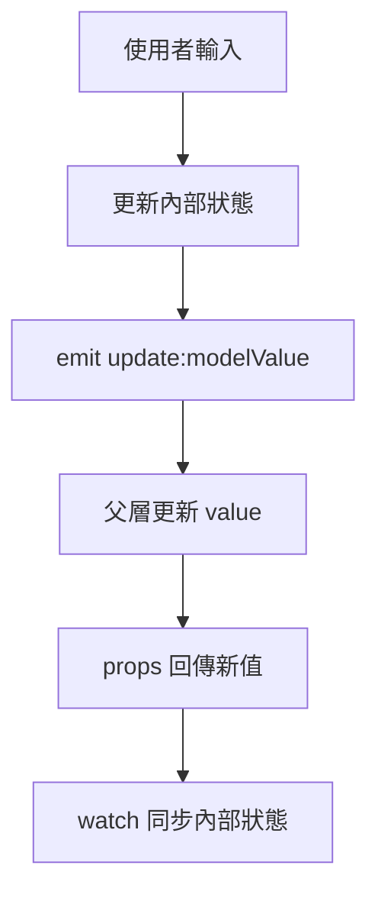
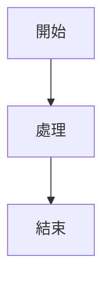

# 00-11_ViewUIPlus 筆記撰寫規範

> 筆記定位：這份文件不是一般的 Markdown 寫作規範，而是 View UI Plus 源碼閱讀筆記的「品質標準、格式標準、回查標準、AI 協作標準」。  
> 目標是讓我在閱讀 View UI Plus 的工程架構、元件源碼、橫向機制與高階專題時，能持續產出一致、可回查、可複習、可仿寫、可轉化成企業後台開發能力的筆記。

---

## 0. 這篇筆記要解決什麼問題？

學習 View UI Plus 這類成熟元件庫時，最常見的問題不是「完全看不懂」，而是：

1. 每篇筆記格式不一致，後面很難回查。
2. 筆記只是在翻譯源碼，沒有提煉設計思路。
3. 筆記只記錄「這段程式碼做了什麼」，沒有回答「為什麼這樣設計」。
4. 只記元件 API，沒有記元件背後的狀態流、事件流、協作關係。
5. 只讀單一檔案，沒有追蹤它和入口、utils、mixins、styles、types、test、examples 的關係。
6. 沒有記錄版本、源碼路徑、閱讀日期，之後很難確認筆記對應哪個版本。
7. 沒有留下「可仿寫點」，導致讀完源碼後很難轉化成自己的能力。
8. 沒有設計 AI 可回查格式，之後用 AI 找筆記時容易找不到精準內容。

所以這份規範的核心任務是：

```txt
把 View UI Plus 源碼閱讀筆記，從「零散心得」升級成「可長期維護的前端元件庫知識系統」。
```

---

## 1. 筆記總原則

### 1.1 每篇筆記都要回答三個問題

每篇筆記不管是工程設定、單一元件、橫向機制、高階專題，至少都要回答：

```txt
1. 這篇在解決什麼問題？
2. View UI Plus 是怎麼設計的？
3. 我可以怎麼把它轉成自己的能力？
```

如果一篇筆記只回答第一個問題，通常只是「使用筆記」。
如果能回答第二個問題，才算「源碼閱讀筆記」。
如果能回答第三個問題，才算「工程能力筆記」。

---

### 1.2 筆記不要只寫「程式碼做了什麼」

低品質寫法：

```txt
這裡定義了 props。
這裡 watch 了 value。
這裡 emit update:modelValue。
這裡使用 prefixCls 組 class。
```

高品質寫法：

```txt
這個元件把外部狀態與內部狀態分開處理：

1. 外部透過 value / modelValue 傳入受控狀態。
2. 內部使用 local state 處理暫存互動狀態。
3. 使用 emit 將變更通知父層。
4. 這種設計讓元件可以同時支援 v-model 與內部互動邏輯。

這類模式可以轉化到企業後台的 SearchForm、DialogForm、EditableTable 中。
```

筆記的重點不是「翻譯程式碼」，而是「抽出設計」。

---

### 1.3 每篇筆記都要有源碼追溯能力

閱讀 View UI Plus 時，每篇筆記都應該盡量記錄：

```txt
1. 對應版本
2. 對應 commit 或 tag
3. 對應源碼路徑
4. 對應文件或 Demo
5. 對應測試檔案
6. 對應相關章節
```

範例：

```txt
源碼版本：view-ui-plus 1.3.x
閱讀日期：2026-05-03
主要源碼：src/components/input/input.vue
相關源碼：src/components/input/index.js
相關樣式：src/styles/components/input.less
相關型別：types/input.d.ts
相關章節：13_表單與輸入元件、23_src-styles_樣式系統、24_types_型別宣告
```

不要只寫「我看了 Input 元件」，要能回到具體檔案。

---

### 1.4 筆記要服務於未來回查

每篇筆記都要假設：

```txt
三個月後的我，已經忘記這段源碼。
我需要靠這篇筆記快速回想：
這個元件的用途、API、流程、設計模式、可仿寫點。
```

因此筆記要避免：

1. 只寫當下自己才懂的縮寫。
2. 只貼一大段程式碼，沒有解釋。
3. 只寫心得，沒有結構。
4. 只寫結論，沒有源碼位置。
5. 只寫「之後再補」，但沒有列出待補問題。

---

### 1.5 筆記要服務於 AI 回查

因為目標是未來透過 AI 快速找回筆記，所以每篇筆記要做到：

1. 標題清楚。
2. 小標題語義明確。
3. 關鍵詞重複出現但不要堆砌。
4. 重要概念使用固定名稱。
5. 每篇筆記有摘要區。
6. 每篇筆記有「關鍵問題」區。
7. 每篇筆記有「可仿寫點」區。
8. 不要把多個不相關主題塞進同一篇。

AI 友善的筆記，不是寫給 AI 看，而是寫給「未來想用 AI 快速找資料的自己」看。

---

## 2. 檔案命名規範

### 2.1 章節資料夾命名

目前你的根目錄採用：

```txt
00_總覽與讀碼策略
01_專案啟動與版本選擇
02_根目錄與工程設定
...
39_ViewUIPlus設計模式總結
99_總結
```

這種命名很好，建議繼續維持：

```txt
兩位數編號_中文主題
```

優點：

1. 排序穩定。
2. 學習順序清楚。
3. AI 回查時容易定位。
4. 不會因為資料夾名稱太抽象而混淆。

---

### 2.2 單篇筆記命名

建議格式：

```txt
章節編號-筆記編號_主題名稱.md
```

範例：

```txt
00-11_筆記撰寫規範.md
13-01_Input元件總覽.md
13-02_Input的Props設計.md
13-03_Input的v-model與狀態同步.md
14-01_Form與FormItem協作總覽.md
17-01_Message命令式API總覽.md
23-01_prefixCls樣式命名機制.md
```

不建議：

```txt
Input.md
筆記.md
元件研究.md
源碼分析.md
今天看的東西.md
```

原因是這類名稱無法判斷所屬章節、主題範圍與閱讀順序。

---

### 2.3 元件筆記命名

單一元件建議使用：

```txt
章節編號-序號_元件名稱_主題.md
```

範例：

```txt
11-01_Button元件總覽.md
11-02_Button的Props與樣式類型.md
13-01_Input元件總覽.md
13-02_Input的v-model設計.md
13-03_Input的事件與表單協作.md
15-01_Table元件總覽.md
15-02_Table欄位配置與渲染流程.md
17-01_Modal元件總覽.md
17-02_Modal命令式API設計.md
```

如果某個元件很複雜，不要硬塞成一篇。

建議拆成：

```txt
元件總覽
API 設計
狀態流
事件流
樣式系統
與其他元件協作
仿寫版本
```

---

### 2.4 橫向機制筆記命名

橫向機制不是單一元件，而是跨多個元件的設計。

建議命名：

```txt
章節編號-序號_機制名稱_主題.md
```

範例：

```txt
07-01_元件註冊機制總覽.md
07-02_install方法與appuse流程.md
08-01_全域配置機制總覽.md
08-02_globalProperties掛載策略.md
14-01_Form驗證流程總覽.md
14-02_FormItem如何收集與校驗欄位.md
22-01_locale國際化機制總覽.md
23-01_prefixCls樣式命名機制.md
31-01_Message命令式API建立流程.md
```

橫向機制筆記要避免只看一個檔案，要追蹤一組相關檔案。

---

## 3. 每篇筆記的基本 Metadata

每篇筆記開頭建議固定放 metadata 區。

```md
# 筆記標題

> 筆記定位：這篇筆記用來說明什麼？  
> 閱讀目標：讀完後我應該能回答哪些問題？

---

## Metadata

| 項目 | 內容 |
|---|---|
| 所屬章節 | `13_表單與輸入元件` |
| 筆記類型 | 單一元件 / 橫向機制 / 工程設定 / 高階專題 / 仿寫實作 |
| 閱讀對象 | Input 元件 |
| 源碼版本 | view-ui-plus 1.3.x |
| 閱讀日期 | 2026-05-03 |
| 主要源碼 | `src/components/input/input.vue` |
| 相關源碼 | `src/components/input/index.js`、`src/styles/components/input.less` |
| 相關章節 | `14_表單驗證系統專題`、`23_src-styles_樣式系統` |
| 學習產出 | 能說明 Input 的 API、狀態同步、表單協作與仿寫方向 |
```

Metadata 的價值是：

1. 讓筆記可追溯。
2. 讓 AI 更容易檢索。
3. 讓自己知道這篇筆記的範圍。
4. 方便未來版本更新時檢查是否過期。

---

## 4. 標準筆記結構

建議每篇筆記都盡量使用以下結構。

```md
# 標題

> 筆記定位

---

## 0. 這篇筆記要解決什麼問題？

## 1. 使用者視角：這個功能怎麼用？

## 2. 源碼入口：從哪裡開始讀？

## 3. 核心概念：先理解哪些名詞？

## 4. API 設計：對外暴露什麼？

## 5. 內部狀態：內部維護什麼資料？

## 6. 核心流程：資料與事件如何流動？

## 7. 協作關係：和哪些模組互動？

## 8. 樣式與 DOM：畫面如何組成？

## 9. 型別與約束：TypeScript 或 d.ts 如何描述它？

## 10. 測試與 Demo：怎麼反推規格？

## 11. 設計模式：這裡使用了什麼設計思路？

## 12. 企業後台轉化：我可以怎麼用？

## 13. 可仿寫版本：最小實作要做什麼？

## 14. 易錯點與邊界情況

## 15. 總結

## 16. 待追蹤問題
```

不是每篇都要完整填滿 16 個區塊，但越重要的筆記越應該完整。

---

## 5. 不同類型筆記的專用模板

---

## 5.1 工程設定類筆記模板

適用章節：

```txt
01_專案啟動與版本選擇
02_根目錄與工程設定
03_package與依賴分析
04_build_打包腳本與建置流程
05_dist_打包產物分析
```

模板：

```md
# 工程主題名稱

> 筆記定位：這篇用來理解 View UI Plus 的工程結構與建置流程。

---

## 0. 這篇筆記要解決什麼問題？

## 1. 這個工程設定的用途

## 2. 對應檔案

| 檔案 | 用途 |
|---|---|
| `package.json` | scripts、dependencies、入口設定 |
| `build/*` | 打包流程 |
| `dist/*` | 發佈產物 |

## 3. 執行流程

## 4. 關鍵 scripts

## 5. 關鍵 dependencies

## 6. 和元件庫設計的關係

## 7. 如果我要做 Mini UI Library，要保留哪些設計？

## 8. 總結
```

工程設定類筆記的重點不是背設定，而是理解：

```txt
一個元件庫如何從 src 原始碼變成可以被使用者 npm install 的套件。
```

---

## 5.2 單一元件類筆記模板

適用章節：

```txt
11_基礎通用元件
12_布局與容器元件
13_表單與輸入元件
15_資料展示與資料操作元件
16_導航元件
17_回饋_彈層_命令式元件
18_業務型與增強型元件
```

模板：

```md
# 元件名稱：XXX

> 筆記定位：這篇用來分析 XXX 元件的 API、狀態、事件、樣式、協作與可仿寫點。

---

## Metadata

| 項目 | 內容 |
|---|---|
| 元件名稱 | XXX |
| 元件類型 | 基礎元件 / 表單元件 / 彈層元件 / 資料展示元件 |
| 主要源碼 | `src/components/xxx/xxx.vue` |
| 入口檔 | `src/components/xxx/index.js` |
| 樣式檔 | `src/styles/components/xxx.less` |
| 型別檔 | `types/xxx.d.ts` |
| 相關元件 | XXX |

---

## 0. 這篇筆記要解決什麼問題？

## 1. 元件定位

## 2. 使用範例

## 3. Props 設計

| Prop | 類型 | 預設值 | 用途 | 設計分類 |
|---|---|---|---|---|

## 4. Emits 設計

| Event | 觸發時機 | 參數 | 對應使用場景 |
|---|---|---|---|

## 5. Slots 設計

| Slot | 用途 | 適合場景 |
|---|---|---|

## 6. v-model / 受控狀態設計

## 7. 內部狀態

## 8. computed / watch 分析

## 9. 核心事件流程

## 10. 與其他元件的協作

## 11. 樣式與 prefixCls

## 12. 型別設計

## 13. Demo / Test 反推規格

## 14. 設計模式總結

## 15. Mini 版本仿寫計畫

## 16. 企業後台封裝轉化

## 17. 待追蹤問題
```

單一元件筆記的重點是：

```txt
從「使用者如何用」一路追到「源碼如何支撐這個 API」。
```

---

## 5.3 橫向機制類筆記模板

適用章節：

```txt
07_元件註冊機制
08_全域配置與globalProperties
14_表單驗證系統專題
19_src-directives_自訂指令
20_src-utils_工具函式
21_src-mixins_混入與共用邏輯
22_src-locale_國際化
23_src-styles_樣式系統
24_types_型別宣告
30_高階專題_彈層與定位系統
31_高階專題_命令式API設計
```

模板：

```md
# 機制名稱：XXX

> 筆記定位：這篇用來分析 XXX 機制如何跨元件運作。

---

## Metadata

| 項目 | 內容 |
|---|---|
| 機制名稱 | XXX |
| 機制類型 | 註冊 / 全域配置 / 表單驗證 / 樣式 / 國際化 / 命令式 API |
| 主要源碼 | `src/...` |
| 涉及元件 | XXX |
| 涉及工具 | XXX |
| 涉及型別 | XXX |

---

## 0. 這篇筆記要解決什麼問題？

## 1. 這個機制解決什麼問題？

## 2. 使用者如何感知這個機制？

## 3. 源碼入口

## 4. 涉及檔案地圖

## 5. 核心資料結構

## 6. 核心流程

## 7. 涉及哪些元件？

## 8. 涉及哪些工具函式？

## 9. 涉及哪些樣式或 DOM 操作？

## 10. 涉及哪些型別？

## 11. 設計優點

## 12. 設計限制

## 13. 如果我要重構，會怎麼做？

## 14. 如果我要仿寫，最小版本是什麼？

## 15. 企業後台封裝轉化
```

橫向機制筆記的重點是：

```txt
不要只看一個元件，要看一整條機制如何串起來。
```

---

## 5.4 高階專題類筆記模板

適用章節：

```txt
28_高階專題_元件API設計
29_高階專題_受控與非受控狀態
30_高階專題_彈層與定位系統
31_高階專題_命令式API設計
32_高階專題_表單架構設計
33_高階專題_樣式主題與PrefixCls
34_高階專題_Mixin與CompositionAPI重構
35_高階專題_測試反推元件規格
```

模板：

```md
# 高階專題：XXX

> 筆記定位：這篇不是分析單一元件，而是從多個元件中抽出一種設計能力。

---

## 0. 這篇專題要解決什麼問題？

## 1. 專題背景

## 2. 涉及元件

## 3. 涉及源碼

## 4. 共通設計模式

## 5. 不同元件的實作差異

## 6. View UI Plus 的做法

## 7. 優點分析

## 8. 限制分析

## 9. 與其他 UI 元件庫可能的差異

## 10. 對企業後台開發的啟發

## 11. Mini 版本設計方案

## 12. 重構方向

## 13. 總結
```

高階專題筆記的重點是：

```txt
從多個元件中抽出一種可重複使用的設計能力。
```

---

## 5.5 仿寫與重構類筆記模板

適用章節：

```txt
36_仿寫與重構
37_迷你元件庫實作
38_企業後台元件封裝實戰
```

模板：

```md
# 仿寫主題：Mini XXX

> 筆記定位：這篇用來把 View UI Plus 的設計轉成自己的實作。

---

## 0. 這次仿寫要練什麼？

## 1. 參考的 View UI Plus 設計

## 2. 我自己的需求範圍

## 3. 最小功能版本

## 4. API 設計

## 5. 目錄結構

## 6. 核心實作流程

## 7. 關鍵程式碼

## 8. 與原始設計的差異

## 9. 可以繼續擴充的方向

## 10. 實作後反思
```

仿寫類筆記的重點是：

```txt
不要照抄，要保留設計思想，改成自己的簡化版本。
```

---

## 6. 內容撰寫規範

---

### 6.1 標題規範

標題要具體，不要抽象。

推薦：

```md
# Input 元件的 v-model 與狀態同步機制
# Form 與 FormItem 的父子協作流程
# Message 命令式 API 的動態實例建立流程
# prefixCls 在樣式系統中的角色
```

不推薦：

```md
# Input 筆記
# Form 分析
# Message
# 樣式
```

好的標題應該讓你三個月後一看就知道這篇在講什麼。

---

### 6.2 開頭定位規範

每篇筆記開頭建議放一句定位。

格式：

```md
> 筆記定位：這篇用來分析 XXX 的 YYY 機制，重點是理解 ZZZ。
```

範例：

```md
> 筆記定位：這篇用來分析 Input 元件如何處理 v-model、內部輸入狀態、clearable、focus / blur 事件，以及它如何和 FormItem 協作。
```

這句話能幫你控制筆記範圍。

---

### 6.3 摘要規範

重要筆記建議放「一句話摘要」。

範例：

```md
## 一句話摘要

Input 元件的核心不是單純包裝 `<input>`，而是把使用者輸入、外部 value、表單驗證、清除按鈕、狀態樣式與事件通知整合成一個穩定的表單輸入單元。
```

摘要要盡量回答：

```txt
這篇筆記最重要的結論是什麼？
```

---

### 6.4 程式碼引用規範

不要貼太長的程式碼。

推薦做法：

1. 只貼關鍵片段。
2. 省略無關細節。
3. 每段程式碼後面都要有解釋。
4. 標記這段程式碼的設計意義。
5. 記錄來源檔案路徑。

範例：

````md
來源：`src/components/xxx/xxx.vue`

```js
// 只保留與狀態同步有關的邏輯
watch(() => props.modelValue, value => {
  currentValue.value = value
})
```

這段程式碼的重點不是 watch 本身，而是元件需要把外部傳入的受控值同步到內部狀態，避免內外狀態不一致。
````

不推薦：

```md
下面是整個檔案：

// 貼 300 行源碼
```

大量貼源碼會讓筆記失去可讀性，也不利於未來回查。

---

### 6.5 表格使用規範

API、檔案、props、events、slots、狀態資料適合使用表格。

#### Props 表格

```md
| Prop | 類型 | 預設值 | 用途 | 分類 |
|---|---|---|---|---|
| `disabled` | Boolean | false | 禁用元件 | 行為控制 |
| `size` | String | default | 控制尺寸 | 樣式控制 |
| `modelValue` | String / Number | - | 外部受控值 | 狀態控制 |
```

#### 檔案地圖表格

```md
| 檔案 | 角色 |
|---|---|
| `src/components/input/input.vue` | 主元件實作 |
| `src/components/input/index.js` | 元件入口與 install |
| `src/styles/components/input.less` | 元件樣式 |
| `types/input.d.ts` | 對外型別宣告 |
```

表格適合整理「對照關係」，不適合寫長篇推理。

---

### 6.6 流程圖使用規範

如果筆記涉及事件流、資料流、驗證流程、命令式 API 建立流程，建議使用 Mermaid。

範例：

````md

````

流程圖適合用在：

1. v-model 雙向同步。
2. Form / FormItem 驗證流程。
3. Message / Modal 動態建立流程。
4. Dropdown / Tooltip 彈層定位流程。
5. app.use 元件註冊流程。

如果流程圖畫不出來，通常代表自己還沒真的理解流程。

---

### 6.7 名詞統一規範

同一個概念要使用固定名稱。

建議固定用語：

| 概念 | 建議用語 | 不建議混用 |
|---|---|---|
| controlled state | 受控狀態 | 外部狀態、父層控制狀態、controlled value 混用 |
| uncontrolled state | 非受控狀態 | 內部狀態、自己管理狀態混用 |
| imperative API | 命令式 API | 函式式呼叫、手動呼叫、服務式 API 混用 |
| component registry | 元件註冊機制 | 批量註冊、install 註冊、全域註冊混用 |
| global config | 全域配置 | 全域設定、config、options 混用 |
| prefixCls | 樣式前綴 | class 前綴、CSS prefix 混用 |
| parent-child collaboration | 父子協作 | 上下層協作、元件聯動混用 |
| public API surface | 對外 API 表面 | 使用者 API、元件接口混用 |

固定用語有助於 AI 回查，也有助於自己建立系統性理解。

---

## 7. 筆記品質分級

---

### 7.1 5 分筆記

特徵：

1. 有看源碼。
2. 有記一些片段。
3. 但沒有結構。
4. 只有「這段程式碼做什麼」。
5. 沒有源碼路徑。
6. 沒有設計分析。
7. 沒有仿寫方向。

範例：

```txt
Input 有 value、disabled、size。
它會 emit input 事件。
有 clearable 功能。
```

這種筆記只能證明「看過」，不能支援複習與能力轉化。

---

### 7.2 7 分筆記

特徵：

1. 有基本結構。
2. 有 API 表格。
3. 有源碼路徑。
4. 能說明主要功能。
5. 但設計思路不夠清楚。
6. 缺少流程圖或狀態流。
7. 缺少企業後台應用連結。

這種筆記可以回查，但不一定能幫助仿寫。

---

### 7.3 8 分筆記

特徵：

1. 有完整結構。
2. 有使用者視角。
3. 有源碼入口。
4. 有 API 分析。
5. 有核心流程。
6. 有設計模式總結。
7. 有可仿寫點。

這種筆記已經可以作為正式學習筆記。

---

### 7.4 9 分筆記

特徵：

1. 能從使用方式反推源碼設計。
2. 能從源碼設計反推元件規格。
3. 能分析狀態流、事件流、協作關係。
4. 能說明這個設計解決什麼問題。
5. 能比較不同元件的共通模式。
6. 能提出 Mini 版本仿寫方案。
7. 能連結到企業後台封裝場景。

這種筆記已經不只是記錄，而是在萃取工程能力。

---

### 7.5 9.5 分筆記

特徵：

1. 有明確定位。
2. 有完整 metadata。
3. 有使用者視角。
4. 有源碼入口與檔案地圖。
5. 有 API 表格。
6. 有狀態流。
7. 有事件流。
8. 有協作關係。
9. 有樣式與型別分析。
10. 有 Demo / Test 反推。
11. 有設計模式抽象。
12. 有優點與限制。
13. 有仿寫策略。
14. 有企業後台轉化。
15. 有待追蹤問題。
16. 有回查關鍵詞。
17. 有複習檢核表。

簡單說：

```txt
9.5 分筆記 = 源碼追蹤 + 設計抽象 + 實戰轉化 + 可回查結構。
```

---

## 8. 每篇筆記必備區塊

如果時間有限，至少要寫以下 8 個區塊。

---

### 8.1 這篇筆記要解決什麼問題？

這是每篇筆記的起點。

範例：

```md
## 0. 這篇筆記要解決什麼問題？

這篇筆記要解決的是：

1. Input 元件如何對外提供輸入能力？
2. Input 如何處理 v-model？
3. Input 如何和 FormItem 協作？
4. Input 的 clearable、disabled、size 等功能如何設計？
5. 我能不能仿寫一個 MiniInput？
```

---

### 8.2 使用者如何使用？

讀源碼前先看使用方式。

範例：

```vue
<template>
  <Input v-model="username" clearable placeholder="請輸入使用者名稱" />
</template>
```

然後問：

```txt
這個用法背後需要哪些能力？

1. 支援 v-model。
2. 支援 placeholder。
3. 支援 clearable。
4. 支援禁用與尺寸。
5. 支援事件通知。
6. 可能要支援表單驗證。
```

使用方式是理解 API 設計的入口。

---

### 8.3 源碼入口在哪裡？

每篇筆記都要寫清楚源碼入口。

範例：

```md
## 2. 源碼入口

| 檔案 | 用途 |
|---|---|
| `src/components/input/input.vue` | Input 主元件 |
| `src/components/input/index.js` | 元件安裝與匯出 |
| `src/components/input/textarea.vue` | Textarea 子元件 |
| `src/styles/components/input.less` | Input 樣式 |
| `types/input.d.ts` | Input 型別宣告 |
```

不要只寫「看 input 元件」，要明確到檔案。

---

### 8.4 API 怎麼設計？

API 是元件庫最重要的對外契約。

至少要分成：

```txt
1. Props
2. Emits
3. Slots
4. v-model
5. Methods 或 expose
6. 全域配置影響
```

分析 API 時要加上分類：

```txt
1. 樣式控制 API
2. 行為控制 API
3. 狀態控制 API
4. 內容擴展 API
5. 事件通知 API
```

---

### 8.5 狀態如何流動？

元件筆記一定要追狀態。

常見狀態來源：

```txt
1. props 傳入
2. v-model 傳入
3. 內部 ref / data
4. computed 推導
5. watch 同步
6. provide / inject 傳入
7. global config 傳入
8. DOM 狀態，如 focus、hover、visible
```

狀態流分析範例：

```txt
外部 modelValue
   ↓
props 接收
   ↓
watch 同步到內部 currentValue
   ↓
使用者輸入改變 currentValue
   ↓
emit update:modelValue
   ↓
父層更新資料
   ↓
props 再次同步
```

如果一篇元件筆記沒有狀態流，通常不夠完整。

---

### 8.6 事件如何流動？

元件庫的互動能力主要體現在事件流。

常見事件：

```txt
click
input
change
focus
blur
clear
open
close
visible-change
select
submit
validate
```

事件流分析要回答：

1. 事件從哪裡發生？
2. 事件被哪個 handler 接住？
3. handler 修改了什麼狀態？
4. 是否 emit 給父層？
5. 是否觸發表單驗證？
6. 是否影響樣式或 DOM？

---

### 8.7 它用了什麼設計模式？

每篇筆記最後要抽象出模式。

範例：

```txt
這個元件涉及的模式：

1. Props-driven UI
2. v-model controlled state
3. Parent-child collaboration
4. prefixCls style namespace
5. FormItem validation trigger
```

不要只寫「這裡用了 props」，要寫「props 在這裡扮演什麼設計角色」。

---

### 8.8 我能怎麼仿寫？

每篇筆記都要有仿寫方向。

範例：

```txt
MiniInput 第一版只做：

1. modelValue / update:modelValue
2. placeholder
3. disabled
4. clearable
5. focus / blur event
6. 基本 prefixCls

暫時不做：

1. password
2. search
3. textarea autosize
4. FormItem 深度整合
5. 複雜樣式主題
```

仿寫不是照抄，而是把設計拆成可實作的最小版本。

---

## 9. AI 輔助筆記撰寫規範

---

### 9.1 使用 AI 前先準備上下文

不要直接問：

```txt
請幫我解釋這段程式碼。
```

建議問：

```txt
我正在閱讀 View UI Plus 的 Input 元件。
我的目標是理解它的 v-model、內部狀態、事件流、FormItem 協作與可仿寫點。
以下是相關源碼片段，請你按照我的筆記格式分析。
```

AI 的回答品質取決於你提供的上下文。

---

### 9.2 AI 分析 Prompt 模板

#### Prompt 1：單一元件分析

```txt
我正在閱讀 View UI Plus 的 XXX 元件。
請你根據以下源碼，幫我用「元件庫設計」角度分析：

1. 這個元件的定位
2. 使用者如何使用它
3. Props / Emits / Slots / v-model 設計
4. 內部狀態與外部狀態如何同步
5. 事件流如何運作
6. 它和其他元件如何協作
7. 樣式與 prefixCls 如何設計
8. 它背後使用了哪些元件設計模式
9. 如果我要仿寫 Mini 版本，應該先做哪些功能
10. 這個設計如何轉化到企業後台元件封裝
```

#### Prompt 2：橫向機制分析

```txt
我正在閱讀 View UI Plus 的 XXX 機制。
這不是單一元件，而是跨元件的設計。
請你幫我分析：

1. 這個機制解決什麼問題
2. 使用者如何感知這個機制
3. 源碼入口在哪裡
4. 涉及哪些檔案與元件
5. 核心資料結構是什麼
6. 核心流程如何運作
7. 它的優點與限制
8. 如果用 Composition API 重構，可以怎麼做
9. 如果我要仿寫最小版本，應該怎麼切功能
```

#### Prompt 3：把 AI 回答轉成正式筆記

```txt
請把以上分析整理成我的 View UI Plus 筆記格式：

1. 筆記定位
2. 這篇筆記要解決什麼問題
3. 使用者視角
4. 源碼入口
5. API 設計
6. 狀態流
7. 事件流
8. 協作關係
9. 設計模式
10. 可仿寫點
11. 企業後台轉化
12. 待追蹤問題

請避免只翻譯程式碼，要重點提煉設計思路。
```

---

### 9.3 AI 回答的驗證規範

AI 可能會推測錯誤，所以不能直接照單全收。

每次使用 AI 分析源碼後，要檢查：

```txt
1. AI 提到的檔案是否真的存在？
2. AI 提到的 props 是否真的存在？
3. AI 提到的事件是否真的 emit？
4. AI 說的流程是否能在源碼中找到？
5. AI 是否把 Vue 2 / Vue 3 寫法混在一起？
6. AI 是否把其他元件庫的設計套到 View UI Plus？
7. AI 是否過度推測不存在的設計？
```

筆記中可以加上標記：

```txt
已確認：源碼中可直接看到
推測：根據上下文判斷，尚未完全確認
待驗證：需要繼續追蹤其他檔案
```

---

### 9.4 AI 回查友善寫法

為了未來用 AI 查找筆記，每篇筆記都建議加入：

```md
## 回查關鍵詞

- View UI Plus
- Input
- v-model
- modelValue
- update:modelValue
- 受控狀態
- FormItem
- 表單驗證
- prefixCls
- MiniInput
```

關鍵詞要包含：

1. 元件名稱。
2. 機制名稱。
3. 英文技術詞。
4. 中文解釋詞。
5. 相關高階專題。
6. 可仿寫名稱。

---

## 10. 來源與引用規範

---

### 10.1 官方來源優先順序

View UI Plus 筆記的來源建議優先順序：

```txt
1. GitHub repo 源碼
2. 官方文件
3. npm / unpkg 套件資訊
4. examples / demos
5. test 測試案例
6. issue / pull request 討論
7. 其他文章或教學
```

越靠前越接近事實來源。

---

### 10.2 每篇源碼筆記要記錄版本

因為開源專案會變動，所以筆記要記錄版本。

範例：

```md
## 來源資訊

| 項目 | 內容 |
|---|---|
| 專案 | View UI Plus |
| repo | `view-design/ViewUIPlus` |
| 分支 | master / main |
| tag | v1.3.x |
| commit | 尚未記錄 |
| 閱讀日期 | 2026-05-03 |
```

如果還沒記 commit，也要寫：

```txt
commit：尚未記錄，後續補上
```

這比完全不寫好。

---

### 10.3 源碼路徑寫法

路徑使用反引號標記。

推薦：

```md
主要源碼位於 `src/components/button/button.vue`。
元件入口位於 `src/components/button/index.js`。
樣式位於 `src/styles/components/button.less`。
```

不推薦：

```md
主要源碼在 components 裡面。
樣式在 styles 裡。
```

路徑越精準，回查越快。

---

### 10.4 引用外部資料時要標記來源

如果筆記中提到官方定位，可以寫：

```md
根據官方 README，View UI Plus 是基於 Vue.js 3 的企業級 UI component library and front-end solution。
```

如果提到 npm 版本，可以寫：

```md
根據 npm / unpkg 套件資訊，目前 latest 版本需要以實際查詢為準。
```

如果是自己的推論，要明確標記：

```md
我的理解：這裡可以視為一種元件註冊表模式，雖然源碼中不一定直接稱為 registry。
```

要分清楚：

```txt
官方事實
源碼事實
我的理解
AI 推測
待驗證事項
```

---

## 11. 圖解與結構化表達規範

---

### 11.1 何時使用文字？

適合用文字說明：

1. 設計意圖。
2. 優點與限制。
3. 推理過程。
4. 企業後台轉化。
5. 自己的理解。

---

### 11.2 何時使用表格？

適合用表格整理：

1. Props。
2. Emits。
3. Slots。
4. 檔案地圖。
5. 狀態來源。
6. 設計模式對照。
7. 元件分類。
8. 優缺點比較。

---

### 11.3 何時使用流程圖？

適合用流程圖表達：

1. 安裝與註冊流程。
2. v-model 同步流程。
3. 表單驗證流程。
4. 彈層顯示流程。
5. Message 實例建立流程。
6. Table 資料渲染流程。

---

### 11.4 何時使用清單？

適合用清單整理：

1. 學習目標。
2. 待追蹤問題。
3. 可仿寫功能。
4. 常見錯誤。
5. 完成檢核。

---

## 12. 讀碼筆記的「四層寫法」

一篇好的 View UI Plus 筆記，最好同時有四層。

---

### 12.1 第一層：現象層

回答：使用者看到什麼？

範例：

```txt
使用者可以透過 <Input v-model="value" clearable /> 建立可清除的輸入框。
```

---

### 12.2 第二層：API 層

回答：元件對外暴露什麼？

範例：

```txt
Input 透過 modelValue 接收外部值，透過 update:modelValue 通知父層更新。
clearable 控制是否顯示清除按鈕。
```

---

### 12.3 第三層：源碼層

回答：源碼如何實作？

範例：

```txt
元件內部維護 currentValue，當 props 改變時同步內部狀態；當使用者輸入時觸發 emit。
```

---

### 12.4 第四層：設計層

回答：這種設計有什麼可學習之處？

範例：

```txt
這是一種典型的受控狀態設計，適合用在企業後台中需要外部表單模型統一管理的輸入元件。
```

如果筆記只停在第一層與第二層，就比較像使用文件。
如果能寫到第三層與第四層，才是真正的源碼閱讀筆記。

---

## 13. 企業後台轉化規範

每篇重要筆記都要有一段：

```md
## 企業後台轉化
```

這一段要回答：

```txt
1. 這個設計在銀行、後台、管理系統中能用在哪裡？
2. 我目前工作或未來專案會不會遇到類似問題？
3. 如果我要封裝業務元件，可以借用哪些設計？
4. 哪些地方不應該照搬？
```

範例：

```txt
Form / FormItem 的協作模式可以轉化成企業後台的 SearchForm：

1. SearchForm 負責管理整體查詢模型。
2. SearchFormItem 負責單一欄位配置。
3. Input、Select、DatePicker 負責具體輸入。
4. 最後統一觸發 validate / submit / reset。

這可以避免每個頁面都重複寫查詢表單邏輯。
```

這一段是把「讀源碼」變成「工程能力」的關鍵。

---

## 14. 可仿寫點規範

每篇重要筆記都要列出可仿寫點。

格式：

```md
## 可仿寫點

### 第一版：最小可用版本

- [ ] 功能 A
- [ ] 功能 B
- [ ] 功能 C

### 第二版：接近元件庫版本

- [ ] 功能 D
- [ ] 功能 E
- [ ] 功能 F

### 暫時不做

- 功能 X：原因是複雜度太高
- 功能 Y：目前學習價值不高
```

這樣做的好處：

1. 控制範圍。
2. 避免一開始就追求完整複製。
3. 讓學習可以落地成實作。
4. 讓每篇筆記都有輸出方向。

---

## 15. 待追蹤問題規範

每篇筆記最後要保留「待追蹤問題」。

範例：

```md
## 待追蹤問題

- [ ] Input 是否透過 FormItem 觸發 blur/change 驗證？
- [ ] clearable 點擊後是否會觸發 change？
- [ ] prefixCls 是從全域配置來，還是元件內部固定？
- [ ] 這個元件是否有 TypeScript 型別宣告？
- [ ] 測試案例是否覆蓋 disabled / clearable / v-model？
```

待追蹤問題不要寫得太空泛。

不推薦：

```txt
之後再看。
還要研究。
有點不懂。
```

推薦：

```txt
需要確認 Modal 的命令式 API 是否會共用同一個 Vue app 實例。
需要確認 FormItem 如何接收子元件觸發的 validate 事件。
```

問題越具體，之後越容易補完。

---

## 16. 回查關鍵詞規範

每篇筆記底部建議加上回查關鍵詞。

格式：

```md
## 回查關鍵詞

- View UI Plus
- Vue 3
- Input
- v-model
- modelValue
- update:modelValue
- 受控狀態
- 非受控狀態
- FormItem
- 表單驗證
- prefixCls
- MiniInput
```

關鍵詞要包含：

1. 專案名。
2. 元件名。
3. 機制名。
4. 英文 API 名。
5. 中文概念名。
6. 對應高階專題。
7. 對應仿寫目標。

---

## 17. 常見錯誤與反模式

---

### 17.1 反模式一：只貼程式碼

問題：

```txt
未來看筆記時還是要重新讀一遍程式碼。
```

修正：

```txt
每段程式碼後面都要寫：
1. 它在解決什麼問題
2. 它在流程中的位置
3. 它的設計意義
```

---

### 17.2 反模式二：只寫使用 API

問題：

```txt
這會變成官方文件摘要，不是源碼閱讀筆記。
```

修正：

```txt
使用 API 後面要接：
1. 源碼如何支撐這個 API
2. 內部狀態如何配合
3. 事件如何回傳
4. 樣式如何呈現
```

---

### 17.3 反模式三：不記源碼路徑

問題：

```txt
未來無法回到原始碼確認。
```

修正：

```txt
每篇都要有源碼入口表。
```

---

### 17.4 反模式四：把單一元件和橫向機制混在一起

問題：

```txt
筆記會變得過長，主題不清楚。
```

修正：

```txt
單一元件放在元件章節。
跨元件機制放在高階專題或橫向機制章節。
```

範例：

```txt
Input 的基本 API：放在 13_表單與輸入元件。
Input 如何觸發 FormItem 驗證：可以連到 14_表單驗證系統專題。
```

---

### 17.5 反模式五：一開始就想讀完整元件庫

問題：

```txt
容易陷入細節，沒有主線。
```

修正：

```txt
先讀核心 10 個元件：
Button、Icon、Input、Form、FormItem、Select、Modal、Message、Table、DatePicker。
```

先建立元件庫設計模型，再擴展到其他元件。

---

### 17.6 反模式六：沒有仿寫輸出

問題：

```txt
讀懂但不會用，無法轉化成工程能力。
```

修正：

```txt
每篇重要筆記都要加 Mini 版本仿寫計畫。
```

---

## 18. 複習規範

---

### 18.1 每日複習

每天讀完源碼後，至少做三件事：

```txt
1. 補齊當天筆記的「這篇解決什麼問題」。
2. 補齊源碼路徑。
3. 寫 3 條可仿寫點或待追蹤問題。
```

---

### 18.2 每週複習

每週整理一次：

```txt
1. 本週讀了哪些元件？
2. 本週看到哪些重複設計模式？
3. 哪些筆記需要補流程圖？
4. 哪些筆記可以開始仿寫？
5. 哪些問題卡住，需要回頭看工程設定或橫向機制？
```

---

### 18.3 每階段複習

每完成一個資料夾章節，要做：

```txt
1. 章節總結。
2. 核心概念索引。
3. 相關元件列表。
4. 可仿寫功能列表。
5. 待補筆記列表。
```

範例：

```txt
完成 13_表單與輸入元件後，要能整理：

1. Input / Select / Checkbox / Radio 的共同 API 模式。
2. 它們如何支援 v-model。
3. 它們如何與 FormItem 協作。
4. 哪些功能可以抽成 useFormControl。
5. 哪些元件適合優先仿寫。
```

---

## 19. 章節總結筆記規範

每個資料夾建議最後加一篇：

```txt
章節編號-99_本章總結.md
```

範例：

```txt
13-99_表單與輸入元件總結.md
17-99_回饋彈層命令式元件總結.md
23-99_樣式系統總結.md
```

章節總結模板：

```md
# 本章總結：XXX

## 1. 本章解決什麼問題？

## 2. 本章讀了哪些源碼？

## 3. 本章最重要的 5 個概念

## 4. 本章最重要的 5 個設計模式

## 5. 本章可以仿寫什麼？

## 6. 本章和企業後台開發的關係

## 7. 還沒搞懂的問題

## 8. 下一章銜接
```

章節總結可以讓整套筆記從「很多篇文章」變成「一套課程」。

---

## 20. 與既有 00 系列筆記的關係

這篇 `00-11_筆記撰寫規範.md` 應該和前面的筆記配合使用。

| 筆記 | 關係 |
|---|---|
| `00-01_ViewUIPlus學習目標與範圍.md` | 決定為什麼學、學到什麼程度 |
| `00-02_ViewUIPlus專案定位與技術棧總覽.md` | 決定專案背景與技術棧理解 |
| `00-03_整體讀碼路線圖.md` | 決定整體閱讀順序 |
| `00-04_源碼閱讀方法論.md` | 決定讀碼方法 |
| `00-05_元件庫核心問題清單.md` | 提供讀碼時的問題庫 |
| `00-06_單一元件讀碼模板.md` | 提供單一元件筆記格式 |
| `00-07_橫向機制讀碼模板.md` | 提供跨元件機制筆記格式 |
| `00-08_章節依賴關係與閱讀順序.md` | 決定章節先後與回查路線 |
| `00-09_元件分類與優先閱讀順序.md` | 決定先讀哪些元件 |
| `00-10_常見設計模式索引.md` | 提供模式抽象與索引 |
| `00-11_筆記撰寫規範.md` | 統一所有筆記的品質與格式 |

簡單說：

```txt
00-01 到 00-10 告訴我「讀什麼、怎麼讀、看什麼模式」。
00-11 告訴我「讀完後怎麼寫成高品質筆記」。
```

---

## 21. 標準筆記完整範本

以下是一份可以直接複製的完整範本。

````md
# 筆記標題

> 筆記定位：這篇用來分析 XXX，重點是理解 YYY，並轉化成 ZZZ 能力。

---

## Metadata

| 項目 | 內容 |
|---|---|
| 所屬章節 | `XX_章節名稱` |
| 筆記類型 | 單一元件 / 橫向機制 / 工程設定 / 高階專題 / 仿寫實作 |
| 閱讀對象 | XXX |
| 源碼版本 | view-ui-plus 1.3.x |
| 閱讀日期 | YYYY-MM-DD |
| 主要源碼 | `src/...` |
| 相關源碼 | `src/...` |
| 相關章節 | `XX_...` |
| 學習產出 | XXX |

---

## 0. 這篇筆記要解決什麼問題？

## 1. 一句話摘要

## 2. 使用者視角

## 3. 源碼入口

| 檔案 | 用途 |
|---|---|
| `src/...` | XXX |

## 4. 核心概念

## 5. API 設計

### 5.1 Props

| Prop | 類型 | 預設值 | 用途 | 分類 |
|---|---|---|---|---|

### 5.2 Emits

| Event | 觸發時機 | 參數 | 用途 |
|---|---|---|---|

### 5.3 Slots

| Slot | 用途 | 場景 |
|---|---|---|

### 5.4 v-model

## 6. 內部狀態

## 7. 核心流程



## 8. 協作關係

## 9. 樣式與 DOM

## 10. 型別設計

## 11. Demo / Test 反推

## 12. 設計模式總結

## 13. 優點與限制

## 14. 企業後台轉化

## 15. 可仿寫點

### 第一版：最小可用版本

- [ ] XXX

### 第二版：進階版本

- [ ] XXX

### 暫時不做

- XXX

## 16. 待追蹤問題

- [ ] XXX

## 17. 回查關鍵詞

- View UI Plus
- Vue 3
- XXX
````

---

## 22. 實際撰寫流程

每次讀一篇源碼時，建議照這個流程。

```txt
第 1 步：先看官方 Demo 或使用方式
第 2 步：寫下「這篇筆記要解決什麼問題」
第 3 步：找到源碼入口與相關檔案
第 4 步：整理 API 表格
第 5 步：追蹤狀態流
第 6 步：追蹤事件流
第 7 步：追蹤協作關係
第 8 步：整理樣式與型別
第 9 步：用 00-10 對照設計模式
第 10 步：寫企業後台轉化
第 11 步：寫 Mini 仿寫計畫
第 12 步：列待追蹤問題
```

不要一開始就追求完美。

可以先寫 7 分版本，再補成 8 分、9 分、9.5 分。

---

## 23. 9.5 分筆記檢核表

每篇重要筆記完成後，檢查以下項目。

```txt
基本資訊
- [ ] 有清楚標題
- [ ] 有筆記定位
- [ ] 有 metadata
- [ ] 有閱讀日期
- [ ] 有源碼版本
- [ ] 有源碼路徑

使用者視角
- [ ] 有使用範例
- [ ] 有說明使用場景
- [ ] 有反推使用者需求

API 設計
- [ ] 有 Props 表格
- [ ] 有 Emits 表格
- [ ] 有 Slots 表格
- [ ] 有 v-model 分析
- [ ] 有 API 分類

源碼分析
- [ ] 有核心檔案地圖
- [ ] 有內部狀態分析
- [ ] 有 computed / watch 分析
- [ ] 有事件 handler 分析
- [ ] 有資料流或事件流

協作分析
- [ ] 有父子協作分析
- [ ] 有 provide / inject 或 mixin 分析，如果有使用
- [ ] 有 FormItem / global config / locale / style 關聯分析，如果相關

樣式與型別
- [ ] 有 prefixCls 或 class 命名分析
- [ ] 有樣式檔路徑
- [ ] 有型別宣告路徑，如果存在

設計抽象
- [ ] 有設計模式總結
- [ ] 有優點分析
- [ ] 有限制分析
- [ ] 有與其他元件的共通點

實戰轉化
- [ ] 有企業後台應用場景
- [ ] 有 Mini 仿寫計畫
- [ ] 有暫時不做的範圍控制

回查與維護
- [ ] 有待追蹤問題
- [ ] 有回查關鍵詞
- [ ] 有相關章節連結
```

如果一篇筆記能通過 80% 以上，基本就可以算是高品質筆記。

---

## 24. 最後總結

`00-11_筆記撰寫規範.md` 的核心價值是：

```txt
讓每篇 View UI Plus 源碼筆記都具備一致格式、清楚範圍、源碼追溯、設計抽象、AI 回查與實戰轉化能力。
```

一篇好的 View UI Plus 筆記，不應該只是：

```txt
我看懂了這個元件。
```

而應該進一步變成：

```txt
我知道這個元件為什麼這樣設計。
我知道它的 API、狀態、事件、協作、樣式、型別如何組合。
我知道它背後的元件庫設計模式。
我知道如何把它仿寫成 Mini 版本。
我知道如何把它轉化成企業後台開發能力。
```

如果之後所有章節都遵守這份規範，你的 View UI Plus 學習筆記就不會只是「讀碼紀錄」，而會變成一套可以長期累積、反覆查詢、支援實作、支援職涯成長的前端元件庫知識系統。

---

## 25. 參考來源

- View UI Plus GitHub Repository：`view-design/ViewUIPlus`
- View UI Plus 官方文件：`https://www.iviewui.com`
- View UI Plus npm package：`view-ui-plus`

---

## 26. 回查關鍵詞

- View UI Plus
- Vue 3
- 元件庫
- 源碼閱讀
- 筆記規範
- 筆記模板
- AI 回查
- 元件 API
- Props
- Emits
- Slots
- v-model
- 受控狀態
- 非受控狀態
- FormItem
- 命令式 API
- prefixCls
- globalProperties
- provide inject
- mixin
- TypeScript 型別
- 測試反推規格
- 企業後台元件封裝
- Mini UI Library
