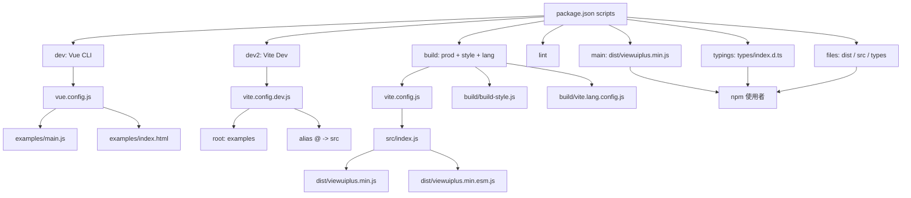

# 02-00_章節導讀：根目錄要讀什麼

> 適用章節：`02_根目錄與工程設定`  
> 專案：View UI Plus  
> 閱讀目標：先建立「工程地圖」，再進入 `package`、`build`、`dist`、`src`、`types` 等後續章節。  
> 查閱基準：View UI Plus GitHub `master` 分支，2026-05-05。

---

## 1. 本章定位

這一章不是要深入分析每一個元件，也不是要馬上拆 `src/components`。  
這一章要做的是：**先讀懂 View UI Plus 這個元件庫專案的根目錄工程配置，建立後續讀碼的導航圖。**

View UI Plus 不是一般的 Vue 業務專案，而是一個要被開發、預覽、打包、發布、安裝、引用的 Vue 3 元件庫。因此，根目錄下的設定檔不只是「輔助檔案」，它們其實決定了整個專案的運作方式。

讀這一章時，要把根目錄看成四件事的交會點：

```text
根目錄
├── 專案定位：這是什麼套件？要給誰用？
├── 開發入口：本地開發時從哪裡啟動？
├── 打包入口：正式輸出時從哪裡開始打包？
└── 發布邏輯：npm 使用者最後會拿到哪些檔案？
```

本章的核心任務是回答：

> 當我打開 View UI Plus 根目錄時，我應該先看什麼？  
> 這些設定檔分別控制哪一段工程流程？  
> 哪些內容要在本章理解，哪些內容應該留到後續章節深入？

---

## 2. 為什麼不能直接從 `src/components` 開始讀？

很多人讀元件庫會直接打開：

```text
src/components
```

然後開始看 `Button`、`Input`、`Table`、`Modal`。這樣可以看到元件實作，但很容易漏掉更重要的問題：

- 元件是怎麼被註冊成插件的？
- 本地 Demo 是怎麼載入元件庫原始碼的？
- 正式打包時入口是哪個檔案？
- 打包產物輸出到哪裡？
- 為什麼 `vue` 沒有被打包進 bundle？
- TypeScript 型別宣告從哪裡提供？
- npm 發布時到底包含哪些檔案？
- Vue CLI、Vite、Gulp、ESLint、TSLint 為什麼同時出現在專案裡？

這些問題都不在單一元件裡，而是在根目錄工程設定中。

所以本章採用的讀碼順序是：

```text
先看根目錄工程設定
  -> 再看 package 與依賴
  -> 再看 build 與 dist
  -> 再看 src 入口與元件註冊
  -> 最後深入各類元件
```

這樣讀的好處是：後面看到任何元件檔案時，都知道它最後會如何進入插件、如何被 examples 使用、如何被 Vite 打包、如何被 npm 使用者引用。

---

## 3. 本章要建立的三條主線

讀根目錄時，不要把檔案當成零散設定。建議用三條主線串起來。

### 3.1 開發預覽主線

開發時，目標不是立刻輸出 npm 套件，而是讓開發者能在瀏覽器裡看到 Demo、調整元件、驗證互動。

```text
package.json scripts
  -> dev / dev2
  -> vue.config.js / vite.config.dev.js
  -> examples
  -> src
```

這條線要理解：

- `examples` 為什麼是本地預覽入口。
- `vue.config.js` 如何配置 Vue CLI 開發入口。
- `vite.config.dev.js` 如何配置 Vite 開發入口。
- `@` alias 如何讓 Demo 直接引用 `src` 原始碼。

本章只建立概念，後續會在 `25_examples_範例與Demo` 深入。

---

### 3.2 正式打包主線

正式打包時，目標是把元件庫輸出成使用者可以引用的 bundle。

```text
package.json scripts
  -> build / build:prod
  -> vite.config.js
  -> src/index.js
  -> dist/viewuiplus.min.js
  -> dist/viewuiplus.min.esm.js
```

這條線要理解：

- `vite.config.js` 是正式 library build 設定。
- `src/index.js` 是元件庫打包入口。
- `dist` 是正式輸出目錄。
- `vue` 被設定為 external，代表元件庫不把 Vue 一起打進 bundle。
- 同時輸出 UMD 與 ES module，方便不同使用場景引用。

本章只先看「入口與輸出關係」，詳細 build 流程放到 `04_build_打包腳本與建置流程`。

---

### 3.3 發布使用主線

發布時，目標是讓 npm 使用者安裝 `view-ui-plus` 後，可以取得必要檔案。

```text
package.json
  -> main
  -> typings
  -> files
  -> .npmignore
  -> dist / src / types
```

這條線要理解：

- `main` 決定套件主要 JavaScript 入口。
- `typings` 決定 TypeScript 型別入口。
- `files` 決定 npm package 主動包含哪些資料夾。
- `.npmignore` 決定哪些 repo 檔案不要發布。
- `dist`、`src`、`types` 分別服務不同使用者需求。

本章只先建立發布地圖，完整依賴與 package 欄位分析放到 `03_package與依賴分析`。

---

## 4. 本章要看的根目錄項目

本章的重點不是「全部細讀」，而是先分類。

| 類型 | 項目 | 本章閱讀重點 |
|---|---|---|
| 專案定位 | `README.md`、`README-CN.md`、`package.json` | 確認這是 Vue 3 元件庫，不是普通 Vue App |
| 啟動腳本 | `package.json` | 看 `dev`、`dev2`、`build`、`build:style`、`build:lang`、`lint` 的職責 |
| 開發設定 | `vue.config.js`、`vite.config.dev.js` | 確認 Demo 開發入口與 examples 關係 |
| 正式打包 | `vite.config.js` | 確認 library entry、output、external、format |
| 型別設定 | `tsconfig.json` | 確認 TS 設定與 `types` 的關係 |
| 程式風格 | `.editorconfig`、`.eslintrc.js`、`.eslintignore`、`tslint.json` | 理解格式、lint、歷史工具鏈痕跡 |
| 忽略規則 | `.gitignore`、`.npmignore` | 分辨 Git 不追蹤與 npm 不發布的差異 |
| CI / 預覽 | `.travis.yml`、`preview.yml`、`.inscode` | 理解測試、線上預覽或歷史部署設定 |
| 主要資料夾 | `src`、`examples`、`build`、`dist`、`types`、`test`、`assets` | 先知道角色，不在本章深入細節 |

---

## 5. 本章暫時不要深入的內容

這一章是導讀章，最容易犯的錯是看到每個設定都想展開。為了避免重複與失焦，以下內容先「標記位置」，不要在本章深入。

| 內容 | 本章只做到 | 深入章節 |
|---|---|---|
| `package.json` dependencies | 只看 scripts、main、typings、files | `03_package與依賴分析` |
| `build` 腳本 | 只知道它處理 build/style/lang | `04_build_打包腳本與建置流程` |
| `dist` 內容 | 只知道它是打包產物 | `05_dist_打包產物分析` |
| `src/index.js` | 只知道它是打包入口 | `06_src_入口與插件機制` |
| 元件註冊 | 只知道後面會從入口串到 install | `07_元件註冊機制` |
| `types` | 只知道它提供型別宣告 | `24_types_型別宣告` |
| `examples` | 只知道它是開發與 Demo 入口 | `25_examples_範例與Demo` |
| `test` | 只知道它是測試目錄 | `26_test_測試` |
| `assets` | 只知道它是靜態資源 | `27_assets_靜態資源` |

這裡要記住一個原則：

> 本章只建立根目錄導航，不搶後續章節的工作。

---

## 6. 讀根目錄時的判斷框架

打開任一根目錄檔案時，都用下面五個問題判斷它的角色。

### 6.1 它影響哪個流程？

```text
開發？打包？發布？測試？格式？型別？CI？預覽？
```

例如：

- `vite.config.dev.js` 主要影響開發預覽。
- `vite.config.js` 主要影響正式打包。
- `.npmignore` 主要影響 npm 發布。
- `.editorconfig` 主要影響編輯器格式。

---

### 6.2 它的入口是誰？

每個工程設定都會指向某些入口。

例如：

```text
vue.config.js
  -> examples/main.js
  -> examples/index.html

vite.config.dev.js
  -> root: examples
  -> alias @: src

vite.config.js
  -> lib.entry: src/index.js
```

看到入口時，要立刻問：

> 這個入口後面會接到哪個章節？

---

### 6.3 它的輸出是什麼？

元件庫專案一定要關心輸出。

例如：

```text
vite.config.js
  -> dist/viewuiplus.min.js
  -> dist/viewuiplus.min.esm.js

package.json
  -> main: dist/viewuiplus.min.js
  -> typings: types/index.d.ts
  -> files: dist, src, types
```

這裡要建立一個關鍵認知：

> 元件庫不是只要能在本地跑起來就好，它最後必須變成可被別人安裝與引用的 package。

---

### 6.4 它依賴哪些工具？

View UI Plus 根目錄可以看到多種工具鏈痕跡：

```text
Vue CLI
Vite
Gulp
ESLint
TSLint
TypeScript
Karma / Mocha / Chai / Sinon
```

本章不要急著研究每個工具的所有細節，只要先判斷：

- 哪些工具用於本地開發。
- 哪些工具用於正式打包。
- 哪些工具用於樣式或語言包處理。
- 哪些工具用於測試。
- 哪些工具可能是歷史遺留。

---

### 6.5 它反映了什麼工程演進？

View UI Plus 不是一個完全從零開始的現代 Vite + TypeScript 專案。根目錄同時保留 Vue CLI、Vite、ESLint、TSLint、Gulp 等設定，這代表它有明顯的工具鏈演進痕跡。

讀這類專案時，不要用單一技術棧的假設硬套，而要接受它是「長期演化中的元件庫工程」。

這個觀察會影響後面的讀碼方式：

- 不要看到 Vue CLI 就以為它不是 Vite 專案。
- 不要看到 Vite 就以為所有開發流程都已遷移到 Vite。
- 不要看到 TypeScript 設定就以為整個 `src` 都是 TypeScript 寫的。
- 不要看到 TSLint 就以為它是主要 lint 工具。

---

## 7. 建議閱讀順序

本章建議按照下面順序讀。

### Step 1：先確認專案定位

先看：

```text
README.md
README-CN.md
package.json
```

要確認：

- 這是 Vue 3 元件庫。
- 套件名稱是什麼。
- npm 安裝後的主要入口是什麼。
- 專案是否提供 starter、Demo、文件或線上預覽。

讀完這一步，要能說出：

> View UI Plus 是一個面向 Vue 3 使用者的 UI 元件庫，根目錄設定服務於開發、打包、發布與使用者引用。

---

### Step 2：再看 scripts

看：

```text
package.json -> scripts
```

重點不是每個指令都完全理解，而是先分類。

```text
npm run dev          -> Vue CLI 開發預覽
npm run dev2         -> Vite 開發預覽
npm run build        -> 組合式建置流程
npm run build:prod   -> Vite 正式打包
npm run build:style  -> 樣式建置
npm run build:lang   -> 語言包建置
npm run lint         -> 程式碼檢查與修正
```

讀完這一步，要能說出：

> scripts 是根目錄工程設定的總開關，後面所有設定檔都可以從 scripts 反推用途。

---

### Step 3：區分開發設定與打包設定

看：

```text
vue.config.js
vite.config.dev.js
vite.config.js
```

要分清楚：

```text
vue.config.js        -> Vue CLI 開發預覽設定
vite.config.dev.js   -> Vite 開發預覽設定
vite.config.js       -> 正式 library build 設定
```

這裡最重要的是不要混淆 `vite.config.dev.js` 和 `vite.config.js`。

- `vite.config.dev.js`：服務於 examples 開發預覽。
- `vite.config.js`：服務於元件庫正式打包。

---

### Step 4：看發布邏輯

看：

```text
package.json -> main / typings / files
.npmignore
.gitignore
```

要理解三件事：

```text
main       -> 使用者 import 套件時的 JS 入口
typings    -> TypeScript 型別入口
files      -> npm package 要包含的主要資料夾
.npmignore -> npm package 要排除的內容
.gitignore -> Git repo 不追蹤的內容
```

讀完這一步，要能說出：

> Git 倉庫內容、npm 發布內容、打包輸出內容，三者不是同一件事。

---

### Step 5：最後看輔助工程設定

看：

```text
.editorconfig
.eslintrc.js
.eslintignore
tslint.json
tsconfig.json
.travis.yml
preview.yml
```

這些設定不一定直接改變元件邏輯，但會影響專案品質、開發習慣、型別支援、測試與線上預覽。

讀完這一步，要能說出：

> 根目錄不只是啟動與打包，它也反映團隊如何維持一致性、如何測試、如何展示專案。

---

## 8. 本章讀完後要形成的整體圖

讀完本章後，腦中應該有這張圖。



如果你的 Markdown 閱讀器不支援 Mermaid，可以用下面純文字版理解：

```text
package.json scripts
├── dev
│   └── vue.config.js
│       └── examples/main.js
├── dev2
│   └── vite.config.dev.js
│       ├── root: examples
│       └── alias @ -> src
├── build
│   ├── build:prod
│   │   └── vite.config.js
│   │       └── src/index.js
│   │           └── dist/*.js
│   ├── build:style
│   │   └── build/build-style.js
│   └── build:lang
│       └── build/vite.lang.config.js
└── lint
    └── vue-cli-service lint --fix

package.json 發布入口
├── main: dist/viewuiplus.min.js
├── typings: types/index.d.ts
└── files: dist / src / types
```

---

## 9. 重要觀念：根目錄是「架構入口」，不是雜物區

讀大型前端專案時，初學者常把根目錄檔案視為：

```text
設定檔
雜項檔案
工具檔案
看不懂先跳過
```

但對元件庫來說，根目錄其實是架構入口。因為它回答的是最上層的工程問題：

| 問題 | 根目錄如何回答 |
|---|---|
| 這是什麼專案？ | `README`、`package.json` |
| 怎麼啟動開發？ | `scripts.dev`、`scripts.dev2`、`vue.config.js`、`vite.config.dev.js` |
| 怎麼正式打包？ | `scripts.build`、`vite.config.js`、`build/` |
| 打包入口在哪裡？ | `vite.config.js -> src/index.js` |
| 打包輸出在哪裡？ | `vite.config.js -> dist` |
| npm 使用者讀哪個檔案？ | `package.json -> main` |
| TypeScript 使用者讀哪個檔案？ | `package.json -> typings` |
| npm 發布包含什麼？ | `package.json -> files`、`.npmignore` |
| 哪些東西不進 Git？ | `.gitignore` |
| 專案如何維持格式？ | `.editorconfig`、`.eslintrc.js` |
| 專案如何測試或預覽？ | `.travis.yml`、`preview.yml` |

所以本章的真正目標不是背檔名，而是能從檔名推回它所在的工程流程。

---

## 10. 本章關鍵詞

讀本章時，建議先掌握下面關鍵詞。

### 10.1 root

在 Vite 開發設定中，`root` 代表開發伺服器以哪個資料夾作為專案根。  
View UI Plus 的 Vite 開發設定使用 `examples` 作為 root，代表本地預覽以 Demo 專案為中心。

### 10.2 entry

`entry` 是入口。  
不同設定裡的 entry 意義不同：

```text
examples/main.js      -> Vue CLI Demo 入口
src/index.js          -> 元件庫正式打包入口
```

### 10.3 alias

`alias` 是路徑別名。  
例如 `@` 指向 `src`，可以讓 examples 直接引用元件庫原始碼。

### 10.4 external

`external` 表示打包時排除某些依賴。  
元件庫通常會把 `vue` 設成 external，避免把 Vue 一起打進自己的 bundle。

### 10.5 dist

`dist` 是 distribution 的縮寫，通常代表正式輸出產物。  
在元件庫中，`dist` 會包含給使用者引用的 JavaScript、CSS、語言包等打包後內容。

### 10.6 typings

`typings` 指向 TypeScript 型別宣告入口。  
這對使用 TypeScript 的專案很重要，因為 IDE 提示、型別檢查、元件 API 感知都依賴它。

### 10.7 files

`package.json` 的 `files` 用來指定 npm package 要包含的檔案或資料夾。  
它和 `.gitignore`、`.npmignore` 的角色不同。

### 10.8 ignore

不同 ignore 檔案控制不同範圍：

```text
.gitignore  -> Git 不追蹤什麼
.npmignore  -> npm 發布時排除什麼
.eslintignore -> ESLint 不檢查什麼
```

---

## 11. 容易誤解的地方

### 11.1 誤解一：有 Vite 就代表整個專案只用 Vite

不一定。View UI Plus 同時存在 Vue CLI 與 Vite 相關設定。

比較合理的理解是：

```text
Vue CLI 仍保留為一種開發預覽方式
Vite 用於另一種開發預覽方式，也用於正式 library build
```

---

### 11.2 誤解二：有 `tsconfig.json` 就代表 `src` 全部是 TypeScript

不一定。這個專案的 `tsconfig.json` 更偏向型別宣告與工程輔助，並不能直接推論 `src` 全部以 TypeScript 編寫。

讀這類專案時，要看：

```text
include
exclude
src 實際副檔名
package.json typings
```

---

### 11.3 誤解三：`dist` 和 `src` 只有一個會發布

不一定。View UI Plus 的 `package.json` 明確將 `dist`、`src`、`types` 放入發布檔案範圍。這代表它不只發布打包後產物，也保留原始碼與型別宣告給使用者或工具使用。

---

### 11.4 誤解四：`.gitignore` 和 `.npmignore` 是同一件事

不是。

```text
.gitignore
  控制 Git 倉庫不追蹤哪些檔案

.npmignore
  控制 npm 發布時排除哪些檔案
```

一個檔案可以被 Git 追蹤，但不發布到 npm；也可能不被 Git 追蹤，當然也不應該進入 npm package。

---

### 11.5 誤解五：根目錄只要看一次就好

根目錄應該在不同階段反覆回來看。

例如：

- 讀 `src/index.js` 時，回來對照 `vite.config.js`。
- 讀 `types/index.d.ts` 時，回來對照 `package.json typings`。
- 讀 `examples` 時，回來對照 `vue.config.js` 與 `vite.config.dev.js`。
- 讀 `build` 時，回來對照 `package.json scripts`。
- 讀 `dist` 時，回來對照 `package.json main` 與 `vite.config.js`。

---

## 12. 本章輸出物

讀完本章後，應該產出三個東西。

### 12.1 根目錄分類表

你應該能整理出：

```text
src       -> 元件庫原始碼
examples  -> Demo 與本地開發入口
build     -> 建置腳本
dist      -> 打包產物
types     -> 型別宣告
test      -> 測試
assets    -> 靜態資源
```

以及：

```text
package.json        -> 套件資訊、scripts、發布入口
vite.config.js      -> 正式打包設定
vite.config.dev.js  -> Vite 開發設定
vue.config.js       -> Vue CLI 開發設定
tsconfig.json       -> TypeScript 設定
.eslintrc.js        -> ESLint 設定
tslint.json         -> TSLint 設定
.editorconfig       -> 編輯器格式設定
.gitignore          -> Git 忽略規則
.npmignore          -> npm 發布忽略規則
.travis.yml         -> CI 測試設定
preview.yml         -> 線上預覽設定
```

---

### 12.2 工程流程圖

你應該能畫出三條主線：

```text
開發預覽：package scripts -> config -> examples -> src
正式打包：package scripts -> vite.config.js -> src/index.js -> dist
npm 發布：package fields -> files / npmignore -> dist / src / types
```

---

### 12.3 後續章節連接表

你應該知道本章每個結論要接到哪個後續章節。

| 本章觀察 | 後續章節 |
|---|---|
| `package.json` 是總開關 | `03_package與依賴分析` |
| `build` 腳本被 scripts 串起 | `04_build_打包腳本與建置流程` |
| `dist` 是正式輸出 | `05_dist_打包產物分析` |
| `src/index.js` 是 library entry | `06_src_入口與插件機制` |
| 元件會透過入口被註冊 | `07_元件註冊機制` |
| 型別入口是 `types/index.d.ts` | `24_types_型別宣告` |
| examples 是開發與 Demo 入口 | `25_examples_範例與Demo` |
| 測試設定與測試目錄存在 | `26_test_測試` |
| assets 是靜態資源 | `27_assets_靜態資源` |

---

## 13. 實作式讀碼任務

這一章建議不要只看文字，最好實際做一次檔案定位。

### 任務一：找出所有根目錄設定檔

在專案根目錄列出檔案：

```bash
ls -la
```

然後把檔案分成：

```text
啟動設定
打包設定
型別設定
格式設定
忽略規則
CI / Preview
文件與授權
```

---

### 任務二：從 scripts 反推設定檔

打開 `package.json`，只看 `scripts`。

把每個 script 對應到設定檔：

```text
dev          -> vue.config.js
dev2         -> vite.config.dev.js
build:prod   -> vite.config.js
build:style  -> build/build-style.js
build:lang   -> build/vite.lang.config.js
lint         -> .eslintrc.js / .eslintignore
```

---

### 任務三：找出開發入口與打包入口

分別找到：

```text
examples/main.js
examples/index.html
src/index.js
```

然後回答：

```text
哪個是 Demo 入口？
哪個是元件庫打包入口？
哪個入口會被使用者間接引用？
```

---

### 任務四：找出 npm 發布入口

打開 `package.json`，查看：

```json
{
  "main": "...",
  "typings": "...",
  "files": []
}
```

然後回答：

```text
JS 入口是什麼？
型別入口是什麼？
npm package 包含哪些資料夾？
```

---

## 14. 本章完成檢查清單

完成本章後，應該能勾選以下項目。

```text
[ ] 我知道 View UI Plus 是元件庫專案，不是普通 Vue App
[ ] 我知道根目錄是讀碼導航，不是雜物區
[ ] 我能說出 src、examples、build、dist、types、test、assets 的基本角色
[ ] 我能分辨 vue.config.js、vite.config.dev.js、vite.config.js 的差異
[ ] 我知道 dev、dev2、build、build:prod、build:style、build:lang、lint 大致做什麼
[ ] 我知道 examples 是本地開發與 Demo 預覽入口
[ ] 我知道 src/index.js 是正式打包入口
[ ] 我知道 dist 是打包產物輸出目錄
[ ] 我知道 main、typings、files 對 npm 使用者的意義
[ ] 我能分辨 .gitignore、.npmignore、.eslintignore 的差異
[ ] 我知道 tsconfig.json 不等於整個 src 都是 TypeScript
[ ] 我知道 Vue CLI、Vite、Gulp、ESLint、TSLint 並存代表工程演進痕跡
[ ] 我知道本章哪些內容應該留到後續章節深入
```

---

## 15. 本章一句話總結

> `02_根目錄與工程設定` 的任務，是先從根目錄讀出 View UI Plus 的開發入口、打包入口、發布入口與工具鏈演進脈絡，讓後續分析 `package`、`build`、`dist`、`src`、`types` 時不會迷路。

---

## 16. 參考來源

以下來源用於確認 View UI Plus 根目錄與工程設定現況：

- View UI Plus GitHub Repository  
  https://github.com/view-design/ViewUIPlus
- `package.json`  
  https://raw.githubusercontent.com/view-design/ViewUIPlus/master/package.json
- `vite.config.js`  
  https://raw.githubusercontent.com/view-design/ViewUIPlus/master/vite.config.js
- `vite.config.dev.js`  
  https://raw.githubusercontent.com/view-design/ViewUIPlus/master/vite.config.dev.js
- `vue.config.js`  
  https://raw.githubusercontent.com/view-design/ViewUIPlus/master/vue.config.js
- `tsconfig.json`  
  https://raw.githubusercontent.com/view-design/ViewUIPlus/master/tsconfig.json
- `.eslintrc.js`  
  https://raw.githubusercontent.com/view-design/ViewUIPlus/master/.eslintrc.js
- `.editorconfig`  
  https://raw.githubusercontent.com/view-design/ViewUIPlus/master/.editorconfig
- `.gitignore`  
  https://raw.githubusercontent.com/view-design/ViewUIPlus/master/.gitignore
- `.npmignore`  
  https://raw.githubusercontent.com/view-design/ViewUIPlus/master/.npmignore
- `.travis.yml`  
  https://raw.githubusercontent.com/view-design/ViewUIPlus/master/.travis.yml
- `preview.yml`  
  https://raw.githubusercontent.com/view-design/ViewUIPlus/master/preview.yml
