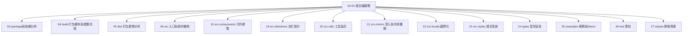

# 02-01_根目錄總覽：資料夾與檔案分類

> 適用章節：`02_根目錄與工程設定`  
> 專案：View UI Plus  
> 筆記定位：根目錄地圖、資料夾分類、設定檔分類  
> 閱讀目標：打開 View UI Plus 根目錄時，能快速判斷「哪些是原始碼、哪些是 Demo、哪些是建置、哪些是產物、哪些是型別、哪些是工程設定」。  
> 查閱基準：View UI Plus GitHub `master` 分支，2026-05-05。

---

## 1. 本篇要解決的問題

這篇筆記的任務很明確：**先把 View UI Plus 根目錄分門別類，建立讀碼時的第一張地圖。**

當你第一次打開一個元件庫專案時，很容易被大量資料夾與設定檔干擾：

```text
src
examples
build
dist
types
test
package.json
vite.config.js
vite.config.dev.js
vue.config.js
tsconfig.json
.eslintrc.js
.npmignore
...
```

如果不知道這些檔案各自屬於哪一條工程流程，後面讀 `src/components`、`build`、`dist` 或 `types` 時就會失去方向。

所以本篇不急著深入任何單一檔案，而是先回答四個問題：

```text
1. 根目錄有哪些主要資料夾？
2. 每個資料夾在元件庫工程中扮演什麼角色？
3. 根目錄設定檔可以怎麼分類？
4. 哪些內容本篇只建立地圖，後續章節再深入？
```

本篇的重點不是背檔名，而是建立判斷能力：

> 看到一個根目錄項目時，要能立刻判斷它屬於「原始碼、開發預覽、建置腳本、打包產物、型別宣告、測試、靜態資源、工程設定、發布控制、文件與治理」哪一類。

---

## 2. 一眼看懂根目錄結構

View UI Plus 目前根目錄可以先抽象成下面這棵樹：

```text
ViewUIPlus/
├── .github/
├── assets/
├── build/
├── dist/
├── examples/
├── src/
├── test/
├── types/
├── .editorconfig
├── .eslintignore
├── .eslintrc.js
├── .gitattributes
├── .gitignore
├── .inscode
├── .npmignore
├── .travis.yml
├── LICENSE
├── README-CN.md
├── README.md
├── SECURITY.md
├── package.json
├── preview.yml
├── tsconfig.json
├── tslint.json
├── vite.config.dev.js
├── vite.config.js
└── vue.config.js
```

第一層可以先分成兩大類：

```text
資料夾
├── src        -> 元件庫原始碼
├── examples   -> 本地開發與 Demo 預覽
├── build      -> 建置輔助腳本
├── dist       -> 打包輸出產物
├── types      -> TypeScript 型別宣告
├── test       -> 測試
├── assets     -> 靜態資源
└── .github    -> GitHub 協作模板

根目錄檔案
├── package.json        -> 套件資訊、scripts、依賴、發布入口
├── vite.config.js      -> 正式 library build 設定
├── vite.config.dev.js  -> Vite 開發預覽設定
├── vue.config.js       -> Vue CLI 開發預覽設定
├── tsconfig.json       -> TypeScript 設定
├── .eslintrc.js        -> ESLint 設定
├── .eslintignore       -> ESLint 忽略規則
├── tslint.json         -> TSLint 設定
├── .editorconfig       -> 編輯器格式規範
├── .gitignore          -> Git 忽略規則
├── .npmignore          -> npm 發布忽略規則
├── .travis.yml         -> Travis CI 設定
├── preview.yml         -> 線上預覽設定
├── .inscode            -> InsCode 相關設定
├── README.md           -> 英文說明文件
├── README-CN.md        -> 中文說明文件
├── SECURITY.md         -> 安全政策
├── LICENSE             -> 授權資訊
└── .gitattributes      -> Git 屬性設定
```

這裡先建立一個關鍵觀念：

> 根目錄不是雜物區，而是整個元件庫的工程索引。  
> `src` 讓你看見元件怎麼寫；根目錄讓你看見這些元件如何被開發、展示、打包、發布與使用。

---

## 3. 根目錄分類總表

先用一張表建立全局地圖。

| 類型 | 項目 | 主要用途 | 本篇閱讀重點 | 後續深入章節 |
|---|---|---|---|---|
| 專案核心原始碼 | `src/` | 元件、指令、樣式、工具、國際化、入口 | 知道它是元件庫本體 | `06_src_入口與插件機制` 起 |
| 開發與 Demo | `examples/` | 本地預覽、Demo、路由、展示頁 | 知道它是開發預覽入口 | `25_examples_範例與Demo` |
| 建置腳本 | `build/` | 樣式建置、語言包建置、建置輔助 | 知道它被 scripts 串起 | `04_build_打包腳本與建置流程` |
| 打包產物 | `dist/` | 發布後的 JS、CSS、語言包 | 知道它是輸出結果，不是主要閱讀起點 | `05_dist_打包產物分析` |
| 型別宣告 | `types/` | `.d.ts` 型別宣告 | 知道它服務 TypeScript 使用者 | `24_types_型別宣告` |
| 測試 | `test/` | 單元測試與測試配置 | 知道它可反推元件行為規格 | `26_test_測試` |
| 靜態資源 | `assets/` | Logo、圖片、展示資源 | 知道它不是元件邏輯主體 | `27_assets_靜態資源` |
| GitHub 協作 | `.github/` | Issue / PR 模板 | 知道它服務協作流程 | 本章即可 |
| 套件總控 | `package.json` | scripts、依賴、入口、發布欄位 | 知道它是根目錄總開關 | `03_package與依賴分析` |
| 開發設定 | `vue.config.js`、`vite.config.dev.js` | 本地開發伺服器與 Demo 入口 | 分辨 Vue CLI 與 Vite dev 設定 | `25_examples_範例與Demo` |
| 正式打包設定 | `vite.config.js` | library build、entry、output、external | 知道它負責正式打包 | `04_build_打包腳本與建置流程` |
| 型別與路徑設定 | `tsconfig.json` | TS 編譯選項與 alias | 知道它跟 `types/`、`@/*` 有關 | `24_types_型別宣告` |
| 程式碼品質 | `.eslintrc.js`、`.eslintignore`、`tslint.json`、`.editorconfig` | lint、格式、歷史工具鏈 | 看出團隊風格與技術演進 | 本章 / `26_test_測試` |
| 忽略與發布控制 | `.gitignore`、`.npmignore` | 控制 Git 與 npm 要排除什麼 | 分辨 repo 內容與 npm package 內容 | `03_package與依賴分析` |
| CI / 預覽 | `.travis.yml`、`preview.yml`、`.inscode` | 測試、線上預覽、雲端環境 | 理解專案展示與歷史 CI | 本章 / `26_test_測試` |
| 文件與治理 | `README.md`、`README-CN.md`、`SECURITY.md`、`LICENSE` | 專案說明、授權、安全政策 | 確認專案定位與使用方式 | `00_總覽與讀碼策略` / 本章 |

這張表就是本篇最重要的索引。後續讀碼時，只要迷路，就回來對照它。

---

## 4. 主要資料夾分類

### 4.1 `src/`：元件庫原始碼本體

`src` 是 View UI Plus 的核心原始碼資料夾。它不是 Demo，也不是打包產物，而是元件庫真正的實作位置。

目前 `src` 下可以看到：

```text
src/
├── components/
├── directives/
├── locale/
├── mixins/
├── styles/
├── utils/
└── index.js
```

這個結構透露出 View UI Plus 的核心組成：

| 子項目 | 角色 | 後續閱讀方向 |
|---|---|---|
| `components/` | 元件實作主體 | 元件分類與單一元件分析 |
| `directives/` | 自訂指令 | `19_src-directives_自訂指令` |
| `locale/` | 國際化語言邏輯 | `22_src-locale_國際化` |
| `mixins/` | Options API 時期常見的共用邏輯 | `21_src-mixins_混入與共用邏輯` |
| `styles/` | Less / CSS 樣式系統 | `23_src-styles_樣式系統` |
| `utils/` | 共用工具函式 | `20_src-utils_工具函式` |
| `index.js` | 元件庫入口與插件安裝入口 | `06_src_入口與插件機制`、`07_元件註冊機制` |

讀 `src` 時不要只看 `components`。對元件庫來說，`index.js`、`styles`、`utils`、`locale`、`mixins` 通常比單一元件更能看出架構設計。

本篇只先建立定位：

> `src` 是元件庫本體；`src/index.js` 是後續追插件安裝、全域註冊、全域配置的關鍵入口。

---

### 4.2 `examples/`：本地開發與 Demo 預覽入口

`examples` 是本地開發時用來展示與驗證元件的地方。

目前 `examples` 下可以看到：

```text
examples/
├── components/
├── public/fonts/
├── routers/
├── app.vue
├── index.html
└── main.js
```

它的角色不是「元件庫本體」，而是「使用元件庫的示範應用」。這一點很重要。

`examples` 的典型用途：

```text
開發者啟動 dev server
  -> examples/main.js 建立 Demo App
  -> examples/routers 控制展示頁路由
  -> examples/components 放示範頁或展示組件
  -> Demo App 引用 src 裡的元件庫原始碼
```

`vite.config.dev.js` 把開發 root 指向 `examples`，並設定 `@` alias 指到根目錄下的 `src`。這代表 Vite 開發模式不是把 `src` 當作一個獨立 App 跑起來，而是透過 `examples` 這個展示應用來載入元件庫原始碼。

本篇只先建立定位：

> `examples` 是本地開發與展示入口，不是 npm 使用者最終拿到的主要入口。

---

### 4.3 `build/`：建置輔助腳本

`build` 是建置相關腳本的集中位置。它不是打包結果，而是用來產生或輔助產生打包結果的工程腳本。

目前 `build` 下可以看到：

```text
build/
├── build-style.js
├── locale.js
└── vite.lang.config.js
```

從檔名可以先推得三個方向：

| 檔案 | 初步角色 | 對應 script / 流程 |
|---|---|---|
| `build-style.js` | 樣式建置腳本 | `npm run build:style` |
| `locale.js` | 語言包或國際化建置輔助 | 語言包建置流程 |
| `vite.lang.config.js` | 語言包的 Vite 建置設定 | `npm run build:lang` |

`package.json` 裡的 `build` 指令會組合 `build:prod`、`build:style`、`build:lang`，所以 `build/` 需要放在「正式建置流程」底下理解。

本篇只先建立定位：

> `build` 是產生樣式與語言包等建置產物的腳本區，不是元件邏輯主體。

---

### 4.4 `dist/`：打包輸出產物

`dist` 是 distribution 的縮寫，在元件庫中通常代表「準備被使用者引用或被 npm package 帶出去的輸出產物」。

目前 `dist` 下可以看到：

```text
dist/
├── locale/
├── styles/
├── viewuiplus.min.esm.js
└── viewuiplus.min.js
```

這個結構說明 View UI Plus 的產物至少包含三類：

| 產物 | 用途 |
|---|---|
| `viewuiplus.min.js` | UMD 格式 bundle，常見於全域 script 或相容場景 |
| `viewuiplus.min.esm.js` | ES module 格式 bundle，常見於現代打包工具 |
| `styles/` | 打包後樣式 |
| `locale/` | 打包後語言包 |

`package.json` 的 `main` 指向 `dist/viewuiplus.min.js`，代表這是套件的主要 JavaScript 入口之一；`package.json` 的 `files` 也包含 `dist`，代表 `dist` 是 npm 發布範圍中的重要資料夾。

讀 `dist` 時要注意：

```text
src  -> 原始碼
build -> 產生產物的腳本
dist -> 產生後的結果
```

所以 `dist` 不應該作為理解元件設計的第一站，但它非常適合用來反推「這個元件庫最後提供什麼給使用者」。

本篇只先建立定位：

> `dist` 是打包產物；要理解它從哪裡來，回頭看 `vite.config.js`、`build/` 與 `package.json scripts`。

---

### 4.5 `types/`：TypeScript 型別宣告

`types` 是給 TypeScript 使用者、IDE 型別提示、元件 API 感知使用的型別宣告資料夾。

目前 `types` 下有大量 `.d.ts` 檔案，例如：

```text
types/
├── index.d.ts
├── button.d.ts
├── form.d.ts
├── input.d.ts
├── modal.d.ts
├── table.d.ts
├── viewuiplus.components.d.ts
└── ...
```

這個結構透露出兩件事：

```text
1. 元件庫為多數元件提供獨立型別宣告。
2. package.json 的 typings 指向 types/index.d.ts，代表 TypeScript 使用者會從這裡進入型別系統。
```

要注意：有 `types/` 和 `tsconfig.json`，不代表 `src/` 全部都是 TypeScript 原始碼。View UI Plus 更像是「JavaScript / Vue 原始碼 + TypeScript declaration」的元件庫結構。

本篇只先建立定位：

> `types` 是公開 API 的型別投影；後續分析元件 API 時，可以把 `src/components` 與 `types/*.d.ts` 對照閱讀。

---

### 4.6 `test/`：測試與規格反推入口

`test` 是測試相關資料夾。

目前 `test` 下可以看到：

```text
test/
├── unit/
└── .eslintrc.json
```

對元件庫來說，測試不只是驗證程式碼，也可以反推元件規格：

```text
測試案例
  -> 元件應該支援哪些 props
  -> 元件觸發哪些 events
  -> 元件在邊界情境下如何表現
  -> 哪些行為是作者認為不能壞掉的契約
```

本篇只先建立定位：

> `test` 是元件行為規格的輔助來源，深入閱讀放到 `26_test_測試`。

---

### 4.7 `assets/`：靜態資源

`assets` 放的是專案級靜態資源。從目前內容看，可以看到圖片與 Logo 類資源，例如：

```text
assets/
├── iview.png
├── iview2.png
├── logo.png
├── logo.svg
└── pay.png
```

這類資源通常服務於 README、展示頁、品牌識別或文檔，不是元件核心邏輯。

本篇只先建立定位：

> `assets` 是專案靜態資源區；除非你在研究文檔、展示或品牌資源，否則不需要優先閱讀。

---

### 4.8 `.github/`：協作流程設定

`.github` 是 GitHub 平台約定的協作設定資料夾。

目前 `.github` 下可以看到：

```text
.github/
├── ISSUE_TEMPLATE.md
└── PULL_REQUEST_TEMPLATE.md
```

這類檔案不影響元件執行，也不影響打包產物，但會影響開源協作流程：

```text
Issue 要如何描述問題
PR 要如何提交變更
維護者希望貢獻者提供哪些資訊
```

本篇只先建立定位：

> `.github` 是社群協作與維護流程的一部分，不是元件庫 runtime 或 build 的核心。

---

## 5. 根目錄設定檔分類

資料夾建立的是「工程區域」，根目錄檔案則建立「工程規則」。

### 5.1 `package.json`：專案總開關

`package.json` 是根目錄裡最應該優先看的檔案。

它同時回答以下問題：

| 問題 | 對應欄位 |
|---|---|
| 這個 npm 套件叫什麼？ | `name` |
| 目前版本是多少？ | `version` |
| 主要 JS 入口在哪裡？ | `main` |
| TypeScript 型別入口在哪裡？ | `typings` |
| npm 發布包含哪些資料夾？ | `files` |
| 開發、打包、lint 怎麼啟動？ | `scripts` |
| runtime 依賴有哪些？ | `dependencies` |
| 開發工具鏈有哪些？ | `devDependencies` |

View UI Plus 的 `package.json` 中，幾個最值得在本章先記住的欄位是：

```json
{
  "name": "view-ui-plus",
  "main": "dist/viewuiplus.min.js",
  "typings": "types/index.d.ts",
  "files": ["dist", "src", "types"]
}
```

以及 scripts 的角色分類：

```text
dev          -> Vue CLI 開發預覽
dev2         -> Vite 開發預覽
build        -> build:prod + build:style + build:lang
build:prod   -> Vite 正式打包
build:style  -> Gulp 樣式建置
build:lang   -> Vite 語言包建置
lint         -> Vue CLI lint 修正
```

本篇只先建立定位：

> `package.json` 是「專案身份 + 工程指令 + 發布入口」的總控檔案。

---

### 5.2 `vite.config.js`：正式 library build 設定

`vite.config.js` 是正式打包設定，不是一般業務專案的開發設定。

它的關鍵訊息包括：

```text
build.outDir  -> dist
lib.entry     -> src/index.js
lib.name      -> ViewUIPlus
external      -> vue
outputs       -> UMD + ES module
```

也就是說，正式 build 主線可以先畫成：

```text
npm run build:prod
  -> vite build
  -> vite.config.js
  -> src/index.js
  -> dist/viewuiplus.min.js
  -> dist/viewuiplus.min.esm.js
```

這裡要特別注意 `external: ['vue']`：

> 元件庫打包時通常不應該把 Vue 一起打進自己的 bundle，而是讓使用者專案提供 Vue。

本篇只先建立定位：

> `vite.config.js` 是正式產生 `dist` JavaScript bundle 的關鍵設定。

---

### 5.3 `vite.config.dev.js`：Vite 開發預覽設定

`vite.config.dev.js` 是 Vite 開發伺服器設定。

它的關鍵訊息包括：

```text
root       -> examples
server     -> port 8080, open true
alias @    -> src
```

這代表 Vite dev 主線是：

```text
npm run dev2
  -> vite --config vite.config.dev.js
  -> root: examples
  -> examples 內透過 @ 引用 src
```

這裡最重要的判斷是：

> `vite.config.dev.js` 服務的是 Demo 開發預覽；`vite.config.js` 服務的是元件庫正式打包。兩者不要混在一起。

---

### 5.4 `vue.config.js`：Vue CLI 開發預覽設定

`vue.config.js` 是 Vue CLI 的設定檔。

它的關鍵訊息包括：

```text
pages.index.entry     -> examples/main.js
pages.index.template  -> examples/index.html
```

也就是說，Vue CLI dev 主線是：

```text
npm run dev
  -> vue-cli-service serve
  -> vue.config.js
  -> examples/main.js
  -> examples/index.html
```

這跟 Vite dev 主線都指向 `examples`，只是使用的開發工具不同。

本篇只先建立定位：

> `vue.config.js` 說明專案保留 Vue CLI 開發預覽流程，也證明 `examples` 是本地展示應用入口。

---

### 5.5 `tsconfig.json`：TypeScript 與路徑設定

`tsconfig.json` 是 TypeScript 設定。

本章先看幾個重點：

```text
target       -> esnext
module       -> esnext
strict       -> true
baseUrl      -> .
paths        -> @/* 對應 src/*
include      -> types/*.ts
exclude      -> node_modules
```

這裡有兩個讀碼判斷：

```text
1. @/* -> src/*
   表示專案希望用 @ 作為 src 的路徑別名。

2. include 主要指向 types/*.ts
   表示 TS 設定與型別宣告關係很強，不能直接推論整個 src 都是 TypeScript 原始碼。
```

本篇只先建立定位：

> `tsconfig.json` 在這個專案中主要是型別與路徑設定，不要看到它就預設這是完整 TypeScript 原始碼專案。

---

### 5.6 Lint 與格式設定：`.eslintrc.js`、`.eslintignore`、`tslint.json`、`.editorconfig`

這組檔案負責工程一致性。

| 檔案 | 作用 | 本章觀察 |
|---|---|---|
| `.eslintrc.js` | ESLint 規則 | 使用 `plugin:vue/vue3-essential`，parser 為 `babel-eslint` |
| `.eslintignore` | ESLint 忽略範圍 | 排除 `src/directives` 與 `src/utils/throttle.js` |
| `tslint.json` | TSLint 規則 | 保留舊式 TypeScript lint 設定，帶有歷史痕跡 |
| `.editorconfig` | 編輯器格式統一 | UTF-8、LF、4 空格縮排、Markdown 保留尾端空白 |

這組檔案很適合觀察專案演進：

```text
ESLint + TSLint 並存
Vue CLI + Vite 並存
JavaScript / Vue 原始碼 + TypeScript declaration 並存
```

本篇只先建立定位：

> Lint 與格式設定不是元件邏輯，但它們反映了專案的工程風格與歷史工具鏈。

---

### 5.7 忽略與發布控制：`.gitignore`、`.npmignore`

`.gitignore` 和 `.npmignore` 很容易被混淆，但它們控制的是不同範圍。

```text
.gitignore
  -> 控制哪些檔案不要進 Git 版本控制

.npmignore
  -> 控制 npm 發布時排除哪些檔案
```

View UI Plus 的 `.gitignore` 排除了本地環境、IDE、log、coverage、`node_modules`、`examples/dist`、`package-lock.json` 等內容。

View UI Plus 的 `.npmignore` 排除了 dotfiles、Markdown、YAML、`build/`、`node_modules/`、`test/`、`gulpfile.js` 等內容。

再搭配 `package.json`：

```json
{
  "files": ["dist", "src", "types"]
}
```

可以得到一個很重要的結論：

> Git 倉庫內容、npm package 內容、打包輸出內容不是同一件事。  
> View UI Plus 發布時重點保留 `dist`、`src`、`types`，而不是把整個 repo 原封不動發布出去。

---

### 5.8 CI、預覽與平台設定：`.travis.yml`、`preview.yml`、`.inscode`

這組檔案不是元件庫本體，但能看出專案曾如何被測試、展示或放到線上環境。

| 檔案 | 角色 | 本章觀察 |
|---|---|---|
| `.travis.yml` | Travis CI 設定 | Node.js 版本、`npm run test`、Chrome sandbox 權限處理 |
| `preview.yml` | 線上預覽設定 | 安裝依賴後執行 `npm run dev`，應用名稱為 View UI Plus |
| `.inscode` | InsCode 相關設定 | 與線上體驗環境有關 |

本篇只先建立定位：

> CI / Preview 設定通常不會直接解釋元件怎麼寫，但能補足專案如何被驗證與展示的工程背景。

---

### 5.9 文件與治理：`README`、`LICENSE`、`SECURITY`

這組檔案用來確認專案定位、授權與安全政策。

| 檔案 | 用途 |
|---|---|
| `README.md` | 英文專案介紹、安裝、使用方式、連結 |
| `README-CN.md` | 中文專案介紹 |
| `LICENSE` | 授權條款 |
| `SECURITY.md` | 安全政策或漏洞回報說明 |

README 對讀碼的價值在於：它先告訴你這不是普通 Vue App，而是 Vue 3 的企業級 UI 元件庫與前端解決方案。

本篇只先建立定位：

> 文件不是實作，但它能校準讀碼視角：你正在讀的是「可發布、可安裝、可被使用者引入的元件庫」。

---

## 6. 用「工程流程」重新分類根目錄

除了按檔案類型分類，也可以按工程流程分類。這種分類更適合讀碼。

### 6.1 開發預覽流程

```text
package.json scripts
├── dev
│   └── vue.config.js
│       ├── examples/main.js
│       └── examples/index.html
└── dev2
    └── vite.config.dev.js
        ├── root: examples
        └── alias @ -> src
```

相關項目：

```text
package.json
vue.config.js
vite.config.dev.js
examples/
src/
```

一句話理解：

> 開發預覽是透過 `examples` 這個 Demo App 載入 `src` 原始碼。

---

### 6.2 正式打包流程

```text
package.json scripts
└── build
    ├── build:prod
    │   └── vite.config.js
    │       └── src/index.js
    │           └── dist/viewuiplus.min.js
    │           └── dist/viewuiplus.min.esm.js
    ├── build:style
    │   └── build/build-style.js
    └── build:lang
        └── build/vite.lang.config.js
```

相關項目：

```text
package.json
vite.config.js
build/
src/index.js
dist/
```

一句話理解：

> 正式打包從 `src/index.js` 進入，最後輸出到 `dist`。

---

### 6.3 npm 發布流程

```text
package.json
├── main: dist/viewuiplus.min.js
├── typings: types/index.d.ts
└── files: dist / src / types

.npmignore
└── 排除 build、test、Markdown、YAML、dotfiles 等
```

相關項目：

```text
package.json
.npmignore
dist/
src/
types/
```

一句話理解：

> npm 使用者主要拿到打包產物、原始碼與型別宣告，而不是整個 GitHub repo。

---

### 6.4 型別支援流程

```text
package.json
└── typings: types/index.d.ts

Typescript / IDE
└── types/*.d.ts
```

相關項目：

```text
package.json
tsconfig.json
types/
```

一句話理解：

> `types` 是 View UI Plus 對 TypeScript 使用者公開 API 的型別版本。

---

### 6.5 工程品質流程

```text
.editorconfig
.eslintrc.js
.eslintignore
tslint.json
.gitignore
.travis.yml
```

相關項目：

```text
.editorconfig
.eslintrc.js
.eslintignore
tslint.json
test/
.travis.yml
```

一句話理解：

> 這些檔案維持格式、檢查、測試與協作品質，不是元件 runtime 的核心，但會影響專案長期維護。

---

## 7. 讀根目錄時的優先順序

如果時間有限，不建議從第一個檔案一路看到最後。建議按照下面順序讀。

### 第一優先：先看專案身份與總開關

```text
README.md
README-CN.md
package.json
```

要確認：

```text
這是什麼專案？
套件名稱是什麼？
怎麼啟動？
怎麼打包？
npm 主要入口與型別入口在哪裡？
```

---

### 第二優先：分清開發與打包

```text
vue.config.js
vite.config.dev.js
vite.config.js
examples/
src/index.js
```

要確認：

```text
哪個設定是開發預覽？
哪個設定是正式打包？
Demo 入口在哪裡？
Library entry 在哪裡？
```

---

### 第三優先：確認輸出與發布

```text
dist/
types/
.npmignore
.gitignore
```

要確認：

```text
打包輸出長什麼樣？
型別宣告在哪裡？
哪些內容會進 npm？
哪些內容只留在 Git 倉庫？
```

---

### 第四優先：看品質、測試與協作設定

```text
.editorconfig
.eslintrc.js
.eslintignore
tslint.json
test/
.travis.yml
.github/
preview.yml
```

要確認：

```text
專案使用哪些 lint 工具？
格式規範是什麼？
測試入口在哪裡？
協作模板與線上預覽怎麼配置？
```

---

## 8. 不要混淆的幾組概念

### 8.1 `src` vs `examples`

```text
src
  -> 元件庫本體

examples
  -> 用來展示與驗證元件庫的 Demo App
```

看元件設計，進 `src`。  
看本地開發如何跑起來，進 `examples`。

---

### 8.2 `build` vs `dist`

```text
build
  -> 建置腳本

dist
  -> 建置結果
```

看「怎麼產生」，進 `build`。  
看「最後產生什麼」，進 `dist`。

---

### 8.3 `vite.config.dev.js` vs `vite.config.js`

```text
vite.config.dev.js
  -> Vite 開發預覽設定
  -> root: examples
  -> alias @ -> src

vite.config.js
  -> 正式 library build 設定
  -> entry: src/index.js
  -> outDir: dist
```

一個是開發用，一個是正式打包用。

---

### 8.4 `.gitignore` vs `.npmignore`

```text
.gitignore
  -> Git 不追蹤什麼

.npmignore
  -> npm 發布時排除什麼
```

Git 倉庫有的東西，不代表 npm package 一定有。  
npm package 有的東西，也不一定是你平常最先讀的原始碼。

---

### 8.5 `types` vs `tsconfig.json`

```text
types/
  -> 型別宣告檔案本身

tsconfig.json
  -> TypeScript 編譯與路徑設定
```

有型別宣告，不代表專案所有原始碼都是 TypeScript。  
讀 View UI Plus 時，要把 `src` 實作與 `types` 宣告分開看，再互相對照。

---

## 9. 根目錄資料夾角色速查

| 資料夾 | 一句話定位 | 優先度 | 為什麼要看 |
|---|---|---:|---|
| `src/` | 元件庫本體 | 高 | 所有元件、工具、樣式、入口都從這裡追 |
| `examples/` | Demo 與開發入口 | 高 | 理解本地如何跑起來、如何展示元件 |
| `build/` | 建置腳本 | 中高 | 理解樣式、語言包與 build 流程 |
| `dist/` | 打包產物 | 中高 | 理解使用者最後引用什麼 |
| `types/` | 型別宣告 | 中高 | 理解 TypeScript API 與 IDE 提示來源 |
| `test/` | 測試 | 中 | 可反推元件規格與邊界行為 |
| `assets/` | 靜態資源 | 低 | 看品牌、文檔、展示資源即可 |
| `.github/` | 協作模板 | 低 | 看維護流程，不看 runtime |

---

## 10. 根目錄檔案角色速查

| 檔案 | 一句話定位 | 優先度 | 關鍵問題 |
|---|---|---:|---|
| `package.json` | 專案總開關 | 最高 | scripts、main、typings、files 是什麼？ |
| `vite.config.js` | 正式打包設定 | 高 | entry、outDir、external、format 是什麼？ |
| `vite.config.dev.js` | Vite 開發設定 | 高 | dev root 是哪裡？alias 怎麼指？ |
| `vue.config.js` | Vue CLI 開發設定 | 高 | pages entry 與 template 指向哪裡？ |
| `tsconfig.json` | TS 與 alias 設定 | 中高 | `@/*` 指向哪裡？include 包含什麼？ |
| `.eslintrc.js` | ESLint 設定 | 中 | 使用哪些 Vue / JS lint 規則？ |
| `.eslintignore` | ESLint 忽略規則 | 中 | 哪些檔案不檢查？ |
| `tslint.json` | TSLint 設定 | 中 | 是否有舊式 TS lint 痕跡？ |
| `.editorconfig` | 編輯器格式 | 中 | 縮排、換行、尾端空白規則是什麼？ |
| `.gitignore` | Git 忽略規則 | 中 | 本地生成物與環境檔哪些不進 Git？ |
| `.npmignore` | npm 發布忽略 | 中高 | 哪些 repo 內容不進 npm package？ |
| `.travis.yml` | CI 設定 | 低中 | 測試曾如何在 CI 跑？ |
| `preview.yml` | 線上預覽設定 | 低中 | 預覽環境怎麼啟動？ |
| `.inscode` | 平台設定 | 低 | 與線上體驗環境有關 |
| `README.md` | 英文專案說明 | 高 | 專案定位與使用方式是什麼？ |
| `README-CN.md` | 中文專案說明 | 高 | 中文定位與使用方式是什麼？ |
| `LICENSE` | 授權資訊 | 中 | 專案授權是什麼？ |
| `SECURITY.md` | 安全政策 | 低 | 漏洞回報與安全規範是什麼？ |
| `.gitattributes` | Git 屬性 | 低 | Git 層級的屬性規則 |

---

## 11. 本篇先不深入的內容

這篇是根目錄分類筆記，不是深入分析章。以下內容只標記位置，後續再展開。

| 內容 | 本篇做到哪裡 | 後續章節 |
|---|---|---|
| `package.json` 依賴版本與依賴用途 | 只知道它是總控 | `03_package與依賴分析` |
| `build/build-style.js` 具體流程 | 只知道它是樣式建置腳本 | `04_build_打包腳本與建置流程` |
| `dist` bundle 內容 | 只知道它是輸出產物 | `05_dist_打包產物分析` |
| `src/index.js` 插件安裝邏輯 | 只知道它是 library entry | `06_src_入口與插件機制` |
| 元件如何全域註冊 | 只知道會從入口串起 | `07_元件註冊機制` |
| `src/components` 各元件 | 只知道它是元件實作主體 | `10_src-components_元件總覽` 起 |
| `src/styles` 主題與 Less | 只知道它是樣式源碼 | `23_src-styles_樣式系統` |
| `types/*.d.ts` 型別細節 | 只知道它是型別宣告 | `24_types_型別宣告` |
| `examples` Demo 路由與頁面 | 只知道它是預覽入口 | `25_examples_範例與Demo` |
| `test/unit` 測試案例 | 只知道它是測試來源 | `26_test_測試` |

這裡要守住一個原則：

> 本篇建立「資料夾與檔案分類能力」，不搶後面章節的深度分析工作。

---

## 12. 建議建立的讀碼心智模型

可以把 View UI Plus 根目錄想成四層。

```text
第一層：專案身份
  README / package.json / LICENSE

第二層：工程流程
  scripts / vite.config.js / vite.config.dev.js / vue.config.js / build

第三層：程式與產物
  src / examples / dist / types / test / assets

第四層：維護規則
  lint / editorconfig / ignore / CI / GitHub templates / security
```

這四層對應不同問題：

| 層級 | 回答的問題 |
|---|---|
| 專案身份 | 這是什麼？給誰用？怎麼安裝？ |
| 工程流程 | 怎麼開發？怎麼打包？怎麼發布？ |
| 程式與產物 | 程式在哪？產物在哪？型別在哪？Demo 在哪？ |
| 維護規則 | 團隊如何維持一致性、測試、協作與發布品質？ |

讀碼時不要只停留在第三層。真正理解一個元件庫，要能把四層串起來。

---

## 13. 從使用者角度反推根目錄

一個 npm 使用者通常只關心：

```text
npm install view-ui-plus
import ViewUIPlus from 'view-ui-plus'
import 'view-ui-plus/dist/styles/viewuiplus.css'
```

但對讀碼者來說，要反推：

```text
使用者 import view-ui-plus
  -> package.json main
  -> dist/viewuiplus.min.js
  -> vite.config.js build output
  -> src/index.js
  -> src/components / directives / locale / utils
```

使用者 import CSS：

```text
import 'view-ui-plus/dist/styles/viewuiplus.css'
  -> dist/styles
  -> build/build-style.js
  -> src/styles
```

TypeScript 使用者拿到提示：

```text
IDE / TS Server
  -> package.json typings
  -> types/index.d.ts
  -> types/*.d.ts
```

這種反推方式可以避免只看原始碼、卻不知道使用者最後怎麼消費這個套件。

---

## 14. 從開發者角度反推根目錄

一個維護者在本地開發元件時，可能會走：

```text
npm run dev
  -> vue-cli-service serve
  -> vue.config.js
  -> examples/main.js
  -> examples/app.vue
  -> examples/routers
  -> src/components
```

或走：

```text
npm run dev2
  -> vite --config vite.config.dev.js
  -> root: examples
  -> alias @ -> src
  -> examples 載入 src 原始碼
```

這代表 `examples` 對維護者非常重要。它不是可有可無的 Demo，而是本地開發時驗證元件行為的主要應用殼。

因此讀元件時可以採用兩條路並行：

```text
從 src 看元件實作
從 examples 看元件如何被使用與展示
```

---

## 15. 本章與後續章節的連接圖



純文字版：

```text
02-01 根目錄總覽
├── package.json        -> 03_package與依賴分析
├── build/              -> 04_build_打包腳本與建置流程
├── dist/               -> 05_dist_打包產物分析
├── src/index.js         -> 06_src_入口與插件機制
├── src/components/      -> 10_src-components_元件總覽
├── src/directives/      -> 19_src-directives_自訂指令
├── src/utils/           -> 20_src-utils_工具函式
├── src/mixins/          -> 21_src-mixins_混入與共用邏輯
├── src/locale/          -> 22_src-locale_國際化
├── src/styles/          -> 23_src-styles_樣式系統
├── types/               -> 24_types_型別宣告
├── examples/            -> 25_examples_範例與Demo
├── test/                -> 26_test_測試
└── assets/              -> 27_assets_靜態資源
```

---

## 16. 本篇的實作式讀碼任務

### 任務一：手動分類根目錄

在專案根目錄執行：

```bash
ls -la
```

把看到的項目分成：

```text
原始碼
Demo
建置腳本
打包產物
型別宣告
測試
靜態資源
工程設定
發布控制
文件與治理
協作設定
```

完成後，對照本篇分類表修正。

---

### 任務二：畫出資料流

請畫出下面三條線：

```text
開發預覽線：
package.json -> vue.config.js / vite.config.dev.js -> examples -> src

正式打包線：
package.json -> vite.config.js -> src/index.js -> dist

發布使用線：
package.json -> main / typings / files -> dist / types / src
```

如果畫不出來，代表根目錄還沒有真正讀懂。

---

### 任務三：把資料夾對應到後續章節

請完成下面填空：

```text
src/components       -> 第 __ 章
src/directives       -> 第 __ 章
src/utils            -> 第 __ 章
src/mixins           -> 第 __ 章
src/locale           -> 第 __ 章
src/styles           -> 第 __ 章
types                -> 第 __ 章
examples             -> 第 __ 章
test                 -> 第 __ 章
assets               -> 第 __ 章
```

參考答案：

```text
src/components       -> 第 10 章起
src/directives       -> 第 19 章
src/utils            -> 第 20 章
src/mixins           -> 第 21 章
src/locale           -> 第 22 章
src/styles           -> 第 23 章
types                -> 第 24 章
examples             -> 第 25 章
test                 -> 第 26 章
assets               -> 第 27 章
```

---

## 17. 完成檢查清單

讀完本篇後，應該能勾選以下項目：

```text
[ ] 我能說出 View UI Plus 根目錄主要資料夾有哪些
[ ] 我知道 src 是元件庫本體，不是 Demo
[ ] 我知道 examples 是本地開發與 Demo 預覽入口
[ ] 我知道 build 是建置腳本，不是建置結果
[ ] 我知道 dist 是打包產物，不是主要原始碼入口
[ ] 我知道 types 是 TypeScript 型別宣告
[ ] 我知道 test 可以用來反推元件行為規格
[ ] 我知道 assets 多半是靜態展示資源
[ ] 我知道 package.json 是 scripts、入口、發布設定的總開關
[ ] 我能分辨 vite.config.js、vite.config.dev.js、vue.config.js 的用途
[ ] 我能分辨 .gitignore 與 .npmignore 的差異
[ ] 我知道 README / LICENSE / SECURITY 屬於文件與治理層
[ ] 我知道 .github 屬於協作流程，不屬於 runtime
[ ] 我知道本篇只做分類，深度分析留到後續章節
```

---

## 18. 本篇一句話總結

> `02-01_根目錄總覽_資料夾與檔案分類` 的核心任務，是把 View UI Plus 根目錄從「一堆檔案」整理成「原始碼、Demo、建置、產物、型別、測試、資源、設定、發布、協作」十個工程區塊，讓後續讀 `package`、`build`、`dist`、`src`、`types`、`examples` 時都有清楚導航。

---

## 19. 參考來源

以下來源用於確認 View UI Plus 根目錄與主要設定檔現況：

- View UI Plus GitHub Repository  
  https://github.com/view-design/ViewUIPlus
- `src/` 目錄  
  https://github.com/view-design/ViewUIPlus/tree/master/src
- `examples/` 目錄  
  https://github.com/view-design/ViewUIPlus/tree/master/examples
- `build/` 目錄  
  https://github.com/view-design/ViewUIPlus/tree/master/build
- `dist/` 目錄  
  https://github.com/view-design/ViewUIPlus/tree/master/dist
- `types/` 目錄  
  https://github.com/view-design/ViewUIPlus/tree/master/types
- `test/` 目錄  
  https://github.com/view-design/ViewUIPlus/tree/master/test
- `assets/` 目錄  
  https://github.com/view-design/ViewUIPlus/tree/master/assets
- `.github/` 目錄  
  https://github.com/view-design/ViewUIPlus/tree/master/.github
- `package.json`  
  https://raw.githubusercontent.com/view-design/ViewUIPlus/master/package.json
- `vite.config.js`  
  https://raw.githubusercontent.com/view-design/ViewUIPlus/master/vite.config.js
- `vite.config.dev.js`  
  https://raw.githubusercontent.com/view-design/ViewUIPlus/master/vite.config.dev.js
- `vue.config.js`  
  https://raw.githubusercontent.com/view-design/ViewUIPlus/master/vue.config.js
- `tsconfig.json`  
  https://raw.githubusercontent.com/view-design/ViewUIPlus/master/tsconfig.json
- `.eslintrc.js`  
  https://raw.githubusercontent.com/view-design/ViewUIPlus/master/.eslintrc.js
- `.eslintignore`  
  https://raw.githubusercontent.com/view-design/ViewUIPlus/master/.eslintignore
- `.editorconfig`  
  https://raw.githubusercontent.com/view-design/ViewUIPlus/master/.editorconfig
- `.gitignore`  
  https://raw.githubusercontent.com/view-design/ViewUIPlus/master/.gitignore
- `.npmignore`  
  https://raw.githubusercontent.com/view-design/ViewUIPlus/master/.npmignore
- `.travis.yml`  
  https://raw.githubusercontent.com/view-design/ViewUIPlus/master/.travis.yml
- `preview.yml`  
  https://raw.githubusercontent.com/view-design/ViewUIPlus/master/preview.yml
