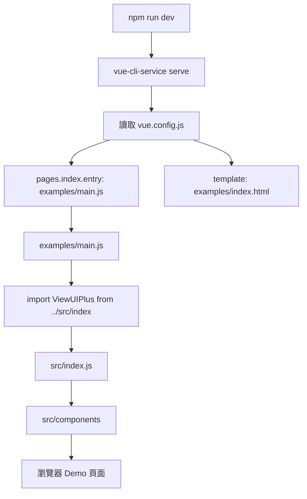

# 02-04_開發模式設定：Vite 與 Vue CLI

> 所屬章節：`02_根目錄與工程設定`  
> 筆記定位：理解 View UI Plus 在「本地開發 / Demo 預覽 / 原始碼調試」階段，為什麼同時存在 Vue CLI 與 Vite 兩套開發入口。  
> 適合閱讀時機：已看過 `02-01_根目錄總覽_先看懂專案邊界.md`、`02-02_根目錄資料夾責任分工.md`、`02-03_根目錄設定檔分類地圖.md` 之後。

---

## 目錄

1. [本篇先講結論](#1-本篇先講結論)
2. [本篇要解決的核心問題](#2-本篇要解決的核心問題)
3. [View UI Plus 的開發模式入口](#3-view-ui-plus-的開發模式入口)
4. [`npm run dev`：Vue CLI 開發模式](#4-npm-run-devvue-cli-開發模式)
5. [`npm run dev2`：Vite 開發模式](#5-npm-run-dev2vite-開發模式)
6. [兩種開發模式的流程圖](#6-兩種開發模式的流程圖)
7. [Vue CLI 與 Vite 設定對照表](#7-vue-cli-與-vite-設定對照表)
8. [為什麼元件庫專案會同時保留 Vue CLI 與 Vite？](#8-為什麼元件庫專案會同時保留-vue-cli-與-vite)
9. [讀碼時真正要抓的重點](#9-讀碼時真正要抓的重點)
10. [容易誤解的地方](#10-容易誤解的地方)
11. [本篇與後續章節的分工](#11-本篇與後續章節的分工)
12. [如果你要仿寫迷你元件庫，應該怎麼取捨？](#12-如果你要仿寫迷你元件庫應該怎麼取捨)
13. [讀碼檢核表](#13-讀碼檢核表)
14. [本篇總結](#14-本篇總結)
15. [參考來源](#15-參考來源)

---

## 1. 本篇先講結論

View UI Plus 的開發模式不是單純的「跑一個 Vue 專案」而已。

它比較像是：

> 用 `examples` 當作元件庫的本地展示場，然後讓展示場直接引用 `src` 原始碼，方便開發者一邊改元件，一邊在瀏覽器中確認效果。

也就是說，這個專案的開發流程核心不是：

```text
開發一個普通 Vue App
```

而是：

```text
開發元件庫原始碼 src
        ↓
透過 examples 建立 Demo 頁面
        ↓
在瀏覽器即時驗證元件行為
```

View UI Plus 目前保留了兩種開發啟動方式：

```json
{
  "dev": "vue-cli-service serve",
  "dev2": "vite --config vite.config.dev.js"
}
```

可以先把它們理解成：

| 指令 | 使用工具 | 主要設定檔 | 用途 |
|---|---|---|---|
| `npm run dev` | Vue CLI / webpack 系列 | `vue.config.js` | 舊式或相容性較高的本地開發模式 |
| `npm run dev2` | Vite | `vite.config.dev.js` | 較新式、啟動較快、設定較直接的本地開發模式 |

本篇重點是理解：

> `vue.config.js` 與 `vite.config.dev.js` 都不是元件庫的正式打包設定，而是支撐本地開發與 Demo 預覽的工程入口。

正式打包設定主要應該留到 `04_build_打包腳本與建置流程` 再深入看。

---

## 2. 本篇要解決的核心問題

讀到根目錄開發設定時，你要先解決 5 個問題：

### 問題一：本地開發時，到底啟動哪個畫面？

答案是：啟動 `examples` 底下的 Demo 應用。

`examples` 不是正式發布給 npm 使用者的核心源碼，而是給元件庫開發者測試元件用的展示場。

---

### 問題二：Demo 應用怎麼用到元件庫原始碼？

在 `examples/main.js` 中，可以看到它直接引入：

```js
import ViewUIPlus from '../src/index';
```

這代表 Demo 不是從 npm 安裝後的 `view-ui-plus` 套件引入元件，而是直接吃本地的 `src/index`。

這是元件庫開發非常重要的模式：

```text
examples/main.js
        ↓
../src/index
        ↓
src/components
        ↓
實際元件原始碼
```

好處是：

- 改 `src` 裡的元件，可以直接在 `examples` 看到效果。
- 不需要每次打包成 `dist` 才能測試。
- 可以透過路由頁面逐一測試 Button、Input、Table、Form、Modal 等元件。

---

### 問題三：為什麼有 `dev` 又有 `dev2`？

因為這個專案保留了兩套開發工具鏈：

```text
dev  → Vue CLI
dev2 → Vite
```

這通常代表專案有歷史演進痕跡。

以 View UI Plus 來看，它是 Vue 3 元件庫，但專案中仍保留了 Vue CLI 相關設定與依賴，例如：

```json
"@vue/cli-service": "~4.5.0"
```

同時也引入了 Vite：

```json
"vite": "^2.6.4"
```

所以不能把它當成「純 Vite 專案」來讀。

更準確的理解是：

> View UI Plus 是一個具有歷史包袱與遷移痕跡的 Vue 3 元件庫專案，它同時保留 Vue CLI 與 Vite 兩種開發模式。

---

### 問題四：`vite.config.dev.js` 和 `vite.config.js` 有什麼差別？

這兩個檔案名字很像，但定位不同。

| 檔案 | 定位 |
|---|---|
| `vite.config.dev.js` | 本地開發 Demo 用 |
| `vite.config.js` | 元件庫正式 build 用 |

`vite.config.dev.js` 會把 root 指向 `examples`：

```js
root: path.resolve(__dirname, 'examples')
```

而 `vite.config.js` 則會把 library entry 指向：

```js
entry: path.resolve(__dirname, './src/index.js')
```

所以不要看到 `vite.config` 就全部混在一起看。

這一篇只處理開發模式：

```text
vite.config.dev.js
vue.config.js
examples/main.js
examples/index.html
```

正式 build 流程留到後面章節。

---

### 問題五：讀這些設定是為了什麼？

不是為了背設定，而是為了建立元件庫工程的基本模型：

```text
元件庫專案 = src 原始碼 + examples 展示場 + 開發伺服器設定 + build 設定 + 發布設定
```

其中本篇只看：

```text
examples 展示場
開發伺服器設定
本地引用 src 原始碼的方式
```

---

## 3. View UI Plus 的開發模式入口

從 `package.json` 的 scripts 可以看到：

```json
{
  "scripts": {
    "dev": "vue-cli-service serve",
    "dev2": "vite --config vite.config.dev.js",
    "build": "npm run build:prod && npm run build:style && npm run build:lang",
    "build:style": "gulp --gulpfile build/build-style.js",
    "build:prod": "vite build",
    "build:lang": "vite build --config build/vite.lang.config.js",
    "lint": "vue-cli-service lint --fix"
  }
}
```

這裡可以先分成 3 組：

| 類型 | script | 說明 |
|---|---|---|
| 本地開發 | `dev` | 使用 Vue CLI 啟動開發伺服器 |
| 本地開發 | `dev2` | 使用 Vite 啟動開發伺服器 |
| 正式建置 | `build` / `build:prod` / `build:style` / `build:lang` | 打包 JS、樣式、語言包 |
| 程式碼檢查 | `lint` | 使用 Vue CLI 相關 lint 流程 |

本篇只聚焦前兩個：

```text
npm run dev
npm run dev2
```

也就是：

```text
Vue CLI 開發模式
Vite 開發模式
```

---

## 4. `npm run dev`：Vue CLI 開發模式

### 4.1 啟動入口

`npm run dev` 對應：

```json
"dev": "vue-cli-service serve"
```

也就是透過 Vue CLI 啟動本地開發伺服器。

Vue CLI 會讀取根目錄的 `vue.config.js`。

---

### 4.2 `vue.config.js` 的核心設定

View UI Plus 的 `vue.config.js` 大致如下：

```js
module.exports = {
  assetsDir: '',
  pages: {
    index: {
      entry: 'examples/main.js',
      template: 'examples/index.html',
      filename: 'index.html',
      chunks: ['chunk-vendors', 'chunk-common', 'index']
    }
  },
  configureWebpack: {
    resolve: {}
  },
  devServer: {
    disableHostCheck: true
  }
};
```

這份設定的重點不是很多，主要看 4 個地方。

---

### 4.3 `pages.index.entry`

```js
entry: 'examples/main.js'
```

這告訴 Vue CLI：

> 本地開發時，頁面入口不是 `src/main.js`，而是 `examples/main.js`。

這是元件庫專案和普通 Vue App 的一個重大差異。

普通 Vue App 常見是：

```text
src/main.js
```

但元件庫專案常見是：

```text
examples/main.js
```

原因是元件庫的 `src` 是產品本體，不一定拿來直接當應用入口。

---

### 4.4 `pages.index.template`

```js
template: 'examples/index.html'
```

這代表 HTML 模板也來自 `examples`。

也就是 Vue CLI 開發模式下的頁面關係為：

```text
examples/index.html
        ↓
examples/main.js
        ↓
../src/index
```

---

### 4.5 `filename`

```js
filename: 'index.html'
```

這表示輸出的 HTML 檔名是 `index.html`。

對開發模式來說，你可以簡單理解為：

```text
瀏覽器打開的主頁面就是 index.html
```

---

### 4.6 `chunks`

```js
chunks: ['chunk-vendors', 'chunk-common', 'index']
```

這是 Vue CLI / webpack 多頁面設定常見的打包區塊配置。

在本篇不用深挖它，先知道：

> 這是 Vue CLI 生成頁面時要掛載哪些 chunk 的設定。

更深的 webpack chunk 拆分邏輯，不是本篇重點。

---

### 4.7 `configureWebpack`

```js
configureWebpack: {
  resolve: {}
}
```

這裡目前沒有太多客製內容。

但它的存在代表：

> 如果專案需要補 webpack 設定，可以在這裡擴充。

目前對讀碼來說，只需要知道它保留了 webpack 客製入口。

---

### 4.8 `devServer.disableHostCheck`

```js
devServer: {
  disableHostCheck: true
}
```

這是 Vue CLI dev server 的開發伺服器設定。

從讀碼角度來看，它代表：

> 這份設定有處理本地開發伺服器的連線限制問題。

不過這類設定通常和當時開發環境、代理、內網、預覽方式有關，不需要在本章過度展開。

---

### 4.9 Vue CLI 開發模式整理

`npm run dev` 的流程可以整理成：

```text
npm run dev
        ↓
vue-cli-service serve
        ↓
讀取 vue.config.js
        ↓
pages.index.entry = examples/main.js
        ↓
examples/main.js 引入 ../src/index
        ↓
啟動 Demo 頁面
        ↓
修改 src 元件時可以在 Demo 中確認效果
```

所以 `vue.config.js` 的本質是：

> 用 Vue CLI 把 `examples` 包裝成一個可運行的本地 Demo 應用。

---

## 5. `npm run dev2`：Vite 開發模式

### 5.1 啟動入口

`npm run dev2` 對應：

```json
"dev2": "vite --config vite.config.dev.js"
```

也就是明確指定使用：

```text
vite.config.dev.js
```

這點很重要。

因為 Vite 預設會找：

```text
vite.config.js
```

但 View UI Plus 的 `dev2` 指令不是用預設的 `vite.config.js`，而是使用：

```text
vite.config.dev.js
```

也就是：

```text
開發模式 Vite 設定 = vite.config.dev.js
正式 build Vite 設定 = vite.config.js
```

---

### 5.2 `vite.config.dev.js` 的核心設定

View UI Plus 的 `vite.config.dev.js` 大致如下：

```js
import { defineConfig } from 'vite';
import vue from '@vitejs/plugin-vue';
import path from 'path';

export default defineConfig({
  root: path.resolve(__dirname, 'examples'),
  plugins: [vue()],
  server: {
    port: 8080,
    open: true
  },
  resolve: {
    alias: {
      // 保证 examples 里能正确引用到库源码
      '@': path.resolve(__dirname, 'src')
    },
    extensions: ['.mjs', '.js', '.ts', '.jsx', '.tsx', '.json', '.vue']
  }
});
```

這份設定可以拆成 5 個重點：

1. `root`
2. `plugins`
3. `server`
4. `resolve.alias`
5. `resolve.extensions`

---

### 5.3 `root`

```js
root: path.resolve(__dirname, 'examples')
```

這是整份 Vite 開發設定的核心。

它告訴 Vite：

> 開發伺服器的專案根目錄是 `examples`。

因此 Vite 會以 `examples` 為開發應用的 root。

這和 Vue CLI 的 `pages.index.entry = examples/main.js` 是同一個思路：

```text
開發時跑 examples，不是直接跑 src
```

只是寫法不同。

---

### 5.4 `plugins`

```js
plugins: [vue()]
```

這代表 Vite 要使用 Vue SFC 插件來處理 `.vue` 檔案。

沒有這個插件，Vite 不知道如何正確處理 Vue 單檔元件。

你可以簡單記：

> `@vitejs/plugin-vue` 是 Vite 處理 Vue SFC 的必要角色。

---

### 5.5 `server`

```js
server: {
  port: 8080,
  open: true
}
```

這是開發伺服器設定：

| 設定 | 意義 |
|---|---|
| `port: 8080` | 本地開發伺服器使用 8080 port |
| `open: true` | 啟動後自動打開瀏覽器 |

所以 `npm run dev2` 啟動後，預期會直接開啟瀏覽器進入 Demo 頁面。

---

### 5.6 `resolve.alias`

```js
alias: {
  '@': path.resolve(__dirname, 'src')
}
```

這是非常值得注意的設定。

註解寫得很清楚：

```js
// 保证 examples 里能正确引用到库源码
```

也就是：

> 保證 `examples` 裡可以正確引用元件庫的 `src` 原始碼。

換句話說，這個 alias 的目的不是單純為了少打路徑，而是為了建立 Demo 應用與元件庫源碼之間的橋。

概念如下：

```text
examples
   ├── routers/button.vue
   ├── routers/form.vue
   └── main.js
        ↓
src
   ├── index.js
   └── components
```

當 Demo 頁面需要引用源碼時，可以透過 `@` 指向 `src`。

---

### 5.7 `resolve.extensions`

```js
extensions: ['.mjs', '.js', '.ts', '.jsx', '.tsx', '.json', '.vue']
```

這表示模組解析時可以省略這些副檔名。

例如：

```js
import Button from '@/components/button'
```

Vite 解析時可以嘗試：

```text
button.mjs
button.js
button.ts
button.jsx
button.tsx
button.json
button.vue
```

對讀碼來說，看到沒有副檔名的 import，不要誤以為找不到檔案。

---

### 5.8 Vite 開發模式整理

`npm run dev2` 的流程可以整理成：

```text
npm run dev2
        ↓
vite --config vite.config.dev.js
        ↓
root = examples
        ↓
啟動 Vite dev server
        ↓
使用 @vitejs/plugin-vue 處理 .vue
        ↓
alias @ 指向 src
        ↓
examples 可以直接引用元件庫原始碼
```

所以 `vite.config.dev.js` 的本質是：

> 用 Vite 把 `examples` 當作開發應用，並建立 `examples → src` 的原始碼引用通道。

---

## 6. 兩種開發模式的流程圖

### 6.1 Vue CLI 開發模式



---

### 6.2 Vite 開發模式

```mermaid
flowchart TD
    A[npm run dev2] --> B[vite --config vite.config.dev.js]
    B --> C[讀取 vite.config.dev.js]
    C --> D[root: examples]
    C --> E[plugins: vue()]
    C --> F[server: port 8080, open true]
    C --> G[alias @ -> src]
    D --> H[examples/index.html]
    H --> I[examples/main.js]
    I --> J[import ViewUIPlus from ../src/index]
    J --> K[src/index.js]
    K --> L[src/components]
    L --> M[瀏覽器 Demo 頁面]
```

---

### 6.3 共同核心

雖然 Vue CLI 和 Vite 的設定寫法不同，但它們最後都導向同一件事：

```text
啟動 examples Demo
        ↓
examples/main.js
        ↓
引用 src/index
        ↓
測試元件庫原始碼
```

所以本篇最重要的抽象模型是：

```text
開發工具只是外殼
examples 才是開發展示場
src 才是元件庫本體
```

---

## 7. Vue CLI 與 Vite 設定對照表

| 對照點 | Vue CLI 模式 | Vite 模式 |
|---|---|---|
| 啟動指令 | `npm run dev` | `npm run dev2` |
| 實際命令 | `vue-cli-service serve` | `vite --config vite.config.dev.js` |
| 主要設定檔 | `vue.config.js` | `vite.config.dev.js` |
| 開發入口 | `examples/main.js` | `examples` 作為 root，間接進入 `examples/main.js` |
| HTML 模板 | `examples/index.html` | `examples/index.html` |
| Vue 檔處理 | Vue CLI / webpack loader 體系 | `@vitejs/plugin-vue` |
| Demo 與 src 的關係 | `examples/main.js` 直接 `import ../src/index` | `examples/main.js` 直接 `import ../src/index`，並有 `@ -> src` alias |
| 開發伺服器 | Vue CLI dev server | Vite dev server |
| port 設定 | 未在 `vue.config.js` 明確指定 | `8080` |
| 自動開瀏覽器 | 未在 `vue.config.js` 明確指定 | `open: true` |
| 工程意義 | 保留較舊的 Vue CLI 開發模式 | 提供較新式的 Vite 開發模式 |

---

## 8. 為什麼元件庫專案會同時保留 Vue CLI 與 Vite？

這裡不要只從「哪個比較新」來看，而要從企業級元件庫的演進角度看。

View UI Plus 同時存在：

```json
"dev": "vue-cli-service serve",
"dev2": "vite --config vite.config.dev.js"
```

也同時存在：

```json
"@vue/cli-service": "~4.5.0",
"vite": "^2.6.4"
```

這通常透露出幾個工程現象。

---

### 8.1 現象一：專案可能不是一次性重寫，而是逐步演進

元件庫通常不會為了換工具鏈就全部重寫。

因為它要維持：

- 元件 API 穩定
- 樣式產物穩定
- 使用者升級成本可控
- 打包格式穩定
- Demo 與文件可持續運作

所以保留 Vue CLI，同時導入 Vite，是很常見的過渡狀態。

---

### 8.2 現象二：開發模式與正式打包模式可能分離

在 View UI Plus 裡：

```text
dev       → Vue CLI 開發
dev2      → Vite 開發
build:prod → Vite build
build:style → gulp build style
```

這代表它不是單一工具解決全部問題，而是不同任務使用不同工具。

可以理解成：

| 任務 | 使用工具 |
|---|---|
| 舊式本地開發 | Vue CLI |
| 新式本地開發 | Vite |
| JS library build | Vite |
| Less / CSS style build | Gulp |
| lint | Vue CLI lint |

這是元件庫、老專案、企業級專案很常見的混合工具鏈。

---

### 8.3 現象三：根目錄設定檔會帶有歷史痕跡

讀開源專案時，不要期待根目錄永遠乾淨。

尤其是元件庫專案，常常會看到：

```text
舊工具還在
新工具也在
部分腳本已轉移
部分腳本仍沿用舊工具
```

所以你要練的是：

> 判斷每個設定檔目前還負責什麼，而不是看到舊工具就立刻認為它沒用。

以本篇來說：

| 設定檔 | 是否仍有明確角色 |
|---|---|
| `vue.config.js` | 有，因為 `npm run dev` 會用到 |
| `vite.config.dev.js` | 有，因為 `npm run dev2` 會用到 |
| `vite.config.js` | 有，但主要是正式 build 用 |
| `build/vite.lang.config.js` | 有，語言包 build 用 |
| `build/build-style.js` | 有，樣式 build 用 |

這也是為什麼根目錄章節必須先建立「設定檔分類地圖」。

---

## 9. 讀碼時真正要抓的重點

讀 `vue.config.js` 和 `vite.config.dev.js` 時，不要平均用力。

以下才是關鍵。

---

### 9.1 第一個重點：誰是開發入口？

Vue CLI 模式：

```js
entry: 'examples/main.js'
```

Vite 模式：

```js
root: path.resolve(__dirname, 'examples')
```

兩者都指向：

```text
examples
```

所以你要記：

> View UI Plus 本地開發不是直接跑 `src`，而是跑 `examples`。

---

### 9.2 第二個重點：Demo 如何接到元件庫原始碼？

在 `examples/main.js`：

```js
import ViewUIPlus from '../src/index';
```

這是整條開發鏈路的核心。

也就是：

```text
examples 是殼
src 是元件庫本體
../src/index 是連接點
```

如果你要讀元件註冊流程，後面應該從這裡接到：

```text
src/index.js
```

再往下看：

```text
install(app)
app.component(...)
app.config.globalProperties
```

這些就會銜接到後面的：

```text
06_src_入口與插件機制
07_元件註冊機制
08_全域配置與globalProperties
```

---

### 9.3 第三個重點：開發工具不是主角

本篇容易被 Vite / Vue CLI 的設定細節吸走。

但真正的重點不是工具本身，而是元件庫開發模型：

```text
Demo App → 引入本地元件庫源碼 → 驗證元件效果
```

工具只是讓這件事跑起來。

所以你不需要在這一篇背完所有 Vite / webpack 設定。

---

### 9.4 第四個重點：`vite.config.dev.js` 不等於正式打包設定

`vite.config.dev.js`：

```js
root: path.resolve(__dirname, 'examples')
```

這是給開發 Demo 用。

`vite.config.js`：

```js
build: {
  outDir: path.resolve(__dirname, './dist'),
  lib: {
    entry: path.resolve(__dirname, './src/index.js'),
    name: 'ViewUIPlus'
  }
}
```

這才是正式 library build 的方向。

因此本篇不要把 `vite.config.dev.js` 看成元件庫正式打包邏輯。

---

### 9.5 第五個重點：這是你未來仿寫元件庫時最該學的結構

如果你要自己做一個迷你元件庫，最值得學的不是照抄所有設定，而是學這個結構：

```text
my-ui-lib
├── src
│   ├── index.ts
│   └── components
├── examples
│   ├── index.html
│   ├── main.ts
│   └── App.vue
├── vite.config.dev.ts
├── vite.config.ts
└── package.json
```

其中開發模式要做到：

```text
examples/main.ts 直接 import src/index.ts
```

或是：

```text
alias @ 指向 src
```

這樣你就可以一邊開發元件，一邊用 examples 測試。

---

## 10. 容易誤解的地方

### 誤解一：`src` 是啟動入口

錯。

在元件庫專案中，`src` 是產品本體，不一定是開發 App 的入口。

View UI Plus 本地開發主要是透過：

```text
examples/main.js
```

啟動 Demo，再引入：

```text
../src/index
```

---

### 誤解二：`examples` 只是無關緊要的範例資料夾

不完全對。

對一般使用者來說，`examples` 可能只是範例。

但對元件庫開發者來說，`examples` 是：

```text
本地開發入口
元件測試場
互動行為驗證場
路由式元件 Demo 集合
```

讀元件庫時，`examples` 常常是理解元件用法最快的地方。

---

### 誤解三：`dev2` 是正式建置

錯。

`dev2` 是本地開發：

```json
"dev2": "vite --config vite.config.dev.js"
```

正式建置比較接近：

```json
"build:prod": "vite build"
```

以及：

```json
"build": "npm run build:prod && npm run build:style && npm run build:lang"
```

所以：

```text
dev2 = Vite 開發模式
build:prod = Vite 正式 JS 打包
```

不要混在一起。

---

### 誤解四：保留 Vue CLI 代表專案落後

不一定。

對成熟元件庫來說，保留舊工具可能只是為了：

- 相容既有開發流程
- 降低遷移風險
- 保留 lint 或部分 webpack 流程
- 避免一次性大改造成不穩定

讀企業級專案時，要用「演進」角度，而不是只用「新舊」角度。

---

### 誤解五：alias `@` 只是偷懶少寫路徑

不完全是。

在這個專案中，`@` 指向 `src`：

```js
'@': path.resolve(__dirname, 'src')
```

它的工程意義是：

> 讓 examples 能穩定引用元件庫原始碼。

這比單純路徑縮寫更重要。

---

## 11. 本篇與後續章節的分工

這一篇要克制，不要把所有東西都講完。

| 後續章節 | 本篇只做到哪裡 |
|---|---|
| `03_package與依賴分析` | 只看 `scripts.dev`、`scripts.dev2`，不深入 dependencies 全表 |
| `04_build_打包腳本與建置流程` | 只區分 dev config 與 build config，不深入 Rollup output |
| `05_dist_打包產物分析` | 不分析 dist |
| `06_src_入口與插件機制` | 只知道 `examples/main.js` 會進到 `../src/index` |
| `07_元件註冊機制` | 不深入 `install` 與 `app.component` |
| `25_examples_範例與Demo` | 只把 examples 當開發入口，不逐頁分析 Demo |
| `26_test_測試` | 不討論測試流程 |

本篇的邊界可以用一句話記：

> 這篇只建立「開發伺服器如何跑起 examples，examples 如何接到 src」的工程地圖。

---

## 12. 如果你要仿寫迷你元件庫，應該怎麼取捨？

你學 View UI Plus，不是為了照抄所有歷史設定。

如果你要做自己的迷你元件庫，我建議不要同時保留 Vue CLI 與 Vite。

除非你有明確的相容需求，否則新專案直接用 Vite 就好。

---

### 12.1 推薦的簡化版 scripts

```json
{
  "scripts": {
    "dev": "vite --config vite.config.dev.ts",
    "build": "vite build",
    "type-check": "vue-tsc --noEmit"
  }
}
```

你可以把 View UI Plus 的 `dev2` 思路吸收成自己的 `dev`。

也就是：

```text
View UI Plus:
dev2 = vite --config vite.config.dev.js

你的迷你元件庫:
dev = vite --config vite.config.dev.ts
```

---

### 12.2 推薦的簡化版 `vite.config.dev.ts`

```ts
import { defineConfig } from 'vite';
import vue from '@vitejs/plugin-vue';
import path from 'node:path';

export default defineConfig({
  root: path.resolve(__dirname, 'examples'),
  plugins: [vue()],
  server: {
    port: 5173,
    open: true
  },
  resolve: {
    alias: {
      '@': path.resolve(__dirname, 'src')
    }
  }
});
```

這份設定學的是 View UI Plus 的核心概念：

```text
root 指向 examples
alias 指向 src
```

---

### 12.3 推薦的簡化版 `examples/main.ts`

```ts
import { createApp } from 'vue';
import App from './App.vue';
import MyUI from '../src';

const app = createApp(App);

app.use(MyUI);

app.mount('#app');
```

這對應 View UI Plus 的：

```js
import ViewUIPlus from '../src/index';

const app = createApp(App);
app.use(ViewUIPlus);
app.mount('#app');
```

---

### 12.4 推薦的資料夾結構

```text
my-ui-lib
├── examples
│   ├── index.html
│   ├── main.ts
│   ├── App.vue
│   └── routers
│       ├── button.vue
│       └── input.vue
├── src
│   ├── index.ts
│   └── components
│       ├── button
│       └── input
├── types
├── vite.config.dev.ts
├── vite.config.ts
├── tsconfig.json
└── package.json
```

如果你現在要練習，不需要一開始就做成 View UI Plus 那麼完整。

先做到：

```text
src 有元件
examples 可以展示
npm run dev 可以跑
npm run build 可以產出 library
```

這就已經是很好的第一階段。

---

## 13. 讀碼檢核表

讀完本篇後，可以用下面問題檢查自己是否真的理解。

### 13.1 開發入口檢核

- [ ] 我知道 `npm run dev` 使用 Vue CLI。
- [ ] 我知道 `npm run dev2` 使用 Vite。
- [ ] 我知道 `dev2` 指定的是 `vite.config.dev.js`，不是預設的 `vite.config.js`。
- [ ] 我知道 View UI Plus 本地開發主要是跑 `examples`。
- [ ] 我知道 `examples/main.js` 會引入 `../src/index`。

---

### 13.2 Vue CLI 設定檢核

- [ ] 我知道 `vue.config.js` 中的 `pages.index.entry` 指向 `examples/main.js`。
- [ ] 我知道 `template` 指向 `examples/index.html`。
- [ ] 我知道 `vue.config.js` 是 Vue CLI 開發模式會讀取的設定檔。
- [ ] 我知道 `configureWebpack` 是 webpack 客製入口。
- [ ] 我不會把 `vue.config.js` 當成 Vite 設定。

---

### 13.3 Vite 設定檢核

- [ ] 我知道 `vite.config.dev.js` 的 `root` 指向 `examples`。
- [ ] 我知道 `plugins: [vue()]` 是為了處理 Vue SFC。
- [ ] 我知道 `server.port` 是 8080。
- [ ] 我知道 `server.open` 會自動開啟瀏覽器。
- [ ] 我知道 alias `@` 指向 `src`。
- [ ] 我知道 `resolve.extensions` 會影響 import 解析副檔名。

---

### 13.4 工程理解檢核

- [ ] 我知道 View UI Plus 不是純 Vite 專案。
- [ ] 我知道這種雙工具鏈代表專案有歷史演進痕跡。
- [ ] 我知道 `vite.config.dev.js` 和 `vite.config.js` 的定位不同。
- [ ] 我知道正式 build 不屬於本篇重點。
- [ ] 我能說出「examples 是展示場，src 是元件庫本體」這句話的意思。

---

### 13.5 仿寫能力檢核

- [ ] 我能設計一個 `examples` 作為 Demo 應用。
- [ ] 我能讓 `examples/main.ts` 直接引入 `../src/index.ts`。
- [ ] 我能設定 Vite dev root 指向 `examples`。
- [ ] 我能設定 alias `@` 指向 `src`。
- [ ] 我知道新專案通常不需要同時保留 Vue CLI 與 Vite。

---

## 14. 本篇總結

這一篇的核心不是學會所有 Vite 或 Vue CLI 細節。

真正要學的是元件庫開發模式：

```text
src 是元件庫本體
examples 是本地展示場
dev server 是讓 examples 跑起來的外殼
examples/main.js 是接到 src/index 的橋
```

View UI Plus 用兩種方式支撐本地開發：

```text
npm run dev
        ↓
Vue CLI
        ↓
vue.config.js
        ↓
examples/main.js

npm run dev2
        ↓
Vite
        ↓
vite.config.dev.js
        ↓
examples
```

兩者最後都導向：

```text
examples Demo → ../src/index → 元件庫原始碼
```

所以你讀這篇時，最終應該建立的心智模型是：

> 元件庫不是直接用 `src/main.js` 啟動，而是透過 `examples` 建立一個開發 App，再讓這個 App 直接引用 `src` 裡的元件庫原始碼。

這個模式非常值得你在後續做 `37_迷你元件庫實作` 時模仿。

---

## 15. 參考來源

> 以下來源為撰寫本筆記時對照的 View UI Plus 官方 GitHub 原始碼與相關官方文件。

1. View UI Plus GitHub Repository  
   `https://github.com/view-design/ViewUIPlus`

2. View UI Plus `package.json`  
   `https://raw.githubusercontent.com/view-design/ViewUIPlus/master/package.json`

3. View UI Plus `vite.config.dev.js`  
   `https://raw.githubusercontent.com/view-design/ViewUIPlus/master/vite.config.dev.js`

4. View UI Plus `vue.config.js`  
   `https://raw.githubusercontent.com/view-design/ViewUIPlus/master/vue.config.js`

5. View UI Plus `vite.config.js`  
   `https://raw.githubusercontent.com/view-design/ViewUIPlus/master/vite.config.js`

6. View UI Plus `examples/main.js`  
   `https://raw.githubusercontent.com/view-design/ViewUIPlus/master/examples/main.js`

7. Vite 官方文件：Configuring Vite  
   `https://vite.dev/config/`

8. Vue CLI 官方文件：Configuration Reference  
   `https://cli.vuejs.org/config/`
