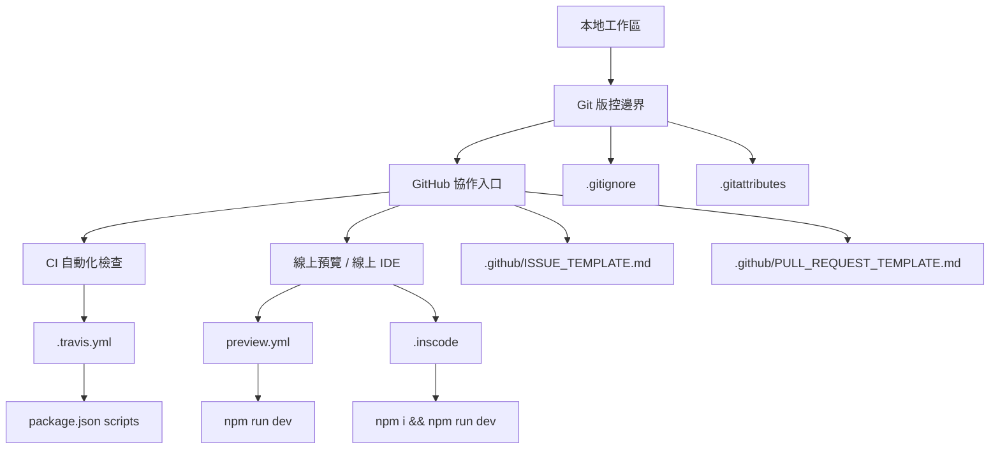

# 02-09_Git_CI_線上預覽設定

> 章節位置：`02_根目錄與工程設定`  
> 筆記定位：根目錄工程設定中的「Git 協作、CI、自動化檢查、線上預覽」入口地圖  
> 專案：View UI Plus  
> 建議閱讀順序：先讀 `02-01`～`02-08`，再讀本篇  
> 版本基準：依 View UI Plus `master` 分支目前可見根目錄設定整理

---

## 1. 本篇要解決什麼問題？

這一篇不是要深入學 Git，也不是要教 CI/CD 全流程，而是要幫你在讀 View UI Plus 根目錄時回答幾個工程判斷問題：

1. 哪些檔案負責 Git 忽略規則？
2. 哪些檔案負責 GitHub 上的協作流程？
3. 這個專案目前有沒有 GitHub Actions？
4. `.travis.yml` 還代表目前 CI 一定有效嗎？
5. `preview.yml` 和 `.inscode` 是給本地開發用，還是給線上工作區用？
6. 怎麼判斷某個設定檔是「正在使用」還是「歷史遺留」？

本篇的核心目標是建立一個判斷框架：

> **根目錄看到 CI / Preview / Git 設定檔時，不要只問「它是什麼」，還要問「誰會讀它、什麼時機讀它、目前還有沒有入口會觸發它」。**

---

## 2. 本篇觀察範圍

本篇主要觀察以下根目錄檔案與資料夾：

```text
ViewUIPlus/
├── .github/
│   ├── ISSUE_TEMPLATE.md
│   └── PULL_REQUEST_TEMPLATE.md
├── .gitattributes
├── .gitignore
├── .travis.yml
├── .inscode
├── preview.yml
└── package.json
```

其中 `package.json` 在這篇不是主角，但它很重要，因為 CI 或 Preview 最後通常都會呼叫 `package.json` 裡的 scripts。

---

## 3. 一句話總結這組設定

View UI Plus 的 Git / CI / Preview 設定可以這樣理解：

```text
.gitignore       控制哪些本地檔案不要進 Git
.gitattributes   控制 GitHub 如何看待某些檔案，例如語言統計
.github/         提供 GitHub Issue / PR 協作模板，目前模板內容為空
.travis.yml      舊式 Travis CI 設定，指定 Node.js 8 並嘗試跑 npm run test
preview.yml      線上預覽環境設定，會安裝依賴並執行 npm run dev
.inscode         InsCode 線上工作區啟動設定
package.json     提供 dev / dev2 / build / lint 等真正可執行的 npm scripts
```

這組設定最重要的讀碼結論是：

> **View UI Plus 根目錄中確實保留了 Git、Travis CI、InsCode 預覽相關設定，但不是每個設定都能直接代表目前仍完整有效。尤其 `.travis.yml` 指向 `npm run test`，但目前 `package.json` 並沒有定義 `test` script，因此這個 CI 設定很可能是歷史遺留或未同步維護的設定。**

---

## 4. 工程設定分類地圖

| 類別 | 檔案 | 誰會讀它 | 主要用途 | 讀碼重點 |
|---|---|---|---|---|
| Git 忽略規則 | `.gitignore` | Git | 排除本地暫存、依賴、IDE、log、coverage 等檔案 | 看哪些東西不應該進版控 |
| GitHub 語言統計 / 檔案分類 | `.gitattributes` | Git / GitHub Linguist | 調整 GitHub 對特定路徑的語言 / vendored 判斷 | 看專案是否調整 GitHub 統計或 diff 顯示 |
| GitHub 協作模板 | `.github/ISSUE_TEMPLATE.md`、`.github/PULL_REQUEST_TEMPLATE.md` | GitHub | 建立 issue / PR 時預填模板 | 目前模板為空，只能視為保留入口 |
| CI 設定 | `.travis.yml` | Travis CI | 指定 CI 執行環境與測試命令 | 要回頭比對 `package.json` scripts 是否存在 |
| 線上工作區啟動 | `.inscode` | InsCode / 線上 IDE | 定義線上工作區啟動命令與環境變數 | 不是本地開發必要設定 |
| 線上預覽 | `preview.yml` | 線上預覽平台 | 定義預覽應用的 port、啟動指令、工作目錄 | 看它啟動的是 `dev` 還是 `dev2` |
| 指令入口 | `package.json` scripts | npm / yarn / CI / Preview | 提供 `dev`、`dev2`、`build`、`lint` 等命令 | 所有自動化設定最後都要回來對照 scripts |

---

## 5. 本篇心智模型

你可以把這組設定想成四層：



重點不是背檔名，而是要看出：

1. `.gitignore` 和 `.gitattributes` 是 Git / GitHub 層。
2. `.github` 是協作流程層。
3. `.travis.yml` 是 CI 層。
4. `.inscode` 和 `preview.yml` 是線上環境層。
5. CI / Preview 最後都會回到 `package.json` scripts。

---

## 6. `.gitignore`：本地產物與開發雜訊的邊界

### 6.1 它的責任

`.gitignore` 的用途是告訴 Git：哪些檔案不應該被納入版本控制。

View UI Plus 的 `.gitignore` 主要排除幾類東西：

| 類別 | 例子 | 為什麼要忽略 |
|---|---|---|
| IDE 設定 | `.idea`、`.ipr`、`.iws`、`.vscode` | 這些通常是個人開發環境差異 |
| 系統檔案 | `.DS_Store` | macOS 自動產生，和專案無關 |
| 依賴目錄 | `node_modules/`、`node_modules2/` | 體積大，可由 package manager 重建 |
| log / debug | `*.log`、`npm-debug.log`、`yarn-error.log` | 執行過程產物，不應污染 repo |
| patch / diff / 備份 | `*.diff`、`*.patch`、`*.bak` | 通常是暫存或人工備份 |
| coverage | `test/unit/coverage` | 測試覆蓋率產物，可重新產生 |
| example build 產物 | `examples/dist/` | 範例打包後的產物，不一定要進版控 |
| lock file | `package-lock.json` | 專案選擇不提交 npm lock file |

### 6.2 讀碼時要注意什麼？

讀 `.gitignore` 時，不要只看它排除了什麼，更要反推專案的開發形態。

例如：

```text
examples/dist/
test/unit/coverage
package-lock.json
```

這代表幾個訊號：

1. `examples` 可能會被打包或產生輸出。
2. 專案曾經或理論上有測試覆蓋率輸出。
3. 專案沒有選擇把 `package-lock.json` 作為固定依賴版本的依據。

### 6.3 對你讀 View UI Plus 的意義

`.gitignore` 可以幫你分辨：

```text
哪些是源碼？
哪些是本地開發產物？
哪些是測試產物？
哪些是不應該被提交的個人環境檔案？
```

例如你之後看到 `examples/dist/`，就要知道它不是原始設計的核心，而是範例側的建置產物。

---

## 7. `.gitattributes`：不是打包設定，而是 GitHub 顯示與統計設定

### 7.1 實際內容

View UI Plus 的 `.gitattributes` 目前只有一條規則：

```text
src/styles/**/* linguist-vendored=false
```

### 7.2 這行在做什麼？

這行和 Vite、Vue CLI、npm 打包都沒有直接關係。

它主要是在告訴 GitHub Linguist：

> `src/styles/**/*` 底下的檔案不要被視為 vendored code。

簡單講，這比較像是 GitHub 顯示層 / 語言統計層的設定。

### 7.3 為什麼元件庫會在意這件事？

View UI Plus 是 UI 元件庫，樣式系統是核心資產之一。

如果某些樣式檔被 GitHub 誤判為 vendored code，可能會影響：

1. GitHub 語言比例統計。
2. GitHub 對檔案的分類。
3. 讀者對專案組成的第一印象。

所以這行設定可以理解為：

> **專案希望 `src/styles` 被視為自己的核心程式碼，而不是外部 vendored 內容。**

### 7.4 常見誤解

| 誤解 | 正確理解 |
|---|---|
| `.gitattributes` 會影響 Vite 打包 | 通常不會，它主要影響 Git / GitHub 行為 |
| `linguist-vendored=false` 是排除檔案 | 不是排除，而是告訴 Linguist 不要把它當 vendored |
| 這是 CSS / Less 編譯設定 | 不是，樣式編譯在 build / gulp / Vite 相關設定中處理 |

---

## 8. `.github`：GitHub 協作流程入口

### 8.1 目前結構

View UI Plus 的 `.github` 目錄目前可見兩個檔案：

```text
.github/
├── ISSUE_TEMPLATE.md
└── PULL_REQUEST_TEMPLATE.md
```

這兩個檔案的檔名代表：

| 檔案 | GitHub 觸發時機 | 理論用途 |
|---|---|---|
| `ISSUE_TEMPLATE.md` | 使用者建立 issue 時 | 預先提示 bug 描述、重現步驟、環境資訊 |
| `PULL_REQUEST_TEMPLATE.md` | 使用者建立 pull request 時 | 預先提示修改內容、關聯 issue、測試方式 |

### 8.2 但目前內容是空的

目前這兩個模板檔案內容為空。

因此讀碼時要做一個重要判斷：

> **檔案存在，不代表協作流程真的有被細緻設計；如果模板內容是空的，它比較像是保留入口，而不是成熟的貢獻規範。**

### 8.3 你讀開源專案時應該怎麼判斷？

看到 `.github` 時，可以依序檢查：

```text
.github/
├── workflows/                 是否有 GitHub Actions？
├── ISSUE_TEMPLATE/             是否有新版 issue form？
├── ISSUE_TEMPLATE.md           是否有舊式 issue template？
├── PULL_REQUEST_TEMPLATE.md    是否有 PR template？
├── dependabot.yml              是否有依賴更新機制？
└── CODEOWNERS                  是否有 code owner 規則？
```

在 View UI Plus 目前根目錄可見的 `.github` 中：

1. 沒有看到 `.github/workflows/`。
2. 沒有看到 GitHub Actions workflow。
3. 只有 Issue / PR template。
4. 而且兩個 template 內容為空。

所以本專案目前從根目錄可見的 CI 設定，不是 GitHub Actions，而是 `.travis.yml`。

---

## 9. `.travis.yml`：舊式 CI 設定與歷史遺留判斷

### 9.1 實際設定的意思

View UI Plus 的 `.travis.yml` 可以整理成這樣：

```yml
sudo: required
language: node_js
node_js:
  - '8'
script:
  - 'npm run test'
before_script:
  - 'sudo chown root /opt/google/chrome/chrome-sandbox'
  - 'sudo chmod 4755 /opt/google/chrome/chrome-sandbox'
```

這份設定透露出幾個訊息：

| 設定 | 意義 |
|---|---|
| `language: node_js` | Travis 會用 Node.js 專案環境 |
| `node_js: '8'` | CI 指定 Node.js 8 |
| `script: npm run test` | CI 主要任務是跑測試 |
| `before_script` 修改 Chrome sandbox 權限 | 測試環境可能曾經需要瀏覽器或 headless Chrome |
| `sudo: required` | 使用需要 sudo 權限的 Travis 環境 |

### 9.2 和 `package.json` 對照後的問題

目前 `package.json` 的 scripts 主要有：

```json
{
  "dev": "vue-cli-service serve",
  "dev2": "vite --config vite.config.dev.js",
  "build": "npm run build:prod && npm run build:style && npm run build:lang",
  "build:style": "gulp --gulpfile build/build-style.js",
  "build:prod": "vite build",
  "build:lang": "vite build --config build/vite.lang.config.js",
  "lint": "vue-cli-service lint --fix"
}
```

注意：目前 scripts 裡沒有 `test`。

這代表 `.travis.yml` 裡的：

```bash
npm run test
```

在目前 `package.json` 中找不到對應 script。

### 9.3 這代表什麼？

這是本篇最重要的工程判斷點。

你不能只因為根目錄有 `.travis.yml`，就判斷：

> 這個專案目前 CI 一定正常跑測試。

更精準的說法應該是：

> **根目錄保留了一份 Travis CI 設定，但它目前指向 `npm run test`，而 `package.json` 沒有定義 `test` script，因此這份 CI 設定至少和目前 npm scripts 不一致，可能是歷史遺留、未同步維護，或需要其他外部前提才成立。**

### 9.4 為什麼這對你很重要？

因為你之後讀企業舊專案時，會很常看到類似情況：

```text
設定檔還在
文件還在
舊腳本還在
但是現在沒人用了
```

讀碼時要養成一個習慣：

```text
看到設定檔
→ 找誰會讀它
→ 找什麼命令會觸發它
→ 回頭檢查 package.json / CI 平台 / 文件是否一致
→ 再判斷它是不是有效設定
```

### 9.5 CI 設定的有效性判斷表

| 判斷問題 | View UI Plus 的狀況 | 結論 |
|---|---|---|
| 根目錄有 CI 設定檔嗎？ | 有 `.travis.yml` | 有舊式 Travis CI 設定 |
| `.github/workflows` 存在嗎？ | 目前 `.github` 可見內容中沒有 | 不屬於 GitHub Actions 型專案 |
| CI 指令有對應 npm script 嗎？ | `.travis.yml` 指向 `npm run test`，但 `package.json` 無 `test` | CI 與 scripts 不一致 |
| CI Node 版本現代嗎？ | 指定 Node.js 8 | 明顯偏舊，可能是歷史痕跡 |
| 是否能直接推論目前 CI 正常？ | 不能 | 需要實際看 Travis 平台或提交紀錄 |

---

## 10. `preview.yml`：線上預覽應用設定

### 10.1 實際內容整理

View UI Plus 的 `preview.yml` 主要設定如下：

```yml
autoOpen: true
apps:
  - port: 3000
    run: npm i --registry=https://registry.npmmirror.com && npm run dev
    command:
    root: ./
    name: View UI Plus
    description: View UI Plus
    autoOpen: true
```

它的語義可以拆成：

| 欄位 | 意義 |
|---|---|
| `autoOpen: true` | 開啟工作空間時自動開預覽 |
| `apps` | 定義一個或多個可預覽應用 |
| `port: 3000` | 預覽服務使用 3000 port |
| `run` | 啟動前先安裝依賴，再執行開發命令 |
| `root: ./` | 工作目錄是專案根目錄 |
| `name` | 預覽應用名稱 |
| `description` | 預覽應用描述 |
| app 內 `autoOpen: true` | 此應用也會自動開啟預覽 |

### 10.2 它實際啟動哪個模式？

`preview.yml` 中的 run 是：

```bash
npm i --registry=https://registry.npmmirror.com && npm run dev
```

而 `package.json` 中：

```json
"dev": "vue-cli-service serve"
```

所以線上預覽預設啟動的是：

```text
Vue CLI 開發模式
```

不是：

```text
Vite 開發模式
```

因為 Vite 開發模式在 `package.json` 裡是：

```json
"dev2": "vite --config vite.config.dev.js"
```

### 10.3 這個判斷有什麼價值？

這代表你不能看到專案有 `vite.config.dev.js`，就以為所有開發預覽都走 Vite。

在 View UI Plus 中：

| 指令 / 設定 | 實際走向 |
|---|---|
| `npm run dev` | Vue CLI 開發模式 |
| `npm run dev2` | Vite 開發模式 |
| `preview.yml` | 執行 `npm run dev`，所以走 Vue CLI |
| `.inscode` | 執行 `npm i && npm run dev`，所以也走 Vue CLI |

這和 `02-04_開發模式設定_Vite與VueCLI.md` 是同一條線索。

---

## 11. `.inscode`：InsCode 線上工作區啟動設定

### 11.1 實際用途

`.inscode` 的內容可以整理成：

```toml
run = "npm i && npm run dev"

[env]
PATH = "/root/${PROJECT_DIR}/.config/npm/node_global/bin:/root/${PROJECT_DIR}/node_modules/.bin:${PATH}"
XDG_CONFIG_HOME = "/root/.config"
npm_config_prefix = "/root/${PROJECT_DIR}/.config/npm/node_global"
```

它的重點是：

1. 進入線上工作區後先安裝依賴。
2. 安裝完後執行 `npm run dev`。
3. 設定線上環境中的 npm / PATH 相關路徑。

### 11.2 和 `preview.yml` 的關係

`.inscode` 和 `preview.yml` 都和線上環境有關，但側重點不同：

| 檔案 | 側重點 |
|---|---|
| `.inscode` | 工作區啟動命令與環境變數 |
| `preview.yml` | 預覽應用、port、root、啟動命令、autoOpen |

你可以簡化理解為：

```text
.inscode     偏線上 IDE / workspace 啟動
preview.yml  偏線上 preview app 顯示
```

### 11.3 這類檔案在企業專案中的意義

這種設定通常服務於「降低體驗門檻」。

對開源元件庫來說，線上環境的用途可能是：

1. 讓使用者不用本地 clone 就能體驗。
2. 讓維護者快速展示 demo。
3. 讓新貢獻者快速進入開發環境。
4. 讓文件中的「線上體驗」連結能一鍵啟動。

View UI Plus 的 README 也有「Experience it online in InsCode」的入口，因此 `.inscode` 和 `preview.yml` 不是孤立檔案，而是對應到 README 的線上體驗情境。

---

## 12. `package.json`：所有自動化設定最後都要回頭看的地方

### 12.1 為什麼本篇一定要看 `package.json`？

CI 和 Preview 幾乎不會自己編譯專案，它們通常只是呼叫 npm script。

所以你讀任何自動化設定時，都要問：

```text
它最後跑了哪個 npm script？
這個 script 目前真的存在嗎？
這個 script 背後走哪個工具鏈？
```

在 View UI Plus 中：

| 外部設定 | 呼叫的 npm script | script 是否存在 | 實際工具鏈 |
|---|---|---|---|
| `.travis.yml` | `npm run test` | 不存在 | 無法從目前 package.json 確認 |
| `preview.yml` | `npm run dev` | 存在 | Vue CLI |
| `.inscode` | `npm run dev` | 存在 | Vue CLI |
| 手動 Vite 開發 | `npm run dev2` | 存在 | Vite |
| 手動打包 | `npm run build` | 存在 | Vite + gulp + lang build |
| 手動 lint | `npm run lint` | 存在 | Vue CLI lint |

### 12.2 核心讀碼原則

> **看工程設定時，`package.json` 是指令真相表。**

你不能只看 `.travis.yml`、`preview.yml`、`.inscode`，還要回頭看 `scripts`。

因為真正執行時，平台通常只是幫你跑：

```bash
npm run xxx
```

而 `xxx` 到底存在不存在、背後做什麼，都由 `package.json` 決定。

---

## 13. 常見誤解整理

### 誤解一：有 `.travis.yml` 就代表 CI 正常

不一定。

你還要檢查：

1. Travis 是否仍有綁定這個 repo。
2. `.travis.yml` 指令是否還能跑。
3. `package.json` 是否有對應 script。
4. Node.js 版本是否還能安裝目前依賴。
5. 測試工具是否仍存在。

View UI Plus 目前最明顯的問題是：

```text
.travis.yml: npm run test
package.json: 沒有 test script
```

所以這份 CI 設定不能直接視為有效。

---

### 誤解二：`.github` 裡有 template 就代表貢獻流程完善

不一定。

View UI Plus 目前 `.github/ISSUE_TEMPLATE.md` 和 `.github/PULL_REQUEST_TEMPLATE.md` 內容是空的。

因此它們比較像是：

```text
有檔案入口，但沒有實際協作規範內容
```

---

### 誤解三：`preview.yml` 會用 Vite 啟動

不一定。

View UI Plus 的 `preview.yml` 是：

```bash
npm run dev
```

而 `npm run dev` 是：

```bash
vue-cli-service serve
```

所以它走 Vue CLI，不是 Vite。

Vite 開發模式是：

```bash
npm run dev2
```

---

### 誤解四：`.gitattributes` 是建置設定

不是。

這裡的 `.gitattributes` 比較接近 GitHub 顯示、語言統計、檔案分類設定，和元件庫打包流程沒有直接關係。

---

### 誤解五：`.gitignore` 會影響 npm 發布

不直接等同。

`.gitignore` 控制 Git 版控忽略；npm 發布邊界主要要看：

```text
package.json files
.npmignore
npm publish 規則
```

這部分已經放在：

```text
02-08_發布邊界_npmignore_package-files.md
```

---

## 14. 讀碼路線：你應該照這個順序看

建議你讀本組設定時照這個順序：

```text
第一步：看 .gitignore
    ↓
知道哪些是本地產物，哪些不應該被納入 repo

第二步：看 .gitattributes
    ↓
知道專案是否調整 GitHub 語言統計或 vendored 判斷

第三步：看 .github
    ↓
知道協作模板與 GitHub Actions 是否存在

第四步：看 .travis.yml
    ↓
知道是否有舊式 CI 設定，以及它想跑什麼命令

第五步：回頭看 package.json scripts
    ↓
確認 CI / Preview 指令是否真的存在

第六步：看 preview.yml 與 .inscode
    ↓
確認線上預覽啟動的是哪個開發模式
```

---

## 15. 建議你實際 clone 後執行的檢查命令

如果你本地有 clone View UI Plus，可以用以下方式檢查。

### 15.1 看根目錄設定檔

```bash
ls -la
```

### 15.2 看 `.github` 結構

```bash
tree -a .github
```

如果沒有 `tree`，可以用：

```bash
find .github -maxdepth 2 -type f
```

### 15.3 看 npm scripts

```bash
npm run
```

或：

```bash
cat package.json
```

重點是確認有沒有：

```text
test
dev
dev2
build
lint
```

### 15.4 檢查 `.travis.yml` 指向的 script 是否存在

```bash
npm run test
```

如果目前 `package.json` 沒有 `test` script，會出現類似：

```text
Missing script: "test"
```

這就能驗證 `.travis.yml` 和目前 scripts 不一致。

### 15.5 看 Git 忽略規則是否命中

例如：

```bash
git check-ignore -v node_modules/
git check-ignore -v examples/dist/
git check-ignore -v package-lock.json
```

這能幫你理解 `.gitignore` 是哪一行規則在生效。

---

## 16. 從 View UI Plus 學到的工程判斷能力

這篇最值得你帶走的不是幾個檔案名稱，而是下面這套判斷能力。

### 16.1 設定檔存在，不等於設定有效

例如 `.travis.yml` 存在，但它指向目前不存在的 `test` script。

所以你要多做一步：

```text
設定檔存在
→ 找觸發入口
→ 找實際命令
→ 對照 package.json
→ 判斷是否一致
```

---

### 16.2 自動化設定最後都會回到 scripts

不管是 CI、Preview、Docker、Makefile，最後多半都會呼叫某個指令。

前端專案最常見的指令中心就是：

```text
package.json scripts
```

所以你看任何工程設定，都要回頭對照 scripts。

---

### 16.3 線上預覽不一定代表現代開發模式

View UI Plus 同時有 Vue CLI 和 Vite。

但是：

```text
preview.yml -> npm run dev -> vue-cli-service serve
.inscode     -> npm run dev -> vue-cli-service serve
```

所以線上預覽走的是 Vue CLI，不是 Vite。

這提醒你：

> **判斷工具鏈時，不要看專案有什麼設定檔，而要看實際啟動命令跑哪一條路。**

---

### 16.4 開源專案常有歷史層

View UI Plus 是從 iView / View UI 系列演進而來的元件庫。

因此你會看到多種工程痕跡並存：

```text
Vue CLI
Vite
Gulp
Travis CI
InsCode
TSLint
ESLint
```

這不是罕見現象。

企業舊專案更常見：

```text
舊 CI 還在
舊設定還在
舊文件還在
新工具已經部分導入
但沒有完全清理
```

所以你的讀碼策略不能只問「這是什麼工具」，還要問：

```text
它現在還有沒有被觸發？
它服務哪個流程？
它和其他設定是否一致？
```

---

## 17. 如果你要仿寫迷你元件庫，這一章怎麼套用？

如果你之後要做自己的迷你元件庫，不建議照抄 View UI Plus 這組設定，而是要抽取它的工程思想。

### 17.1 建議的現代化最小配置

```text
my-ui-library/
├── .github/
│   ├── ISSUE_TEMPLATE.md
│   ├── PULL_REQUEST_TEMPLATE.md
│   └── workflows/
│       └── ci.yml
├── .gitignore
├── .gitattributes
├── package.json
├── vite.config.ts
├── tsconfig.json
└── README.md
```

### 17.2 建議你的 `.gitignore` 至少包含

```gitignore
node_modules/
dist/
coverage/
.DS_Store
*.log
.env.local
.idea/
.vscode/
```

是否忽略 `.vscode/` 要看團隊習慣：

| 做法 | 適合情境 |
|---|---|
| 忽略整個 `.vscode/` | 不想提交個人 IDE 設定 |
| 只提交 `.vscode/extensions.json` | 想推薦團隊共同外掛 |
| 提交格式化設定 | 團隊希望統一編輯器行為 |

### 17.3 建議你的 CI 不要照抄 Travis Node 8

如果你自己做新專案，不建議直接照抄：

```yml
node_js:
  - '8'
```

也不建議保留不存在的 script。

更好的觀念是：

```text
CI 裡跑什麼，package.json 就要明確提供什麼 script。
```

例如：

```json
{
  "scripts": {
    "lint": "eslint .",
    "typecheck": "vue-tsc --noEmit",
    "test": "vitest run",
    "build": "vite build"
  }
}
```

CI 再呼叫：

```bash
npm run lint
npm run typecheck
npm run test
npm run build
```

這樣就比較清楚。

### 17.4 Issue / PR template 不要空著

如果你要學工程化，`.github` 裡的模板應該要有實際內容。

Issue template 可以要求：

```md
## 問題描述

## 重現步驟

## 預期結果

## 實際結果

## 環境資訊
- OS:
- Browser:
- Vue version:
- Component version:

## 最小重現連結
```

PR template 可以要求：

```md
## 修改內容

## 修改類型
- [ ] bug fix
- [ ] feature
- [ ] refactor
- [ ] docs
- [ ] test

## 測試方式

## 關聯 issue
```

這比空模板更有工程價值。

---

## 18. 和前後章節的分工

| 章節 | 和本篇的關係 |
|---|---|
| `02-03_根目錄設定檔分類地圖` | 本篇是其中 Git / CI / Preview 分支的細化 |
| `02-04_開發模式設定_Vite與VueCLI` | 本篇會用到 `npm run dev` / `npm run dev2` 的判斷結果 |
| `02-07_程式碼規範_ESLint_TSLint_EditorConfig` | 本篇不深入 lint，只提到 CI / scripts 入口 |
| `02-08_發布邊界_npmignore_package-files` | 本篇不處理 npm publish，只處理 Git / CI / Preview |
| `03_package與依賴分析` | 本篇只讀 scripts，不深入 dependencies |
| `04_build_打包腳本與建置流程` | 本篇不分析 build 細節，只知道 build 是一條可執行入口 |
| `25_examples_範例與Demo` | `preview.yml` 啟動 demo，但 examples 細節留到 25 章 |
| `26_test_測試` | `.travis.yml` 指向 test，但測試系統細節留到 26 章 |

---

## 19. 你應該記住的 5 個結論

### 結論 1：`.gitignore` 是 Git 邊界，不是 npm 發布邊界

`.gitignore` 告訴 Git 不要追蹤哪些檔案，但 npm 發布要看 `package.json.files` 和 `.npmignore`。

---

### 結論 2：`.gitattributes` 這裡主要服務 GitHub Linguist

`src/styles/**/* linguist-vendored=false` 代表專案希望樣式系統不要被 GitHub 視為 vendored code。

---

### 結論 3：`.github` 有檔案，但模板目前是空的

所以它只能代表專案保留了 GitHub 協作模板入口，不能代表協作流程已完整設計。

---

### 結論 4：`.travis.yml` 很可能是歷史遺留或未同步維護的 CI 設定

因為它呼叫 `npm run test`，但目前 `package.json` 沒有 `test` script。

---

### 結論 5：線上預覽走的是 `npm run dev`，也就是 Vue CLI，不是 Vite

`preview.yml` 和 `.inscode` 都執行 `npm run dev`，而 `dev` 對應的是 `vue-cli-service serve`。

---

## 20. 自我檢查題

你讀完這篇後，應該能回答下面問題。

### 題目 1

`.gitignore` 和 `.npmignore` 有什麼不同？

參考答案：

```text
.gitignore 控制 Git 是否追蹤檔案；.npmignore 控制 npm publish 時哪些檔案不要被發布。兩者服務的流程不同，不能混為一談。
```

---

### 題目 2

View UI Plus 的 `.gitattributes` 裡 `linguist-vendored=false` 是建置設定嗎？

參考答案：

```text
不是。它主要是 GitHub Linguist 的檔案分類 / 語言統計設定，不是 Vite 或 Vue CLI 的建置設定。
```

---

### 題目 3

為什麼不能看到 `.travis.yml` 就說 CI 一定正常？

參考答案：

```text
因為還要確認 CI 平台是否啟用、CI 指令是否有效、package.json 是否有對應 script。View UI Plus 的 .travis.yml 指向 npm run test，但目前 package.json 沒有 test script。
```

---

### 題目 4

View UI Plus 的 `preview.yml` 實際啟動 Vue CLI 還是 Vite？

參考答案：

```text
啟動 Vue CLI。preview.yml 執行 npm run dev，而 package.json 中 dev 是 vue-cli-service serve。Vite 開發模式是 dev2。
```

---

### 題目 5

`.github/ISSUE_TEMPLATE.md` 和 `.github/PULL_REQUEST_TEMPLATE.md` 目前有什麼工程價值？

參考答案：

```text
它們代表 GitHub 協作模板的入口，但目前內容為空，所以實際規範價值有限，較像保留檔案或歷史痕跡。
```

---

## 21. 本篇讀碼 Checklist

讀完這篇後，你可以用這份 checklist 檢查自己是否真的看懂。

```text
[ ] 我知道 .gitignore 控制的是 Git 追蹤邊界
[ ] 我知道 .gitignore 不等於 npm 發布邊界
[ ] 我知道 .gitattributes 這裡主要影響 GitHub Linguist
[ ] 我知道 src/styles/**/* linguist-vendored=false 的大意
[ ] 我知道 .github 目前只有 Issue / PR template
[ ] 我知道這兩個 template 目前內容為空
[ ] 我知道目前根目錄可見的 CI 設定是 .travis.yml
[ ] 我知道 .travis.yml 指定 Node.js 8
[ ] 我知道 .travis.yml 呼叫 npm run test
[ ] 我知道目前 package.json 沒有 test script
[ ] 我知道 preview.yml 呼叫 npm run dev
[ ] 我知道 .inscode 也呼叫 npm run dev
[ ] 我知道 npm run dev 走 Vue CLI
[ ] 我知道 npm run dev2 才走 Vite
[ ] 我知道判斷設定是否有效時要回頭對照 package.json scripts
```

---

## 22. 本篇最終筆記

`02-09_Git_CI_線上預覽設定` 這篇可以濃縮成一句話：

> **View UI Plus 的 Git / CI / Preview 設定展示了一個成熟但帶有歷史痕跡的元件庫工程：Git 忽略規則與 GitHub 顯示設定仍有明確用途，InsCode / preview 設定服務線上體驗，而 Travis CI 設定則需要和 `package.json` scripts 對照後才能判斷有效性；讀這類專案時，設定檔存在不等於流程有效，真正的判斷關鍵是「誰觸發它、它跑什麼 script、script 是否仍存在」。**

---

## 23. 參考來源

> 以下為撰寫本筆記時對照的 View UI Plus 根目錄與官方 / 相關文件入口。

- View UI Plus GitHub Repository：`https://github.com/view-design/ViewUIPlus`
- `package.json`：`https://raw.githubusercontent.com/view-design/ViewUIPlus/master/package.json`
- `.gitignore`：`https://raw.githubusercontent.com/view-design/ViewUIPlus/master/.gitignore`
- `.gitattributes`：`https://raw.githubusercontent.com/view-design/ViewUIPlus/master/.gitattributes`
- `.travis.yml`：`https://raw.githubusercontent.com/view-design/ViewUIPlus/master/.travis.yml`
- `preview.yml`：`https://raw.githubusercontent.com/view-design/ViewUIPlus/master/preview.yml`
- `.inscode`：`https://raw.githubusercontent.com/view-design/ViewUIPlus/master/.inscode`
- `.github/ISSUE_TEMPLATE.md`：`https://raw.githubusercontent.com/view-design/ViewUIPlus/master/.github/ISSUE_TEMPLATE.md`
- `.github/PULL_REQUEST_TEMPLATE.md`：`https://raw.githubusercontent.com/view-design/ViewUIPlus/master/.github/PULL_REQUEST_TEMPLATE.md`
- GitHub Linguist overrides：`https://github.com/github-linguist/linguist/blob/main/docs/overrides.md`
- Travis CI Node.js 專案設定說明：`https://docs.travis-ci.com/user/tutorials/tutorial-nodejs/`
