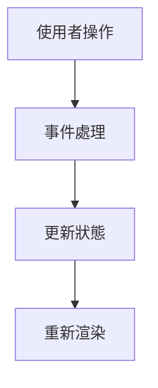

# 元件閱讀模板

複製這份模板到每一個元件筆記中使用。

## 1. 這個元件解決什麼問題？

說明元件的使用場景與設計目的。

## 2. 使用範例

```vue
<template>
  <!-- 貼上最小使用範例 -->
</template>
```

## 3. 源碼位置

- 元件入口：
- 子元件：
- 樣式檔：
- 型別檔：
- Demo：

## 4. 檔案結構

```txt
ComponentName/
├─ index.js
├─ component-name.vue
└─ ...
```

## 5. Props 設計

| Prop | Type | Default | 是否必要 | 說明 |
|---|---|---|---|---|

## 6. Emits / Events 設計

| Event | Payload | 觸發時機 | 設計意圖 |
|---|---|---|---|

## 7. Slots 設計

| Slot | 用途 | 預設內容 |
|---|---|---|

## 8. 狀態設計

- 內部狀態：
- 外部狀態：
- 衍生狀態：
- 非同步狀態：

## 9. 生命週期與 watch

- mounted：
- beforeUnmount：
- watch：
- nextTick：

## 10. DOM 與事件處理

- click：
- input：
- keydown：
- focus / blur：
- scroll：
- resize：

## 11. 樣式設計

- class 生成方式：
- Less 變數：
- 狀態樣式：
- 主題化：

## 12. 與其他元件關係

- 父元件：
- 子元件：
- provide / inject：
- mixins：
- utils：

## 13. 核心流程

用文字或 Mermaid 畫出流程。



## 14. 邊界情況

- 空值
- disabled
- loading
- 非同步
- 重複點擊
- 滾動
- 表單重置
- 鍵盤操作

## 15. 可以學走的設計

待補。

## 16. 如果自己仿寫

先做簡版，再逐步補功能。

## 17. AI 問答紀錄

記錄你問過 AI 的問題與答案。
